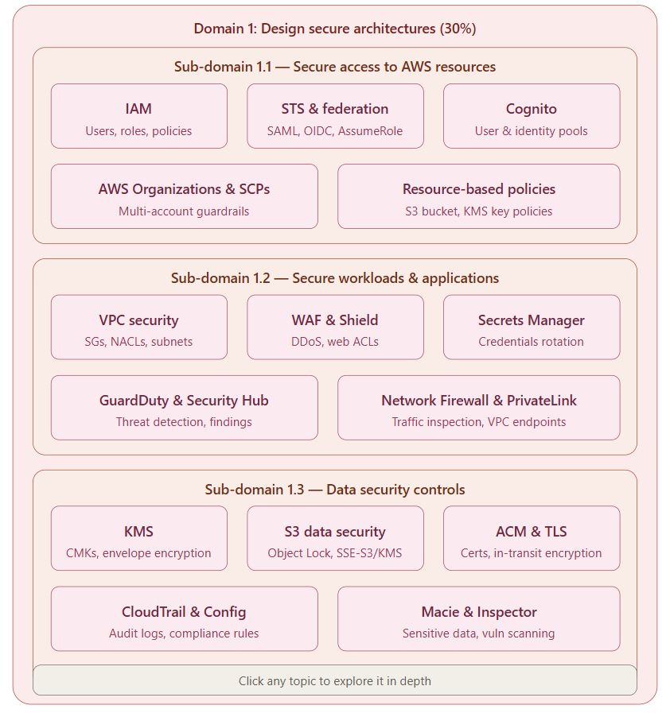
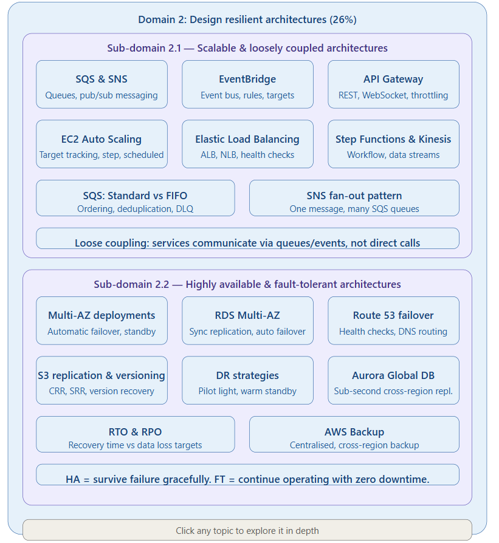
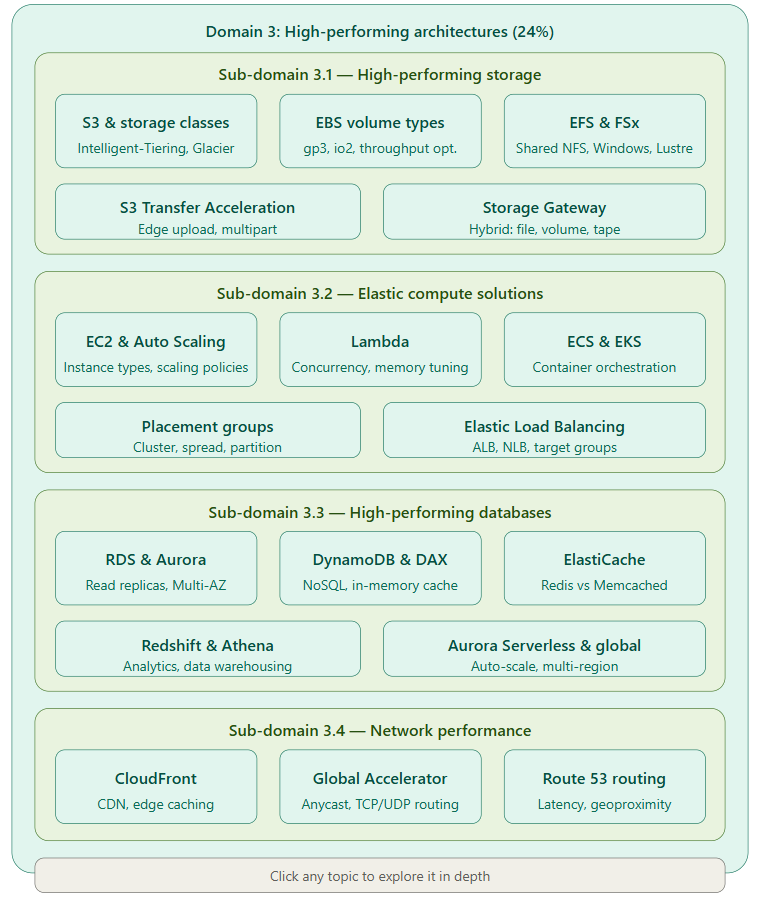
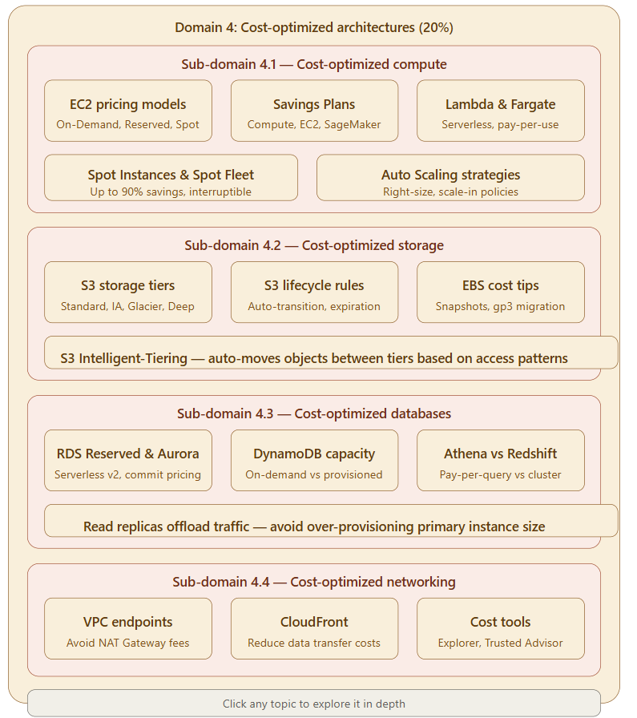

Here's a comprehensive breakdown of the AWS Solutions Architect Associate (SAA-C03) exam to help you prepare effectively.

**Domain 1 — Design Secure Architectures (30% — most important!)**

This is the heaviest-weighted domain and the foundation of every AWS architecture. AWS operates under a Shared Responsibility Model, meaning AWS secures the cloud infrastructure while you are responsible for securing everything you build inside it. Focus on IAM roles/policies, encryption (at rest and in transit), S3 Object Lock, Security Groups, NACLs, AWS Network Firewall, MFA, and Cognito.

**Domain 2 — Design Resilient Architectures (26%)**

Covers designing scalable and loosely coupled architectures, as well as highly available and fault-tolerant systems. Key concepts: multi-AZ deployments, Auto Scaling, Elastic Load Balancing, RDS failover, SQS/SNS for decoupling, and Route 53 routing policies.

**Domain 3 — Design High-Performing Architectures (24%)**

Covers high-performing storage solutions, elastic compute, high-performing databases, and network performance. Focus on caching strategies (ElastiCache, CloudFront), EBS volume types, Aurora read replicas, and Lambda concurrency.

**Domain 4 — Design Cost-Optimized Architectures (20%)**

Covers cost-optimized storage, compute, database, and network architectures. Learn about Reserved vs Spot vs On-Demand instances, S3 storage tiers, and right-sizing.

**Study tips:**

* The SAA-C03 exam is focused on security, so make sure you focus on AWS Network Firewall, AWS Security Hub, MFA, Data Encryption, IPSec, S3 Object Lock, and Security Groups.
* For practice, the exam tests your ability to pick the *best* architectural decision for a given scenario — not just whether a service exists.
