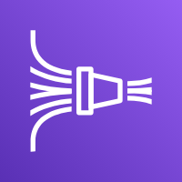
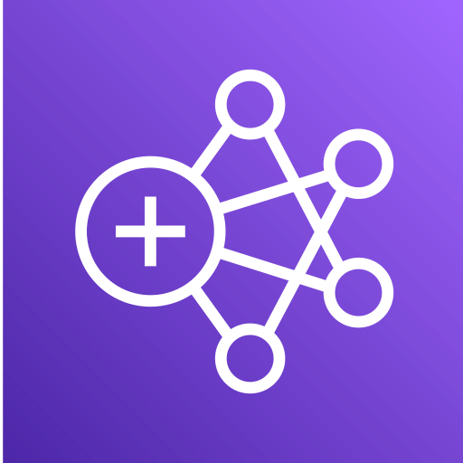
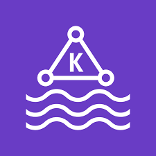
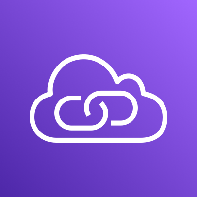
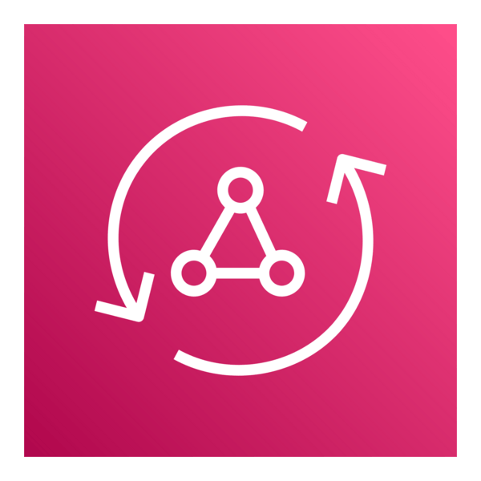

# AWS Certified Solutions Architect Associate SAA-C03 Reference Guide

This repository contains a **comprehensive reference guide and quick study notes** for the **AWS Certified Solutions Architect – Associate SAA-C03** certification exam.

The goal of this repository is to provide a **concise, structured, and practical reference** for developers, architects, and cloud engineers preparing for the exam.

It includes key AWS services, architecture patterns, security concepts, and best practices aligned with the **AWS Well-Architected Framework**.

## Table of Contents

* Overview
* Exam Overview
* Exam Domains
* AWS Core Services
* Architecture Patterns
* Security Best Practices
* Storage Services
* Compute Services
* Networking
* Databases
* Serverless Architecture
* Monitoring & Logging
* Cost Optimization
* High Availability & Disaster Recovery
* Study Tips
* Useful Resources

## Overview

The **AWS Certified Solutions Architect – Associate** certification validates your ability to design distributed systems and scalable architectures on AWS. ([AWS Documentation][2])

This certification focuses on designing solutions that are:

* Secure
* Highly available
* Fault tolerant
* Scalable
* Cost optimized

Solutions architects must evaluate trade-offs and choose the most appropriate AWS services for different use cases. ([CloudFluently][3])

## Exam Overview

| Attribute              | Details                                          |
| ---------------------- | ------------------------------------------------ |
| Exam Name              | AWS Certified Solutions Architect – Associate    |
| Exam Code              | SAA-C03                                          |
| Duration               | 130 minutes                                      |
| Questions              | ~65 (50 scored, 15 unscored)                     |
| Passing Score          | 720 / 1,000 (Scaled score)                       |
| Format                 | Multiple Choice & Multiple Response              |
| Recommended Experience | 1+ year hands-on AWS experience                  |
| Cost                   | $150 USD                                         |
| Delivery               | Testing center or Online proctored (Pearson VUE) |

The exam primarily tests **real-world architectural design scenarios** rather than theoretical knowledge. ([aabiance.com][4])


## Exam Domains

The exam is divided into four major domains:


These domains represent the core competencies required for designing solutions on AWS. ([AWS Documentation][5])

## Core AWS Services (In-scope AWS services and features)

### [Analytics](#analytics)

* [Amazon Athena](#amazon-athena)
* [AWS Data Exchange](#aws-data-exchange)
* [Amazon Data Firehose](#amazon-data-firehose-formerly-kinesis-data-firehose)
* [Amazon EMR](#amazon-emr-elastic-mapreduce)
* [AWS Glue](#aws-glue)
* [Amazon Kinesis](#amazon-kinesis)
* [AWS Lake Formation](#aws-lake-formation)
* [Amazon Managed Streaming for Apache Kafka](#amazon-msk-managed-streaming-for-apache-kafka)
* [Amazon OpenSearch Service](#amazon-opensearch-service)
* [Amazon QuickSuite](#amazon-quicksight)
* [Amazon Redshift](#amazon-redshift)

### [Application Integration](#application-integration)

* Amazon AppFlow
* AWS AppSync
* Amazon EventBridge
* Amazon MQ
* Amazon SNS
* Amazon SQS
* AWS Step Functions

### [AWS Cost Management](#aws-cost-management)

* [AWS Budgets](#aws-budgets)
* AWS Cost and Usage Report
* AWS Cost Explorer
* Savings Plans

### [Compute](#compute)

* [AWS Batch](#aws-batch)
* [Amazon EC2](#amazon-ec2-elastic-compute-cloud)
* [Amazon EC2 Auto Scaling](#amazon-ec2-auto-scaling)
* [AWS Elastic Beanstalk](#aws-elastic-beanstalk)
* [AWS Outposts](#aws-outposts)
* [AWS Serverless Application Repository](#aws-serverless-application-repository-sar)
* [VMware Cloud on AWS](#vmware-cloud-on-aws)
* [AWS Wavelength](#aws-wavelength)

### [Containers](#containers)

* Amazon ECR
* Amazon ECS
* Amazon ECS Anywhere
* Amazon EKS
* Amazon EKS Anywhere
* Amazon EKS Distro

### [Database](#database)

* Amazon Aurora
* Amazon Aurora Serverless
* Amazon DocumentDB
* Amazon DynamoDB
* Amazon ElastiCache
* Amazon Keyspaces
* Amazon Neptune
* Amazon RDS
* Amazon Redshift

### [Developer Tools](#developer-tools)

AWS X-Ray

### Front-End Web and Mobile

* AWS Amplify
* Amazon API Gateway
* AWS Device Farm

### Machine Learning

* Amazon Comprehend
* Amazon Kendra
* Amazon Lex
* Amazon Polly
* Amazon Rekognition
* Amazon SageMaker AI
* Amazon Textract
* Amazon Transcribe
* Amazon Translate

### Management and Governance

*  [AWS Auto Scaling](#aws-auto-scaling)
*  [AWS CLI](#aws-cli-command-line-interface)
*  [AWS CloudFormation](#aws-cloudformation)
*  [AWS CloudTrail](#aws-cloudtrail)
*  [Amazon CloudWatch](#amazon-cloudwatch)
*  [AWS Compute Optimizer](#aws-compute-optimizer)
*  [AWS Config](#aws-config)
*  [AWS Control Tower](#aws-control-tower)
*  [AWS Health Dashboard](#aws-health-dashboard)
*  [AWS License Manager](#aws-license-manager)
*  [Amazon Managed Grafana](#amazon-managed-grafana)
*  [Amazon Managed Service for Prometheus](#amazon-managed-service-for-prometheus-amp)
*  [AWS Management Console](#aws-management-console)
*  [AWS Organizations](#aws-organizations)
*  [AWS Service Catalog](#aws-service-catalog)
*  [AWS Systems Manager](#aws-systems-manager-ssm)
*  [AWS Trusted Advisor](#aws-trusted-advisor)
*  [AWS Well-Architected Tool](#aws-well-architected-tool)

### Media Services

* Amazon Elastic Transcoder
* Amazon Kinesis Video Streams

### Migration and Transfer

* AWS Application Migration Service
* AWS DataSync
* AWS DMS
* AWS Snow Family
* AWS Transfer Family

### Networking and Content Delivery

* [AWS Client VPN](#aws-client-vpn)
* [Amazon CloudFront](#amazon-cloudfront)
* [AWS Direct Connect](#aws-direct-connect-dx)
* [Elastic Load Balancing (ELB)](#elastic-load-balancing-elb)
* [AWS Global Accelerator](#aws-global-accelerator)
* [AWS PrivateLink](#aws-privatelink)
* [Amazon Route 53](#amazon-route-53)
* [AWS Site-to-Site VPN](#aws-site-to-site-vpn)
* [AWS Transit Gateway](#aws-transit-gateway-tgw)
* [Amazon VPC](#amazon-vpc-virtual-private-cloud)

### Security, Identity, and Compliance

* AWS Artifact
* AWS Audit Manager
* AWS Certificate Manager (ACM)
* AWS CloudHSM
* Amazon Cognito
* Amazon Detective
* AWS Directory Service
* AWS Firewall Manager
* Amazon GuardDuty
* AWS IAM Identity Center
* Amazon Inspector
* AWS KMS
* Amazon Macie
* AWS Network Firewall
* AWS Resource Access Manager (AWS RAM)
* AWS Secrets Manager
* AWS Security Hub
* AWS Shield
* AWS WAF
* [IAM](#IAM)

### Serverless

* AWS AppSync
* AWS Fargate
* AWS Lambda

### [Storage](#storage-services)

* [AWS Backup](#aws-backup)
* [Amazon EBS](#amazon-ebs-elastic-block-store)
* [Amazon EFS](#amazon-efs-elastic-file-system)
* [Amazon FSx (for all types)](#amazon-fsx-all-types)
* [Amazon S3](#amazon-s3-simple-storage-service)
* [Amazon S3 Glacier](#amazon-s3-glacier)
* [AWS Storage Gateway](#aws-storage-gateway)

<details>
  <summary>Out-of-scope AWS services and features</summary>
  
### Application Integration
* Amazon Managed Workflows for Apache Airflow (Amazon MWAA)
### AR and VR
* Amazon Sumerian
### Blockchain
* Amazon Managed Blockchain
### Compute
* Amazon Lightsail
### Database
* Amazon RDS on VMware
### Developer Tools
* AWS CDK
* AWS CloudShell
* AWS CodeArtifact
* AWS CodeBuild
* AWS CodeCommit
* AWS CodeDeploy
* Amazon Corretto
* AWS Fault Injection Simulator (AWS FIS)
* AWS Tools and SDKs
### Front-End Web and Mobile
* Amazon Location Service
### Game Tech
* Amazon GameLift
### Internet of Things
* All services
### Machine Learning
* Apache MXNet on AWS
* Amazon Augmented AI (Amazon A2I)
* AWS DeepComposer
* AWS Deep Learning AMIs (DLAMI)
* AWS Deep Learning Containers
* Amazon DevOps Guru
* Amazon Elastic Inference
* Amazon HealthLake
* AWS Inferentia
* Amazon Personalize
* PyTorch on AWS
* Amazon SageMaker Canvas
* Amazon SageMaker Ground Truth
* TensorFlow on AWS
### Management and Governance
* AWS Console Mobile Application
* AWS Distro for OpenTelemetry
### Media Services
* AWS Elemental Appliances and Software
* AWS Elemental MediaConnect
* AWS Elemental MediaConvert
* AWS Elemental MediaLive
* AWS Elemental MediaPackage
* AWS Elemental MediaTailor
* Amazon Interactive Video Service (Amazon IVS)
### Migration and Transfer
* Migration Evaluator
### Networking and Content Delivery
* AWS Cloud Map
### Quantum Technologies
* Amazon Braket
### Satellite
* AWS Ground Station

</details>


---

### Analytics

#### Amazon Athena

##### What It Is
A **serverless, interactive query service** that lets you analyze data directly in **Amazon S3** using standard SQL — no infrastructure to manage, no data loading required.


##### Architecture
```
┌──────────────────────────────────────────────────────────────────────┐
│                        Amazon Athena                                  │
│                                                                       │
│  Data Sources                                                         │
│  ┌────────────┐  ┌────────────┐  ┌────────────┐  ┌───────────────┐  │
│  │  S3        │  │  Glue Data │  │  Federated │  │  CloudWatch   │  │
│  │  (CSV,JSON │  │  Catalog   │  │  Query     │  │  Logs / Lake  │  │
│  │  Parquet,  │  │  (schema   │  │  (RDS,DDB, │  │  Formation    │  │
│  │  ORC, Avro)│  │  metadata) │  │   Redis…)  │  │               │  │
│  └────────┬───┘  └─────┬──────┘  └─────┬──────┘  └───────┬───────┘  │
│           └────────────┴────────────────┴──────────────────┘         │
│                                   │                                   │
│                    ┌──────────────▼─────────────┐                    │
│                    │       Amazon Athena          │                   │
│                    │   (Presto / Trino engine)   │                   │
│                    │     Standard SQL queries     │                   │
│                    └──────────────┬──────────────┘                   │
│                                   │                                   │
│              ┌────────────────────┼────────────────────┐             │
│              ▼                    ▼                    ▼             │
│          S3 Results           QuickSight            Jupyter          │
│          (query output)       (visualize)           Notebooks        │
└──────────────────────────────────────────────────────────────────────┘
```

##### Supported Formats & Performance
| Format | Compression | Performance |
|---|---|---|
| **Parquet** (recommended) | Snappy, GZIP | Best — columnar, predicate pushdown |
| **ORC** (recommended) | Snappy, ZLIB | Best — columnar, splittable |
| **JSON** | GZIP, Snappy | Good |
| **CSV / TSV** | GZIP | Poor — row-based, not splittable when compressed |
| **Avro** | Snappy, Deflate | Good — row-based, good for streaming |

### Athena Pricing Model
- **Pay per query**: $5 per TB of data scanned
- Reduce costs by:
  - Using **columnar formats** (Parquet/ORC) — scan only needed columns
  - **Partitioning** data (e.g., `s3://bucket/year=2024/month=01/`) — skip irrelevant partitions
  - **Compression** — reduce bytes scanned
  - **Bucketing** — organize data within partitions

##### Key Features
| Feature | Description |
|---|---|
| **Federated Query** | Query data in RDS, DynamoDB, Redshift, on-prem via Lambda connectors |
| **Workgroups** | Isolate queries per team/project; set data scan limits, cost controls |
| **Saved Queries** | Store and share frequently used SQL |
| **Prepared Statements** | Parameterized queries for repeated execution |
| **ACID Transactions** | Via Apache Iceberg, Hudi, Delta Lake table formats |
| **Lake Formation Integration** | Fine-grained column/row-level access control on S3 data |

##### Athena for Use Cases
| Use Case | Details |
|---|---|
| **Ad-hoc querying** | Query S3 logs, CloudTrail, ALB access logs, VPC Flow Logs |
| **ETL replacement** | Transform and query without loading into DB |
| **Data lake analytics** | Query structured/semi-structured data at scale |
| **Business intelligence** | Connect QuickSight → Athena → S3 |

##### Exam Key Points
- **Serverless** — no clusters, no setup; pay per query (per TB scanned)
- **Always use Parquet/ORC + partitioning** to minimize cost and maximize speed
- **Glue Data Catalog** = metadata store for Athena tables (schema on read)
- **Federated Query** extends Athena beyond S3 to other data sources via Lambda
- **Athena does not store data** — queries S3 directly; results stored in S3 output bucket
- Query **CloudTrail logs, ELB logs, VPC Flow Logs** in S3 — very common exam scenario
- **Use when**: serverless SQL on S3 without moving data, log analysis, ad-hoc analytics

#### AWS Data Exchange

##### What It Is
A service that makes it easy to **find, subscribe to, and use third-party data** in the cloud — without building or maintaining data pipelines.


##### Architecture
```
┌──────────────────────────────────────────────────────────────────────┐
│                      AWS Data Exchange                                │
│                                                                       │
│  Data Providers                         Data Consumers (You)          │
│  (Reuters, S&P, IMDb,                   ┌──────────────────────────┐ │
│   healthcare firms, etc.)               │  Subscribe to dataset    │ │
│  ┌────────────────────┐                 │                          │ │
│  │  Publish dataset   │──── Subscribe ─▶│  Auto-export to S3       │ │
│  │  (files, APIs,     │                 │                          │ │
│  │   Redshift tables) │                 │  Use with Athena,        │ │
│  └────────────────────┘                 │  Redshift, EMR, etc.     │ │
│                                         └──────────────────────────┘ │
│  Data Types: S3 files, APIs, Redshift tables, Lake Formation         │
└──────────────────────────────────────────────────────────────────────┘
```

##### Exam Key Points
- **Not heavily tested** on SAA-C03 — understand the concept
- Enables **data monetization** (providers) and **data enrichment** (consumers)
- Data automatically delivered to **S3** after subscription
- Common use: financial data (S&P), weather data, demographic data for ML
- **Use when**: enriching internal data with third-party licensed datasets


#### Amazon Data Firehose (formerly Kinesis Data Firehose)

##### What It Is
A **fully managed delivery service** for real-time streaming data to destinations like S3, Redshift, OpenSearch, and third-party services — with optional transformation.



##### Architecture
```
┌──────────────────────────────────────────────────────────────────────┐
│                    Amazon Data Firehose                               │
│                                                                       │
│  Sources                                                              │
│  ┌────────────┐  ┌────────────┐  ┌────────────┐  ┌───────────────┐  │
│  │  Kinesis   │  │  CloudWatch│  │  MSK       │  │  Direct PUT   │  │
│  │  Data      │  │  Logs      │  │ (Kafka)    │  │  (SDK/Agent)  │  │
│  │  Streams   │  │            │  │            │  │               │  │
│  └──────┬─────┘  └──────┬─────┘  └──────┬─────┘  └──────┬────────┘  │
│         └───────────────┴───────────────┴────────────────┘           │
│                                  │                                    │
│             ┌────────────────────▼────────────────────┐              │
│             │             Firehose Delivery Stream      │              │
│             │                                          │              │
│             │  ┌───────────────────────────────────┐  │              │
│             │  │  Optional: Lambda Transformation  │  │              │
│             │  │  (format convert, enrich, filter) │  │              │
│             │  └───────────────────────────────────┘  │              │
│             │                                          │              │
│             │  Buffer: size (1–128 MB) + time (60–900s)│              │
│             └──────────────────┬───────────────────────┘              │
│                                │                                      │
│    ┌───────────────────────────┼────────────────────────────┐        │
│    ▼                           ▼                            ▼        │
│  Amazon S3              OpenSearch              Amazon Redshift      │
│                                                                       │
│    ▼                           ▼                                     │
│  Splunk                   HTTP Endpoint                              │
│  Datadog                  (3rd party)                                │
└──────────────────────────────────────────────────────────────────────┘
```

##### Key Concepts
| Feature | Detail |
|---|---|
| **Near real-time** | 60-second minimum latency (buffering) — NOT real-time |
| **Buffer** | Flush when size (MB) OR time (seconds) threshold hit — whichever first |
| **Lambda Transform** | Invoke Lambda to transform/enrich records before delivery |
| **Format Conversion** | Auto-convert JSON → Parquet/ORC (no Lambda needed) |
| **Compression** | GZIP, Snappy, ZIP for S3 destination |
| **Backup** | Send all or failed records to S3 backup bucket |
| **No consumers** | Unlike Kinesis Data Streams — you don't write consumers; Firehose delivers automatically |

##### Firehose Destinations
| Destination | Notes |
|---|---|
| **Amazon S3** | Primary landing zone; supports partitioning by date |
| **Amazon Redshift** | Copies via S3 intermediate step (COPY command) |
| **Amazon OpenSearch** | Real-time search/analytics indexing |
| **Splunk** | Security and log analytics |
| **HTTP Endpoint** | Any custom HTTP destination (Datadog, New Relic, MongoDB) |
| **3rd Party** | Coralogix, Dynatrace, LogicMonitor |

##### Exam Key Points
- **Firehose is NOT real-time** — minimum 60s buffer (near real-time)
- **No data storage** in Firehose itself — streams through to destination
- **No consumers to write** — unlike Kinesis Data Streams
- **Lambda Transform** = custom processing before delivery (filter, enrich, reformat)
- **Format Conversion** (JSON → Parquet/ORC) is built-in — no Lambda needed
- **Redshift destination** uses S3 as intermediate → issues COPY command to Redshift
- **Use when**: streaming logs/events to S3 data lake, real-time indexing into OpenSearch


#### Amazon EMR (Elastic MapReduce)

##### What It Is
A **managed big data platform** for running large-scale distributed data processing frameworks — Hadoop, Spark, Hive, Presto, HBase, Flink — on a resizable cluster of EC2 instances.




##### Architecture
```
┌──────────────────────────────────────────────────────────────────────┐
│                        Amazon EMR Cluster                             │
│                                                                       │
│  ┌────────────────────────────────────────────────────────────────┐  │
│  │                      EMR Cluster                               │  │
│  │                                                                │  │
│  │  ┌──────────────────┐   ┌──────────────────┐                  │  │
│  │  │   Primary Node   │   │  Core Nodes       │                  │  │
│  │  │  (Master)        │   │  (HDFS + compute) │                  │  │
│  │  │  - Coordinates   │   │  ┌────┐ ┌────┐   │                  │  │
│  │  │  - YARN RM       │   │  │EC2 │ │EC2 │   │                  │  │
│  │  │  - HDFS NN       │   │  └────┘ └────┘   │                  │  │
│  │  └──────────────────┘   └──────────────────┘                  │  │
│  │                                                                │  │
│  │  ┌──────────────────────────────────────────────────────────┐ │  │
│  │  │  Task Nodes (optional — compute only, no HDFS, SPOT OK)  │ │  │
│  │  │  ┌────┐ ┌────┐ ┌────┐ ┌────┐                            │ │  │
│  │  │  │EC2 │ │EC2 │ │EC2 │ │EC2 │  (Spot Instances)          │ │  │
│  │  │  └────┘ └────┘ └────┘ └────┘                            │ │  │
│  │  └──────────────────────────────────────────────────────────┘ │  │
│  └────────────────────────────────────────────────────────────────┘  │
│                           │                                           │
│  ┌────────────────────────┼────────────────────────────────────┐    │
│  ▼                        ▼                                    ▼    │
│ Amazon S3 (EMRFS)      DynamoDB                            HDFS     │
│ (recommended storage)                                               │
└──────────────────────────────────────────────────────────────────────┘
```

##### Node Types
| Node Type | Role | HDFS | Spot Safe? |
|---|---|---|---|
| **Primary (Master)** | Orchestrate cluster, run resource manager | Yes (NN) | ❌ No |
| **Core** | Run tasks + store HDFS data | Yes (DN) | ⚠️ Risk of data loss |
| **Task** | Run tasks only — no HDFS | No | ✅ Yes (safe) |

##### EMR Deployment Options
| Option | Description |
|---|---|
| **EMR on EC2** | Traditional; full control over cluster |
| **EMR on EKS** | Run Spark jobs on EKS cluster (shared infrastructure) |
| **EMR Serverless** | No cluster management; auto-scales workers; pay per use |

##### Storage Options
| Storage | Description |
|---|---|
| **EMRFS (S3)** | Recommended — decouple storage from compute; no data loss on cluster termination |
| **HDFS** | Ephemeral local storage — lost when cluster terminates |
| **Local FS** | Instance store — ephemeral |
| **EBS** | Persistent block storage for HDFS |

##### EMR Cluster Types
| Type | Description |
|---|---|
| **Long-running** | Persistent cluster; interactive queries (Hive, Spark SQL) |
| **Transient (Spot)** | Spin up → process → terminate; cost-optimized batch |

##### Cost Optimization
- **Task Nodes on Spot** — safe because no HDFS; big savings
- **Spot for Core Nodes** — risky (data loss on interruption) but possible with EMRFS
- **Auto Scaling** — scale core/task nodes based on YARN metrics
- **Graviton instances** — lower cost for Spark workloads

##### Exam Key Points
- **Use S3 (EMRFS) as primary storage** — decouples storage from compute; data persists after cluster terminates
- **Task nodes are Spot-safe** — no HDFS, just compute
- **EMR Serverless** = no cluster management (newest option)
- Supports **Apache Spark, Hadoop, Hive, Presto, HBase, Flink, Pig**
- **EMR Studio** — managed Jupyter environment for EMR
- **Use when**: large-scale ETL, ML training, log processing, clickstream analysis, genomics


#### AWS Glue

##### What It Is
A **fully managed serverless ETL (Extract, Transform, Load)** service — discovers, catalogs, cleans, transforms, and moves data between data stores.


##### Architecture
```
┌──────────────────────────────────────────────────────────────────────┐
│                          AWS Glue                                     │
│                                                                       │
│  ┌─────────────────────────────────────────────────────────────┐    │
│  │                   Glue Data Catalog                          │    │
│  │  (Central metadata repository — databases, tables, schemas) │    │
│  │  Used by: Athena, Redshift Spectrum, EMR, Lake Formation    │    │
│  └─────────────────────────────────────────────────────────────┘    │
│                                                                       │
│  ┌──────────────────┐    ┌────────────────┐    ┌──────────────────┐ │
│  │  Glue Crawlers   │    │  Glue Jobs     │    │  Glue Workflows  │ │
│  │                  │    │                │    │                  │ │
│  │  Scan data in S3,│    │  Python/Scala  │    │  Orchestrate     │ │
│  │  RDS, DynamoDB,  │    │  Spark scripts │    │  multi-job ETL   │ │
│  │  Redshift        │    │  (serverless   │    │  pipelines       │ │
│  │                  │    │   Spark)       │    │                  │ │
│  │  Auto-detect     │    │                │    │  Triggers:       │ │
│  │  schema and      │    │  PySpark or    │    │  schedule,       │ │
│  │  populate        │    │  Spark SQL     │    │  on-demand,      │ │
│  │  Data Catalog    │    │                │    │  event-based     │ │
│  └──────────────────┘    └────────────────┘    └──────────────────┘ │
│                                                                       │
│  ┌──────────────────┐    ┌────────────────┐    ┌──────────────────┐ │
│  │  Glue DataBrew   │    │  Glue Elastic  │    │  Glue Studio     │ │
│  │  (visual data    │    │  Views         │    │  (visual ETL     │ │
│  │   prep, no code) │    │  (virtual table│    │   designer)      │ │
│  │                  │    │   across DBs)  │    │                  │ │
│  └──────────────────┘    └────────────────┘    └──────────────────┘ │
└──────────────────────────────────────────────────────────────────────┘
```

##### Glue Data Catalog
- Central **metadata store** for all your data assets
- Stores: database names, table definitions, column names, data types, partition info
- Used by: **Athena, Redshift Spectrum, EMR, Lake Formation**
- Each account has **one Glue Data Catalog per region**

##### Glue Crawlers
- Automatically scan data sources → infer schema → update Data Catalog
- Scheduled or on-demand
- Supports: S3, RDS, DynamoDB, Redshift, JDBC sources

##### Glue Jobs
| Type | Description |
|---|---|
| **Spark ETL** | Distributed PySpark or Scala Spark on serverless cluster |
| **Streaming ETL** | Micro-batch processing from Kinesis or Kafka |
| **Python Shell** | Single-node Python for lightweight tasks |
| **Ray** | Distributed Python for ML workloads |

##### Glue Features
| Feature | Description |
|---|---|
| **DynamicFrame** | Glue-specific DataFrame — handles schema inconsistencies |
| **Job Bookmarks** | Track processed data — resume from where job left off (avoid reprocessing) |
| **FindMatches** | ML-based deduplication / record matching |
| **Glue DataBrew** | Visual data cleaning without code (no-code ETL) |
| **Glue Studio** | Drag-and-drop ETL job builder |
| **Connection** | Reusable connection config for JDBC, S3, Kafka, etc. |

##### Exam Key Points
- **Glue Data Catalog** = metadata layer for Athena, EMR, Redshift Spectrum — they all share it
- **Glue Crawlers** = auto-discover schema; populate catalog
- **Job Bookmarks** = prevent reprocessing of already-processed data
- **Glue is serverless** — no cluster to manage; billed per DPU-hour
- **Glue vs EMR**: Glue = managed serverless ETL; EMR = full control big data cluster
- **Glue DataBrew** = no-code data prep (for analysts, not engineers)
- **Use when**: building data lakes, ETL pipelines, schema discovery, S3 → Redshift pipelines

#### Amazon Kinesis

##### What It Is
A platform for **real-time streaming data** on AWS — collect, process, and analyze data streams at any scale. Three distinct services under the Kinesis umbrella.


##### Kinesis Family Overview
```
┌──────────────────────────────────────────────────────────────────────┐
│                      Amazon Kinesis Family                            │
│                                                                       │
│  ┌──────────────────────┐   ┌──────────────────────────────────────┐ │
│  │  Kinesis Data        │   │  Amazon Data Firehose                │ │
│  │  Streams (KDS)       │   │  (formerly Kinesis Data Firehose)   │ │
│  │                      │   │                                      │ │
│  │  Real-time           │   │  Near real-time (60s+ buffer)        │ │
│  │  Custom consumers    │   │  No consumers needed                 │ │
│  │  1–365 day retention │   │  Delivery to S3/Redshift/OS/etc.    │ │
│  │  Replay capability   │   │  Optional Lambda transform           │ │
│  │  Manual scaling      │   │  Fully managed delivery              │ │
│  └──────────────────────┘   └──────────────────────────────────────┘ │
│                                                                       │
│  ┌──────────────────────────────────────────────────────────────────┐ │
│  │  Kinesis Video Streams                                           │ │
│  │  Ingest, store, process video streams from connected devices     │ │
│  │  (cameras, CCTV, IoT)                                           │ │
│  └──────────────────────────────────────────────────────────────────┘ │
└──────────────────────────────────────────────────────────────────────┘
```

##### Kinesis Data Streams (KDS) — Deep Dive

###### Shards — The Core Unit
```
┌──────────────────────────────────────────────────────────────────────┐
│                  Kinesis Data Stream (4 Shards)                       │
│                                                                       │
│  Producers                                                            │
│  (apps, IoT, logs)                                                   │
│       │                                                               │
│       ▼  Partition Key determines shard                               │
│  ┌─────────┐  ┌─────────┐  ┌─────────┐  ┌─────────┐                │
│  │ Shard 1 │  │ Shard 2 │  │ Shard 3 │  │ Shard 4 │                │
│  │         │  │         │  │         │  │         │                │
│  │ 1 MB/s  │  │ 1 MB/s  │  │ 1 MB/s  │  │ 1 MB/s  │  Write        │
│  │ in      │  │ in      │  │ in      │  │ in      │                │
│  │         │  │         │  │         │  │         │                │
│  │ 2 MB/s  │  │ 2 MB/s  │  │ 2 MB/s  │  │ 2 MB/s  │  Read         │
│  │ out     │  │ out     │  │ out     │  │ out     │                │
│  └─────────┘  └─────────┘  └─────────┘  └─────────┘                │
│       │              │              │              │                  │
│       └──────────────┴──────────────┴──────────────┘                 │
│                              │                                        │
│  Consumers (Enhanced Fan-Out or standard)                             │
│  Lambda, KDA, KDF, EC2, EMR                                          │
└──────────────────────────────────────────────────────────────────────┘
```

###### Shard Capacity
| Direction | Per Shard | Total (N shards) |
|---|---|---|
| **Write (Ingest)** | 1 MB/s or 1,000 records/s | N × 1 MB/s |
| **Read (Standard)** | 2 MB/s shared across consumers | N × 2 MB/s |
| **Read (Enhanced Fan-Out)** | 2 MB/s per consumer per shard | N × 2 MB/s × C consumers |

###### Consumer Types
| Type | Latency | Cost | Pull/Push |
|---|---|---|---|
| **Standard (GetRecords)** | ~200ms | Included | Pull (polling) |
| **Enhanced Fan-Out** | ~70ms | Extra cost | Push (HTTP/2) |

###### Key KDS Concepts
| Concept | Description |
|---|---|
| **Partition Key** | Routes records to shards (consistent hashing) |
| **Sequence Number** | Unique ID per record within a shard |
| **Retention** | 24 hours (default) up to 365 days |
| **Replay** | Re-read historical data from stream |
| **Resharding** | Split shards (scale up) or merge shards (scale down) |
| **On-Demand Mode** | Auto-scale shards; pay per GB; simpler management |
| **Provisioned Mode** | Manual shard count; predictable cost |

###### KDS Producers & Consumers
- **Producers**: Kinesis Producer Library (KPL), AWS SDK, Kinesis Agent
- **Consumers**: Kinesis Client Library (KCL), Lambda, Kinesis Data Analytics, Firehose, EMR

##### Kinesis Data Analytics (Amazon Managed Service for Apache Flink)
- **Real-time SQL or Flink** processing on streaming data from KDS or MSK
- Output to KDS, Firehose, Lambda
- **Use when**: real-time dashboards, anomaly detection, metric generation from streams

##### Exam Key Points
- **KDS = real-time, KDF = near real-time (≥60s)** — critical distinction
- **Shard = 1 MB/s in, 2 MB/s out** — memorize for capacity planning
- **Hot shard** = too many records with same partition key → use high-cardinality partition keys
- **Enhanced Fan-Out** = dedicated 2 MB/s per consumer per shard (low latency)
- **Retention**: default 24h, max 365 days — only KDS supports replay
- **KDS vs SQS**: KDS = ordered per shard, replay, real-time streaming; SQS = distributed queue, auto-scale, at-least-once
- **On-Demand mode** = automatic scaling (shards auto-adjust); **Provisioned** = manual shard management
- **Use when**: real-time analytics, log ingestion, clickstream, IoT telemetry, event sourcing


#### AWS Lake Formation

##### What It Is
A **managed service to build, secure, and manage data lakes** — simplifies ingestion, cataloging, cleaning, and access control for data stored in S3.


##### Architecture
```
┌──────────────────────────────────────────────────────────────────────┐
│                       AWS Lake Formation                              │
│                                                                       │
│  Data Sources                                                         │
│  ┌──────────┐  ┌──────────┐  ┌──────────┐  ┌──────────────────┐    │
│  │  S3      │  │  RDS     │  │  DynamoDB│  │  On-Premises DB  │    │
│  └────┬─────┘  └────┬─────┘  └────┬─────┘  └────────┬─────────┘    │
│       └─────────────┴─────────────┴─────────────────┘               │
│                               │  Ingest (Blueprints)                 │
│                               ▼                                       │
│  ┌──────────────────────────────────────────────────────────────┐   │
│  │                   Data Lake (S3)                              │   │
│  │                                                               │   │
│  │   ┌─────────────────────────────────────────────────────┐   │   │
│  │   │         Glue Data Catalog (Metadata)                │   │   │
│  │   └─────────────────────────────────────────────────────┘   │   │
│  │                                                               │   │
│  │   Lake Formation Permissions (column, row, cell level)       │   │
│  └───────────────────────────────────┬───────────────────────────┘   │
│                                       │                               │
│         ┌─────────────────────────────┼──────────────────────┐       │
│         ▼                             ▼                       ▼       │
│     Amazon Athena              Amazon Redshift             Amazon EMR │
│     (SQL queries)              (Spectrum)                 (big data)  │
└──────────────────────────────────────────────────────────────────────┘
```

##### Key Features
| Feature | Description |
|---|---|
| **Blueprints** | Pre-built workflows to ingest data from common sources |
| **Governed Tables** | ACID transactions on S3 data lake (row-level locking) |
| **Fine-grained Access Control** | Column-level, row-level, cell-level permissions |
| **Data Filters** | Row/column filtering based on identity |
| **Cross-account sharing** | Share cataloged data with other AWS accounts |
| **LF-Tags** | Attribute-based access control for large catalog management |

##### Lake Formation vs S3 + Glue
| Aspect | S3 + Glue (manually) | Lake Formation |
|---|---|---|
| **Access control** | S3 bucket policies | Fine-grained column/row level |
| **Data ingestion** | Custom ETL | Blueprints |
| **Governance** | Manual | Centralized |
| **Setup complexity** | High | Lower (managed) |

##### Exam Key Points
- **Lake Formation = governance layer on top of Glue Data Catalog + S3**
- **Column-level and row-level security** — Athena and Redshift Spectrum respect LF permissions
- **Governed Tables** = ACID transactions in data lake (INSERT, UPDATE, DELETE on S3)
- **Blueprints** = pre-built templates to import data (incremental, full load)
- Works with existing **Glue Data Catalog** — extends it with fine-grained permissions
- **Use when**: building a governed data lake with fine-grained access control across multiple analytics services


#### Amazon MSK (Managed Streaming for Apache Kafka)

##### What It Is
A **fully managed Apache Kafka service** — create, run, and scale Kafka clusters without managing the underlying infrastructure.



##### Architecture
```
┌──────────────────────────────────────────────────────────────────────┐
│                      Amazon MSK Cluster                               │
│                                                                       │
│  Producers                                                            │
│  (applications, IoT, microservices)                                  │
│       │                                                               │
│       ▼  Kafka Protocol                                               │
│  ┌────────────────────────────────────────────────────────────────┐  │
│  │  MSK Cluster (multi-AZ)                                        │  │
│  │                                                                │  │
│  │  ┌───────────┐  ┌───────────┐  ┌───────────┐                  │  │
│  │  │ Broker 1  │  │ Broker 2  │  │ Broker 3  │                  │  │
│  │  │ (AZ-1a)   │  │ (AZ-1b)   │  │ (AZ-1c)   │                  │  │
│  │  │           │  │           │  │           │                  │  │
│  │  │ Topics +  │  │ Topics +  │  │ Topics +  │                  │  │
│  │  │ Partitions│  │ Partitions│  │ Partitions│                  │  │
│  │  └───────────┘  └───────────┘  └───────────┘                  │  │
│  │                                                                │  │
│  │  ZooKeeper (managed by AWS) or KRaft mode                     │  │
│  └────────────────────────────────────────────────────────────────┘  │
│       │                                                               │
│       ▼  Kafka Consumer Groups                                        │
│  Lambda, Flink (KDA), Glue, EC2 consumers, Firehose                  │
└──────────────────────────────────────────────────────────────────────┘
```

##### MSK vs Kinesis Data Streams
```
┌──────────────────────────────────────────────────────────────────────┐
│                    MSK vs Kinesis Data Streams                        │
│                                                                       │
│  Feature           │  Amazon MSK           │  Kinesis Data Streams  │
│  ──────────────────┼───────────────────────┼─────────────────────── │
│  Protocol          │  Apache Kafka native  │  AWS proprietary       │
│  Message Size      │  Up to 10 MB (config) │  1 MB max              │
│  Retention         │  Configurable (days-  │  1–365 days            │
│                    │  unlimited)           │                        │
│  Partitions        │  Topics + Partitions  │  Shards                │
│  Throughput unit   │  Partitions           │  Shards (1 MB/s each)  │
│  Scaling           │  Add brokers/storage  │  Shard split/merge     │
│  Ordering          │  Per partition        │  Per shard             │
│  Replay            │  ✅ (configurable TTL)│  ✅ (up to 365 days)   │
│  Managed level     │  Semi (cluster mgmt)  │  Fully managed         │
│  Existing Kafka    │  ✅ (drop-in)         │  ❌                    │
│  Consumer groups   │  ✅ native Kafka      │  KCL / Lambda          │
│  VPC access        │  VPC only             │  Public + VPC          │
│  Security          │  TLS, SASL/SCRAM,     │  IAM, KMS              │
│                    │  mTLS, IAM            │                        │
└──────────────────────────────────────────────────────────────────────┘
```

##### MSK Deployment Options
| Option | Description |
|---|---|
| **MSK Provisioned** | You choose broker type, count, storage |
| **MSK Serverless** | No capacity management; auto-scales; pay per usage |

##### Exam Key Points
- **MSK = fully managed Kafka** — use when you need Kafka APIs or migrating existing Kafka
- **MSK Serverless** = no broker management (like KDS on-demand)
- **Data lives in your VPC** — MSK brokers in your subnets (multi-AZ)
- **Message size up to 10 MB** (configurable) vs KDS's 1 MB limit
- **Firehose** can read from MSK → deliver to S3/Redshift/OpenSearch
- **Lambda** supports MSK as event source (event source mapping)
- **Use when**: existing Kafka ecosystem, need Kafka-compatible APIs, large message sizes, long retention


#### Amazon OpenSearch Service

##### What It Is
A **managed search and analytics engine** (based on Elasticsearch/OpenSearch) — ingest, search, analyze, and visualize data in near real-time. Formerly called Amazon Elasticsearch Service.


##### Architecture
```
┌──────────────────────────────────────────────────────────────────────┐
│                    Amazon OpenSearch Service                          │
│                                                                       │
│  Data Ingest                                                          │
│  ┌──────────┐  ┌──────────┐  ┌──────────┐  ┌──────────────────┐    │
│  │ Firehose │  │  Lambda  │  │ Logstash │  │  CloudWatch Logs │    │
│  │          │  │          │  │          │  │  Subscription    │    │
│  └────┬─────┘  └────┬─────┘  └────┬─────┘  └──────────┬───────┘    │
│       └─────────────┴─────────────┴────────────────────┘            │
│                               │                                       │
│                    ┌──────────▼──────────┐                           │
│                    │  OpenSearch Domain  │                           │
│                    │  (cluster of nodes) │                           │
│                    │                     │                           │
│                    │  ┌───────────────┐  │                           │
│                    │  │ Hot tier      │  │                           │
│                    │  │ (SSD nodes)   │  │                           │
│                    │  ├───────────────┤  │                           │
│                    │  │ Warm tier     │  │                           │
│                    │  │ (slower nodes)│  │                           │
│                    │  ├───────────────┤  │                           │
│                    │  │ Cold tier     │  │                           │
│                    │  │ (S3 backed)   │  │                           │
│                    │  └───────────────┘  │                           │
│                    └──────────┬──────────┘                           │
│                               │                                       │
│              ┌────────────────┼─────────────────┐                   │
│              ▼                ▼                 ▼                   │
│        OpenSearch         OpenSearch       Kibana / OS              │
│        REST API           Dashboards       Dashboards               │
└──────────────────────────────────────────────────────────────────────┘
```

##### Key Features
| Feature | Description |
|---|---|
| **Full-text search** | Inverted index; tokenization; relevance scoring |
| **Index** | Collection of documents (like a database table) |
| **Shard** | Horizontal partition of an index |
| **Replica** | Copy of a shard for HA and read scaling |
| **OpenSearch Dashboards** | Kibana-compatible visualization layer |
| **ISM (Index State Management)** | Automate index lifecycle (move, delete, rollover) |
| **UltraWarm** | S3-backed warm storage — lower cost, query-able |
| **Cold Storage** | S3 storage for indexes not actively needed |
| **ML Features** | Anomaly detection, semantic search (kNN) |

##### Common Use Cases
| Use Case | Description |
|---|---|
| **Log analytics** | Ingest logs from Firehose/Lambda → search and visualize |
| **Full-text search** | E-commerce product search, document search |
| **Clickstream analytics** | User behavior analysis |
| **Security analytics** | SIEM use cases, threat hunting |
| **Observability** | APM, distributed tracing |

##### Access Control
| Method | Description |
|---|---|
| **Resource-based policy** | Who can access the domain endpoint |
| **Identity-based (IAM)** | IAM policies for API calls |
| **Fine-grained access control** | Index, document, field-level permissions |
| **VPC access** | Deploy domain in VPC (cannot be changed after creation) |
| **Cognito** | Auth for OpenSearch Dashboards (end-user login) |

##### Exam Key Points
- **Not serverless** — you provision instance types and count (but Serverless option exists)
- **OpenSearch Serverless** = no cluster management; auto-scales; newer option
- **Multi-AZ**: deploy with replicas across AZs for HA
- **Kibana → OpenSearch Dashboards** — same visualization tool, rebranded
- **Common pattern**: Firehose → OpenSearch (streaming log delivery)
- **DynamoDB → Lambda → OpenSearch** — index DynamoDB items for search
- **Cannot use RDS** → OpenSearch directly; always need a transform layer (Lambda)
- **Use when**: full-text search, log analytics, real-time dashboards, e-commerce search


#### Amazon QuickSight

##### What It Is
A **serverless, cloud-native business intelligence (BI)** service — create and publish interactive dashboards and visualizations from data across AWS and external sources.


##### Architecture
```
┌──────────────────────────────────────────────────────────────────────┐
│                       Amazon QuickSight                               │
│                                                                       │
│  Data Sources                                                         │
│  ┌────────┐ ┌────────┐ ┌────────┐ ┌────────┐ ┌───────────────────┐  │
│  │Athena  │ │Redshift│ │  RDS   │ │  S3    │ │  Salesforce,      │  │
│  │        │ │        │ │ Aurora │ │  CSV   │ │  Jira, ServiceNow │  │
│  └───┬────┘ └───┬────┘ └───┬────┘ └───┬────┘ └─────────┬─────────┘  │
│      └──────────┴──────────┴──────────┴─────────────────┘            │
│                              │                                        │
│             ┌────────────────▼────────────────────┐                  │
│             │              SPICE                   │                  │
│             │  (Super-fast, Parallel, In-memory    │                  │
│             │   Calculation Engine)                │                  │
│             │  In-memory cache — fast queries      │                  │
│             │  10 GB per user (Standard)           │                  │
│             └────────────────┬────────────────────┘                  │
│                              │                                        │
│             ┌────────────────▼────────────────────┐                  │
│             │     QuickSight Dashboards            │                  │
│             │  Analyses, Visuals, ML Insights      │                  │
│             │  Embed in apps (QuickSight Embedded) │                  │
│             └────────────────────────────────────────┘                │
└──────────────────────────────────────────────────────────────────────┘
```

##### Key Concepts
| Concept | Description |
|---|---|
| **SPICE** | In-memory engine for fast queries; data imported into SPICE |
| **Dataset** | Connection to a data source + any transformations |
| **Analysis** | Workspace for creating visuals |
| **Dashboard** | Published, read-only view of an analysis |
| **Sheet** | Collection of visuals within an analysis |
| **ML Insights** | Auto-detect anomalies, forecasting, narrative summaries |

##### QuickSight Editions
| Edition | Target | Features |
|---|---|---|
| **Standard** | Individuals/small teams | Basic BI, SPICE |
| **Enterprise** | Organizations | Row-level security, private VPC, AD integration, ML insights |
| **Enterprise + Q** | Business users | Natural language queries ("What were sales in Q3?") |

##### Row-Level Security (RLS)
- Restrict which rows a user sees in a dataset
- Define rules: `username/group → filter condition`
- Enterprise edition only

##### QuickSight Embedding
- Embed dashboards in external applications
- Use **QuickSight Embedded** with per-session pricing
- **Anonymous embedding** — no QuickSight login required for viewers

##### Exam Key Points
- **Serverless BI** — no infrastructure to manage; pay per session or per user
- **SPICE** = in-memory cache — enables fast queries without hitting source every time
- **ML Insights** = built-in anomaly detection, forecasting, auto-narratives (no ML expertise needed)
- **Row-level security** — Enterprise edition; restrict data per user/group
- **QuickSight Q** — natural language interface for business users
- **Does not replace Athena/Redshift** — QuickSight is the visualization layer on top
- **Use when**: business dashboards, self-service BI, embedded analytics in apps


#### Amazon Redshift

##### What It Is
A **fully managed, petabyte-scale cloud data warehouse** — optimized for OLAP (Online Analytical Processing) workloads using columnar storage and massively parallel processing (MPP).


##### Architecture
```
┌──────────────────────────────────────────────────────────────────────┐
│                      Amazon Redshift Cluster                          │
│                                                                       │
│  ┌────────────────────────────────────────────────────────────────┐  │
│  │  Leader Node                                                   │  │
│  │  • Receives queries from clients (SQL)                         │  │
│  │  • Creates query execution plan                                │  │
│  │  • Coordinates parallel execution                              │  │
│  │  • Aggregates results from compute nodes                       │  │
│  └──────────────────────────┬─────────────────────────────────────┘  │
│                             │                                         │
│      ┌──────────────────────┼──────────────────────┐                 │
│      ▼                      ▼                      ▼                 │
│  ┌───────────┐          ┌───────────┐          ┌───────────┐         │
│  │ Compute   │          │ Compute   │          │ Compute   │         │
│  │ Node 1    │          │ Node 2    │          │ Node 3    │         │
│  │           │          │           │          │           │         │
│  │ Slices:   │          │ Slices:   │          │ Slices:   │         │
│  │ [S1][S2]  │          │ [S3][S4]  │          │ [S5][S6]  │         │
│  │           │          │           │          │           │         │
│  │ Columnar  │          │ Columnar  │          │ Columnar  │         │
│  │ storage   │          │ storage   │          │ storage   │         │
│  └───────────┘          └───────────┘          └───────────┘         │
└──────────────────────────────────────────────────────────────────────┘
```

##### Node Types
| Type | Storage | Use Case |
|---|---|---|
| **RA3** (recommended) | Managed storage (S3 backed); scales independently | Flexible; decouple compute/storage |
| **DC2** | Local SSD | High performance, dense compute |
| **DS2** (legacy) | Local HDD | Large data, lower cost |

##### Key Features

###### Columnar Storage + Compression
- Data stored by **column**, not row — only read columns needed for query
- **Zone maps** — track min/max per block; skip irrelevant blocks
- **Compression encoding** — per column (run-length, delta, LZO, etc.)

###### Distribution Styles
| Style | Description | Use Case |
|---|---|---|
| **AUTO** | Redshift chooses based on table size | Default |
| **EVEN** | Round-robin across slices | No clear join column |
| **KEY** | Rows with same key go to same slice | Join/group on that column |
| **ALL** | Copy entire table to every node | Small dimension tables |

###### Sort Keys
| Type | Description |
|---|---|
| **Compound** | Sort by multiple columns in order; best for range queries |
| **Interleaved** | Equal weight to each column; good for multiple filter columns |

###### Redshift Spectrum
- Query data in **S3 directly** from Redshift without loading
- Uses **Glue Data Catalog** for metadata
- Scales independently from Redshift cluster
- **Pattern**: hot data in Redshift + cold data in S3 via Spectrum

###### Redshift Serverless
- No cluster management; auto-scales capacity
- Pay per compute RPU (Redshift Processing Units) per second
- Good for intermittent or unpredictable workloads

###### Loading Data
| Method | Description |
|---|---|
| **COPY command** | Bulk load from S3, DynamoDB, EMR, SSH — fastest method |
| **INSERT** | Row-by-row — slow; avoid for bulk loads |
| **Firehose** | S3 intermediate → COPY into Redshift |
| **Glue ETL** | Transform data before loading |

###### Redshift Features
| Feature | Description |
|---|---|
| **Materialized Views** | Pre-compute and cache complex query results |
| **Concurrency Scaling** | Burst extra read capacity; first 1 hr/day free |
| **Aqua** | Advanced Query Accelerator — hardware-accelerated cache layer |
| **Data Sharing** | Share live data across Redshift clusters without copying |
| **Federated Query** | Query RDS/Aurora in-place from Redshift |
| **Snapshots** | Automated (every 8h or 5 GB) + manual; copy across regions |
| **Multi-AZ** | RA3 supports multi-AZ for HA (dual-cluster) |

###### Enhanced VPC Routing
- Force all COPY and UNLOAD traffic through your VPC (not public internet)
- Required for compliance; uses VPC endpoints for S3

##### Redshift vs Other Services
| Scenario | Use |
|---|---|
| OLAP — complex queries on large datasets | **Redshift** |
| OLTP — transactional row operations | **RDS / Aurora** |
| Ad-hoc queries on S3 without loading | **Athena** |
| Real-time search and analytics | **OpenSearch** |
| Real-time stream processing | **Kinesis / MSK** |

##### Exam Key Points
- **Columnar storage + MPP** = optimized for analytical (OLAP) queries
- **COPY command** = fastest way to load data (always use over INSERT)
- **Redshift Spectrum** = extend Redshift to query S3 directly (hot/cold separation)
- **RA3** = recommended node type; storage and compute scale independently
- **Snapshots are incremental** — stored in S3; automatic + manual
- **Enhanced VPC Routing** — force traffic through VPC (compliance requirement)
- **Concurrency Scaling** — auto-add read capacity during bursts
- **Data Sharing** — share data between clusters without ETL or copying
- **Leader node** is free for clusters with 2+ compute nodes
- **Use when**: data warehouse, BI/reporting, large-scale SQL analytics, petabyte-scale data

---

#### Quick Comparison: Analytics Services

```
┌──────────────────────────────────────────────────────────────────────┐
│                    Analytics Decision Framework                       │
│                                                                       │
│  What is your use case?                                               │
│                                                                       │
│  Real-time stream ingestion + custom processing                       │
│  ───────────────────────────────────────────────                     │
│  → Kinesis Data Streams (real-time, custom consumers, replay)        │
│  → MSK / Kafka (Kafka-native, large messages, existing Kafka)        │
│                                                                       │
│  Stream to destinations (S3, Redshift, OpenSearch)                   │
│  ──────────────────────────────────────────────────                  │
│  → Data Firehose (managed delivery, near real-time, no code)         │
│                                                                       │
│  Big data processing / ETL at scale                                  │
│  ────────────────────────────────────                                │
│  → Glue (serverless ETL, schema discovery, Data Catalog)             │
│  → EMR (full-control Spark/Hadoop/Hive, large-scale batch)           │
│                                                                       │
│  Interactive SQL on S3 (ad-hoc, no loading)                          │
│  ─────────────────────────────────────────                           │
│  → Athena (serverless, pay per query, Glue Catalog)                  │
│                                                                       │
│  Data warehouse (OLAP, complex joins, BI)                            │
│  ────────────────────────────────────────                            │
│  → Redshift (columnar, MPP, petabyte scale)                          │
│                                                                       │
│  Search + log analytics + full-text search                           │
│  ─────────────────────────────────────────                           │
│  → OpenSearch (inverted index, Dashboards, Kibana)                   │
│                                                                       │
│  Business dashboards + BI visualization                              │
│  ──────────────────────────────────────                              │
│  → QuickSight (serverless BI, SPICE, ML Insights, embedding)         │
│                                                                       │
│  Governed data lake with fine-grained access control                 │
│  ────────────────────────────────────────────────────                │
│  → Lake Formation (column/row-level security, Glue Catalog)          │
│                                                                       │
│  Third-party data enrichment                                          │
│  ────────────────────────────                                        │
│  → Data Exchange (subscribe to external datasets → S3)               │
└──────────────────────────────────────────────────────────────────────┘
```

#### Common Exam Traps - Analytics Services

1. **Athena charges per TB scanned** — always use Parquet/ORC + partitioning to reduce cost
2. **Firehose is near real-time (≥60s)**, NOT real-time — use Kinesis Data Streams for true real-time
3. **Kinesis Data Streams shard = 1 MB/s write, 2 MB/s read** — calculate shards needed for capacity
4. **Hot shard in KDS** = uneven partition key distribution → choose high-cardinality partition keys
5. **KDS Enhanced Fan-Out** = dedicated 2 MB/s per consumer per shard (not shared 2 MB/s)
6. **EMR task nodes are Spot-safe** — no HDFS; core nodes should be On-Demand (HDFS data loss risk)
7. **EMR primary node failure** = cluster failure — use On-Demand for primary and core nodes
8. **Glue Data Catalog is shared** across Athena, EMR, Redshift Spectrum, Lake Formation in the same region
9. **Glue Job Bookmarks** = prevent reprocessing; critical for incremental ETL pipelines
10. **Redshift COPY command** = bulk load (fast); INSERT = row-by-row (slow); always use COPY
11. **Redshift is not for OLTP** — use RDS/Aurora for transactional workloads; Redshift is OLAP only
12. **Redshift Spectrum** queries S3 using Glue catalog — decouple hot (Redshift) and cold (S3) data
13. **OpenSearch is NOT serverless by default** — provision node types; use OpenSearch Serverless for managed
14. **MSK message size up to 10 MB** vs **KDS max 1 MB per record** — use MSK for large messages
15. **QuickSight SPICE** = in-memory cache; data imported and refreshed — not always live
16. **Lake Formation permissions override S3 bucket policies** for registered data — LF is the access control layer
17. **Firehose to Redshift** always goes via S3 intermediate → COPY command (never direct)
18. **Athena Federated Query** requires Lambda connectors for non-S3 sources (RDS, DynamoDB, etc.)
19. **MSK vs KDS**: use MSK when migrating existing Kafka, needing Kafka APIs, or large messages; use KDS for AWS-native serverless streaming
20. **QuickSight Row-Level Security** is Enterprise edition only — not available in Standard

---

### Application Integration


---

### AWS Cost Management
---


### Compute

#### AWS Batch

##### What It Is
A **fully managed batch processing service** that dynamically provisions compute resources (EC2 or Spot) to run batch jobs at any scale — no infrastructure management needed.


##### Core Components

| Component | Description |
|---|---|
| **Job** | Unit of work (shell script, Docker container, executable) |
| **Job Definition** | Blueprint for a job (Docker image, CPU, memory, IAM role) |
| **Job Queue** | Jobs submitted here; associated with compute environments |
| **Compute Environment** | Managed or unmanaged EC2/Fargate resources that run jobs |

##### Architecture
```
┌─────────────────────────────────────────────────────────────────┐
│                        AWS Batch Flow                            │
│                                                                   │
│  Developer                                                        │
│     │                                                             │
│     ▼                                                             │
│  ┌──────────────┐     ┌──────────────┐     ┌──────────────────┐  │
│  │ Job          │────▶│  Job Queue   │────▶│ Compute          │  │
│  │ Definition   │     │  (Priority)  │     │ Environment      │  │
│  │ (Docker/ECS) │     └──────────────┘     │                  │  │
│  └──────────────┘                           │ ┌─────────────┐ │  │
│                                             │ │  EC2 / Spot │ │  │
│                                             │ │  Instances  │ │  │
│                                             │ └─────────────┘ │  │
│                                             │ ┌─────────────┐ │  │
│                                             │ │  Fargate    │ │  │
│                                             │ └─────────────┘ │  │
│                                             └──────────────────┘  │
└─────────────────────────────────────────────────────────────────┘
```

##### Managed vs Unmanaged Compute Environments
| Type | AWS Manages | You Manage |
|---|---|---|
| **Managed** | Provisioning, scaling, termination | Job definitions, queues |
| **Unmanaged** | Nothing | You provision and manage instances |

#### Exam Key Points
- **AWS Batch vs Lambda**: Batch = long-running jobs (no time limit), Lambda = short functions (15 min max)
- **Spot Instances** support — great for cost-optimized batch; jobs are retried on interruption
- **Multi-node parallel jobs** — tightly coupled HPC using MPI
- Jobs run as **Docker containers** on ECS under the hood
- **AWS Batch on Fargate** — serverless compute, no EC2 management
- Supports **job dependencies** — Job B starts only after Job A completes
- **Use when**: ETL pipelines, ML training, genomics, financial risk modeling

#### Amazon EC2 (Elastic Compute Cloud)

##### What It Is
**Virtual servers** in the cloud. The foundational AWS compute service — full control over OS, networking, storage, and software.


##### Instance Families

```
┌────────────────────────────────────────────────────────────────────┐
│                    EC2 Instance Families                            │
├────────────┬──────────────────┬────────────────────────────────────┤
│  Family    │  Optimized For   │  Examples / Use Cases              │
├────────────┼──────────────────┼────────────────────────────────────┤
│  General   │  Balanced        │  t3, t4g, m5, m6i                  │
│  Purpose   │  CPU/Mem/Net     │  Web servers, app servers, dev     │
├────────────┼──────────────────┼────────────────────────────────────┤
│  Compute   │  High CPU        │  c5, c6g, c7g                      │
│  Optimized │                  │  HPC, batch, gaming, ML inference  │
├────────────┼──────────────────┼────────────────────────────────────┤
│  Memory    │  High RAM        │  r5, r6g, x1, z1d                  │
│  Optimized │                  │  In-memory DB, SAP HANA, Redis     │
├────────────┼──────────────────┼────────────────────────────────────┤
│  Storage   │  High Disk I/O   │  i3, i4i, d2, h1                   │
│  Optimized │  or throughput   │  OLTP, NoSQL, data warehousing     │
├────────────┼──────────────────┼────────────────────────────────────┤
│  Accel.    │  GPU / FPGA      │  p3, p4, g4, inf1, trn1            │
│  Computing │                  │  ML training, video encoding       │
└────────────┴──────────────────┴────────────────────────────────────┘
```

##### Purchasing Options

| Option | Payment | Discount | Best For |
|---|---|---|---|
| **On-Demand** | Per hour/second | None (baseline) | Short-term, unpredictable |
| **Reserved (1 or 3 yr)** | Upfront/partial/no | Up to 72% | Steady-state workloads |
| **Savings Plans** | Commit to $/hr | Up to 72% | Flexible instance types |
| **Spot** | Bid market price | Up to 90% | Fault-tolerant, flexible |
| **Dedicated Host** | Per host | Varies | Licensing, compliance (BYOL) |
| **Dedicated Instance** | Per instance | Varies | Isolated hardware (no BYOL) |
| **Capacity Reservations** | On-Demand rate | None | Guaranteed capacity in AZ |

##### Reserved Instance Types
| Type | Flexibility | Use Case |
|---|---|---|
| **Standard RI** | Locked to instance type/region | Max discount, predictable |
| **Convertible RI** | Can change instance family/OS | Lower discount, more flexible |
| **Scheduled RI** | Reserved for specific time windows | Predictable recurring jobs |

##### EC2 Instance Lifecycle
```
         Pending ──▶ Running ──▶ Stopping ──▶ Stopped
                        │                        │
                        │◀───────────────────────┘
                        │
                        ▼
                    Shutting-down ──▶ Terminated
```

##### Placement Groups
| Type | Description | Use Case |
|---|---|---|
| **Cluster** | Same rack, same AZ | Low latency HPC, 10 Gbps |
| **Spread** | Different hardware per instance (max 7/AZ) | Critical instances, HA |
| **Partition** | Groups of instances on separate partitions | Hadoop, Kafka, Cassandra |

##### AMI (Amazon Machine Image)
- Blueprint for an EC2 instance (OS + software + config)
- **Region-specific** — copy to other regions as needed
- Types: AWS-provided, AWS Marketplace, Custom (your own)

##### User Data & Metadata
- **User Data**: Bootstrap script run at first launch (install packages, configure software)
- **Instance Metadata**: `http://169.254.169.254/latest/meta-data/` — instance info available from within
- **IMDSv2**: Session-oriented, more secure — enforce via instance metadata options

##### Exam Key Points
- **Spot Instance interruption**: 2-minute warning via instance metadata/CloudWatch Events
- **Spot Fleet**: Mix of Spot + On-Demand; maintains target capacity
- **Hibernate**: Saves RAM to EBS; must be enabled at launch; root volume must be encrypted
- **Burstable instances (T-series)**: Use CPU credits; `unlimited` mode allows sustained burst
- **Dedicated Host vs Dedicated Instance**: Host = per-host billing + BYOL; Instance = per-instance, no BYOL
- **EC2 Instance Connect**: Browser-based SSH without managing SSH keys
- **Nitro System**: Newer instance types (C5, M5+) — better performance, enhanced networking

#### Amazon EC2 Auto Scaling

##### What It Is
**Automatically adjusts** the number of EC2 instances in response to demand, maintaining performance and minimizing cost.


##### Architecture
```
┌─────────────────────────────────────────────────────────────────────┐
│                    EC2 Auto Scaling Group                            │
│                                                                       │
│   CloudWatch Alarm                                                    │
│   (CPU > 70%)  ──▶  Scaling Policy  ──▶  Launch Template            │
│                                                     │                │
│          Min: 2        Desired: 4       Max: 10     │                │
│          ┌──┐          ┌──┐ ┌──┐        ┌──┐        │                │
│   AZ-1a  │EC2│         │EC2│ │EC2│       │EC2│◀───────┘                │
│          └──┘          └──┘ └──┘        └──┘        new instance     │
│   AZ-1b  ┌──┐                                                        │
│          │EC2│                                                        │
│          └──┘                                                        │
│                                                                       │
│          └──────────── Load Balancer (ALB/NLB) ──────────────┘       │
└─────────────────────────────────────────────────────────────────────┘
```

##### Scaling Policies

| Policy | How It Works | Use Case |
|---|---|---|
| **Simple Scaling** | Single adjustment when alarm triggers; cooldown period | Basic scaling |
| **Step Scaling** | Bigger adjustments for bigger alarm breaches | Variable load |
| **Target Tracking** | Maintain a target metric (e.g., 50% CPU) | Most common, recommended |
| **Scheduled Scaling** | Scale at known times | Predictable patterns |
| **Predictive Scaling** | ML-based forecast + proactive scaling | Cyclical traffic |

##### Launch Template vs Launch Configuration
| Feature | Launch Template (Recommended) | Launch Configuration (Legacy) |
|---|---|---|
| Versioning | ✅ | ❌ |
| Multiple instance types | ✅ | ❌ |
| Spot + On-Demand mix | ✅ | ❌ |
| T2/T3 Unlimited | ✅ | ❌ |

##### Lifecycle Hooks
```
  Launch: Pending ──▶ Pending:Wait ──▶ Pending:Proceed ──▶ InService
  Terminate: Terminating ──▶ Terminating:Wait ──▶ Terminating:Proceed ──▶ Terminated
```
- Pause instance in wait state to perform custom actions (install software, drain connections)
- Default wait: 1 hour; send heartbeat to extend

##### Health Checks
| Type | Source | Use Case |
|---|---|---|
| **EC2** (default) | Instance status checks | Basic health |
| **ELB** | Load balancer health checks | Web/app tier |
| **Custom** | Lambda/CloudWatch | Application-level |

##### Exam Key Points
- **Cooldown period**: Prevents rapid scale-in/out after a scaling activity (default 300s)
- **Warm-up period**: New instances don't count toward metrics until warmed up
- **Default termination policy**: Terminates oldest launch configuration first, then in AZ with most instances
- **ASG spans multiple AZs** — balances instances across AZs automatically
- **Instance Refresh**: Rolling replacement of instances (e.g., after AMI update) with configurable min healthy %
- ASG integrates with **ALB/NLB** — auto-registers/deregisters instances
- **Scale-in protection**: Prevent specific instances from being terminated during scale-in


#### AWS Elastic Beanstalk

##### What It Is
A **Platform as a Service (PaaS)** that handles infrastructure provisioning, deployment, scaling, and monitoring — you just upload your code.


 

##### Architecture
```
┌──────────────────────────────────────────────────────────────────┐
│                   Elastic Beanstalk Application                   │
│                                                                    │
│  Developer ──▶  Upload Code (ZIP/WAR/Docker)                      │
│                       │                                            │
│                       ▼                                            │
│  ┌────────────────────────────────────────────────────────────┐   │
│  │              Beanstalk Environment                          │   │
│  │                                                             │   │
│  │  ┌─────────────────┐      ┌──────────────────────────────┐ │   │
│  │  │  Load Balancer  │      │  Auto Scaling Group          │ │   │
│  │  │  (ALB/NLB/CLB)  │─────▶│  EC2 Instances               │ │   │
│  │  └─────────────────┘      └──────────────────────────────┘ │   │
│  │                                                             │   │
│  │  ┌─────────────────┐      ┌──────────────────────────────┐ │   │
│  │  │  RDS (optional) │      │  CloudWatch Monitoring       │ │   │
│  │  └─────────────────┘      └──────────────────────────────┘ │   │
│  └────────────────────────────────────────────────────────────┘   │
└──────────────────────────────────────────────────────────────────┘
```

##### Supported Platforms
- **Languages**: Node.js, Java, .NET, PHP, Python, Ruby, Go
- **Containers**: Docker (single/multi-container)
- **Web servers**: Tomcat, Passenger, Puma, IIS

##### Environment Tiers
| Tier | Use Case | Underlying |
|---|---|---|
| **Web Server** | Handles HTTP requests | ALB + ASG + EC2 |
| **Worker** | Background jobs from SQS | SQS + ASG + EC2 |

##### Deployment Policies
| Policy | Downtime | Extra Cost | Rollback Speed |
|---|---|---|---|
| **All at once** | Yes (brief) | None | Manual re-deploy |
| **Rolling** | No | None | Manual re-deploy |
| **Rolling with additional batch** | No | Yes (extra batch) | Manual re-deploy |
| **Immutable** | No | Yes (double fleet) | Fast (swap ASG) |
| **Blue/Green** | No | Yes (2 environments) | Instant (DNS swap) |
| **Traffic splitting** | No | Yes | Automatic |

##### .ebextensions
- Configuration files in `.ebextensions/` folder (YAML/JSON)
- Customize and configure the Beanstalk environment
- Example: install packages, set env variables, configure nginx

##### Exam Key Points
- **Free service** — you only pay for the underlying resources (EC2, RDS, ELB)
- **Full control of EC2 instances** — access the servers if needed (unlike Lambda)
- **Immutable deployment** = safest; new instances deployed, then swapped — best for production
- **Blue/Green** = two separate environments; Route 53/CNAME swap
- **Managed Platform Updates**: Beanstalk can auto-apply platform patches
- Store database **outside** Beanstalk environment — RDS in Beanstalk is deleted when environment is deleted
- **Use when**: developers want to deploy without managing infrastructure (PaaS)

#### AWS Outposts

##### What It Is
AWS **rack-delivered infrastructure** installed in your on-premises data center, running native AWS services locally with full AWS API compatibility.


##### Architecture
```
┌───────────────────────────────────────────────────────────────────┐
│                          Your Data Center                          │
│                                                                    │
│  ┌──────────────────────────────────────────────────────────┐     │
│  │                    AWS Outpost Rack                       │     │
│  │                                                           │     │
│  │  ┌──────────┐  ┌──────────┐  ┌──────────┐  ┌─────────┐  │     │
│  │  │  EC2     │  │  EBS     │  │  S3      │  │  RDS    │  │     │
│  │  │  Compute │  │  Storage │  │ (Local)  │  │ (Local) │  │     │
│  │  └──────────┘  └──────────┘  └──────────┘  └─────────┘  │     │
│  │                                                           │     │
│  └──────────────────────────────────────────────────────────┘     │
│                           │  Service Link (VPN)                   │
└───────────────────────────┼───────────────────────────────────────┘
                            │
                    ┌───────▼──────────┐
                    │   AWS Region     │
                    │ (control plane,  │
                    │  IAM, Console)   │
                    └──────────────────┘
```

##### Form Factors
| Form Factor | Description |
|---|---|
| **Outpost Rack** | Full 42U rack; delivered and installed by AWS |
| **Outpost Servers** | 1U/2U server; smaller footprint for branch offices |

##### Supported Services on Outposts
- EC2, EBS, S3 (Outposts), RDS, EKS, ECS, ElastiCache, EMR, ALB

##### Connectivity
- **Service Link**: Private VPN connection back to AWS Region (required for management)
- **Local Gateway (LGW)**: Connects Outpost to on-premises network

##### Exam Key Points
- **Low latency** for on-premises applications that need AWS services locally
- **Data residency** — data stays on-premises for regulatory requirements
- AWS owns and manages the hardware; you provide power, space, and network
- **Outposts is an extension of your VPC** — same subnet, security groups, IAM
- Requires reliable **network connectivity** back to AWS Region (Service Link)
- **Use when**: data sovereignty, ultra-low latency on-prem, hybrid cloud


#### AWS Serverless Application Repository (SAR)

##### What It Is
A **managed repository** for pre-built serverless applications and components. Discover, deploy, and share serverless apps built with AWS SAM.


##### Architecture
```
┌──────────────────────────────────────────────────────────────────┐
│              AWS Serverless Application Repository               │
│                                                                    │
│  Publisher (Developer)              Consumer (You)                │
│  ┌─────────────────┐                ┌─────────────────────────┐  │
│  │  SAM Template   │                │ Browse / Search Apps    │  │
│  │  + Code         │──── Publish ──▶│                         │  │
│  │  + Policies     │                │ Deploy with 1-click     │  │
│  └─────────────────┘                │         │               │  │
│                                     └─────────┼───────────────┘  │
│                                               ▼                   │
│                                    ┌─────────────────────────┐   │
│                                    │  CloudFormation Stack   │   │
│                                    │  (Lambda, API GW, etc.) │   │
│                                    └─────────────────────────┘   │
└──────────────────────────────────────────────────────────────────┘
```

##### Key Concepts
| Concept | Description |
|---|---|
| **SAM (Serverless Application Model)** | Framework to define serverless apps (extension of CloudFormation) |
| **Application** | Package of Lambda functions, event sources, APIs, and other resources |
| **Publish** | Share your app publicly or privately within your org |
| **Nested Applications** | Use SAR apps as components inside larger SAM templates |

##### Exam Key Points
- Applications published to SAR are **packaged as SAM templates**
- Can be **public** (shared with everyone) or **private** (within AWS account/org)
- Enables **code reuse** across teams and projects
- Integrates with **CloudFormation** for deployment
- **Use when**: quickly deploying common serverless patterns (image resizing, API backends, chatbots)
- Not heavily tested on SAA-C03 — understand the concept and purpose

#### VMware Cloud on AWS

##### What It Is
A jointly developed service by **AWS and VMware** that lets you run VMware workloads on AWS infrastructure without changing VMware tools, skills, or processes.

##### Architecture
```
┌───────────────────────────────────────────────────────────────────┐
│                        AWS Region                                  │
│                                                                    │
│  ┌───────────────────────────────┐    ┌──────────────────────┐   │
│  │    VMware Cloud on AWS SDDC   │    │   Native AWS         │   │
│  │    (Software-Defined DC)      │◀──▶│   Services           │   │
│  │                               │    │                      │   │
│  │  ┌──────────┐  ┌──────────┐   │    │   S3, RDS, Lambda    │   │
│  │  │ vSphere  │  │  vSAN    │   │    │   DynamoDB, etc.     │   │
│  │  │ (Compute)│  │(Storage) │   │    │                      │   │
│  │  └──────────┘  └──────────┘   │    └──────────────────────┘   │
│  │  ┌──────────┐  ┌──────────┐   │                               │
│  │  │  NSX-T   │  │  HCX     │   │                               │
│  │  │(Network) │  │(Migrate) │   │                               │
│  │  └──────────┘  └──────────┘   │                               │
│  └───────────────────────────────┘                               │
│                                                                    │
│  On-Premises VMware ──── HCX ──────────────────────────────────▶ │
└───────────────────────────────────────────────────────────────────┘
```

##### Key Concepts
| Concept | Description |
|---|---|
| **SDDC** | Software-Defined Data Center — the VMware environment on AWS |
| **vSphere** | VMware virtualization platform (VMs) |
| **vSAN** | VMware storage (runs on bare-metal AWS hosts) |
| **NSX-T** | VMware networking and security |
| **HCX** | VMware Hybrid Cloud Extension — live migration of VMs to/from AWS |

##### Exam Key Points
- Runs on **dedicated bare-metal AWS infrastructure** (i3 or i3en instances)
- **No re-platforming needed** — use same VMware tools (vCenter, vSphere, NSX)
- Ideal for **data center extension**, **disaster recovery**, and **cloud migration**
- Access native AWS services (S3, RDS) directly from VMware workloads
- **HCX** enables **live, in-place migration** of VMs with minimal downtime
- Managed by VMware — no need for VMware expertise changes
- **Use when**: organizations have heavy VMware investment and want to extend to cloud


#### AWS Wavelength

##### What It Is
Embeds AWS compute and storage services **within 5G telecommunications networks** at the edge — enabling ultra-low latency applications for mobile devices.


##### Architecture
```
┌──────────────────────────────────────────────────────────────────────┐
│                        AWS Wavelength                                 │
│                                                                        │
│  Mobile Device                                                         │
│  (5G Phone/IoT)                                                        │
│       │                                                                │
│       │ 5G Radio                                                       │
│       ▼                                                                │
│  ┌──────────────────────────────┐                                     │
│  │   Telecom Provider 5G        │                                     │
│  │   Network (Verizon, Vodafone)│                                     │
│  │                              │                                     │
│  │   ┌──────────────────────┐   │         ┌───────────────────┐      │
│  │   │  Wavelength Zone     │   │◀───────▶│   AWS Region      │      │
│  │   │  (Edge Compute)      │   │         │                   │      │
│  │   │  EC2, EBS, VPC       │   │         │   S3, DynamoDB    │      │
│  │   └──────────────────────┘   │         │   RDS, etc.       │      │
│  └──────────────────────────────┘         └───────────────────┘      │
│                                                                        │
│  Latency: ~1ms (device to Wavelength Zone)                            │
└──────────────────────────────────────────────────────────────────────┘
```

##### Key Concepts
| Concept | Description |
|---|---|
| **Wavelength Zone** | AWS infrastructure deployed inside telecom provider's 5G network |
| **Carrier Gateway** | Connects Wavelength Zone to telecom network and internet |
| **Carrier IP** | IP address assigned from telecom's pool for direct mobile access |

##### Telecom Partners
- Verizon (USA), Vodafone (Europe), KDDI (Japan), SK Telecom (South Korea)

##### Exam Key Points
- Designed for **single-digit millisecond latency** to 5G devices
- **Wavelength Zone is an extension of your VPC** — same subnets, security groups, IAM
- Traffic goes: Device → 5G network → Wavelength Zone → (if needed) → AWS Region
- **No data leaves the telecom network** to reach the Wavelength Zone
- **Use cases**: connected vehicles, AR/VR, real-time gaming, live video streaming, IoT
- Similar concept to **Local Zones** but specifically for **telecom/5G** networks
- **Local Zones** = low latency in a metro area; **Wavelength** = low latency over 5G

---

#### Quick Comparison: When to Use What - Compute service

| Scenario | Service |
|---|---|
| Full control over servers, OS, networking | **Amazon EC2** |
| Auto-scale EC2 fleet based on demand | **EC2 Auto Scaling** |
| Deploy web app without managing infrastructure | **Elastic Beanstalk** |
| Run batch processing / HPC jobs | **AWS Batch** |
| Run VMware workloads on AWS | **VMware Cloud on AWS** |
| Run AWS services in your own data center | **AWS Outposts** |
| Ultra-low latency apps on 5G networks | **AWS Wavelength** |
| Deploy pre-built serverless applications | **Serverless Application Repository** |


#### Common Exam Traps - Compute service

1. **Elastic Beanstalk is free** — you pay only for underlying resources (EC2, ELB, RDS)
2. **Beanstalk Immutable** ≠ Blue/Green — Immutable replaces instances within same env; Blue/Green swaps entire environments via DNS
3. **Don't put RDS inside Beanstalk** — it will be deleted when environment is deleted; always keep RDS external
4. **EC2 Spot 2-minute warning** — not guaranteed for all interruptions; design fault-tolerant workloads
5. **Dedicated Host vs Dedicated Instance** — Host = per-host billing + BYOL; Instance = per-instance billing, NO BYOL
6. **Launch Template > Launch Configuration** — Launch Configurations are legacy; always use Launch Templates
7. **Target Tracking Scaling** is the recommended/default policy — not Simple Scaling
8. **Auto Scaling cooldown** prevents thrashing; warm-up period is for new instances joining the group
9. **Outposts requires connectivity** to AWS Region via Service Link — it's NOT standalone
10. **Wavelength ≠ Local Zones** — Wavelength is specifically for 5G carrier networks; Local Zones are metro edge
11. **AWS Batch** jobs have **no time limit** — unlike Lambda (15 min max); use Batch for long-running jobs
12. **Placement Group Spread** — max **7 instances per AZ** per group; hard limit

---

### Containers

---

### Database

---

### Developer Tools

---

### Front-End Web and Mobile

---

### Machine Learning

---
### Management and Governance

#### AWS Auto Scaling

##### What It Is
A **unified scaling service** that manages scaling for multiple AWS resources beyond just EC2 — including DynamoDB, ECS, Aurora, and more — from a single interface.


> ⚠️ **AWS Auto Scaling ≠ EC2 Auto Scaling**
> - **EC2 Auto Scaling** = manages EC2 instance fleets only
> - **AWS Auto Scaling** = orchestrates scaling across multiple resource types using Scaling Plans

##### Supported Resources
| Resource | Scaling Dimension |
|---|---|
| EC2 Auto Scaling Groups | Instance count |
| ECS Services | Task count |
| DynamoDB Tables/Indexes | Read/Write capacity units |
| Aurora Read Replicas | Replica count |
| Spot Fleet Requests | Instance count |

##### Scaling Plans
- **Dynamic Scaling**: Responds to live CloudWatch metrics
- **Predictive Scaling**: Uses ML to forecast demand and scale proactively
- **Target Tracking**: Maintain a specific resource utilization target (e.g., 60% CPU)

##### Exam Key Points 
- Use **AWS Auto Scaling** when you need to scale **multiple resource types together**
- **Predictive Scaling** is key differentiator — proactive, not reactive
- Works with **Application Auto Scaling** API under the hood for non-EC2 resources
- Integrates with **CloudWatch** for metrics and **Cost Explorer** for cost-aware scaling

#### AWS CLI (Command Line Interface)

##### What It Is
A **unified tool** to control AWS services from the command line. Automate and script any AWS operation.

##### Key Concepts

```
┌──────────────────────────────────────────────────────────────┐
│                    AWS CLI Structure                          │
│                                                              │
│   aws  <service>  <operation>  [options]  [parameters]       │
│    │       │           │                                     │
│    │       │           └── describe-instances, create-bucket │
│    │       └── ec2, s3, iam, cloudformation, lambda          │
│    └── Entry point                                           │
│                                                              │
│  Example:                                                    │
│  aws s3 cp file.txt s3://my-bucket/                          │
│  aws ec2 describe-instances --region us-east-1               │
│  aws cloudformation deploy --template-file stack.yaml        │
└──────────────────────────────────────────────────────────────┘
```

##### Authentication & Configuration
| Config File | Location | Purpose |
|---|---|---|
| `~/.aws/credentials` | Local machine | Access key ID + Secret key |
| `~/.aws/config` | Local machine | Region, output format, profiles |

```bash
# Configure CLI
aws configure
# Outputs: access key, secret key, region, output format

# Named profiles
aws configure --profile prod
aws s3 ls --profile prod

# Use IAM role (on EC2 — no keys needed)
# Instance Profile automatically provides credentials
```

##### CLI v2 Features
- **AWS SSO integration** — `aws sso login`
- **Auto-prompt** — `aws --cli-auto-prompt`
- **Wizards** — guided setup for complex services
- **Paginators** — auto-paginate large result sets

##### Output Formats
| Format | Use Case |
|---|---|
| `json` (default) | Programmatic parsing |
| `yaml` | Human-readable structured |
| `text` | Shell scripting |
| `table` | Human-readable display |

##### Exam Key Points
- **Never store access keys on EC2** — use **IAM Instance Profiles / Roles** instead
- **Credential chain order**: CLI flags → Env vars → `~/.aws/credentials` → Instance Profile → Container role → IAM Role
- `--dry-run` flag — checks permissions without executing (useful for IAM testing)
- `--query` flag — JMESPath filter for output (e.g., `--query 'Instances[*].InstanceId'`)
- CLI on **EC2** automatically uses **instance metadata** for credentials — no keys needed
- CLI is a **thin wrapper** over the AWS REST APIs


#### AWS CloudFormation

##### What It Is
**Infrastructure as Code (IaC)** — model, provision, and manage AWS resources using declarative YAML/JSON templates.


##### Architecture & Concepts
```
┌──────────────────────────────────────────────────────────────────────┐
│                    CloudFormation Workflow                            │
│                                                                       │
│  Template (YAML/JSON)                                                 │
│  ┌────────────────────────────────────────────────────────────────┐  │
│  │  AWSTemplateFormatVersion │ Description │ Metadata             │  │
│  │  Parameters  │  Mappings  │  Conditions │  Transform           │  │
│  │  Resources (REQUIRED)     │  Outputs                           │  │
│  └────────────────────────────────────────────────────────────────┘  │
│                │                                                       │
│                ▼                                                       │
│  ┌─────────────────────┐   Create/Update/Delete                       │
│  │   CloudFormation    │──────────────────────────▶  AWS Resources    │
│  │   Stack             │                             (EC2, S3, RDS…)  │
│  └─────────────────────┘                                              │
└──────────────────────────────────────────────────────────────────────┘
```

##### Template Sections
| Section | Required | Description |
|---|---|---|
| `AWSTemplateFormatVersion` | No | Template version (always `2010-09-09`) |
| `Description` | No | Template description string |
| `Parameters` | No | Input values at stack creation |
| `Mappings` | No | Key-value lookup tables (e.g., AMI by region) |
| `Conditions` | No | Conditional resource creation |
| `Transform` | No | Macros (e.g., `AWS::Serverless-2016-10-31` for SAM) |
| `Resources` | **YES** | AWS resources to create — only required section |
| `Outputs` | No | Values to export or display after stack creation |

##### Key Features

###### Stacks & StackSets
| Feature | Description |
|---|---|
| **Stack** | Single deployment unit of a template in one account/region |
| **StackSets** | Deploy stacks across **multiple accounts and regions** simultaneously |
| **Nested Stacks** | Stacks that reference other stacks (modularity/reuse) |
| **Stack Sets + Org** | Auto-deploy to new accounts joining AWS Organization |

###### Change Sets
- Preview **what will change** before executing an update
- Identifies resource replacements (destructive changes)

###### Drift Detection
- Detect if deployed resources were **manually modified** outside CloudFormation
- Reports configuration drift per resource

###### CloudFormation Rollback
- On failure: automatically rolls back to last known good state
- Can disable rollback for debugging

##### Intrinsic Functions
| Function | Purpose |
|---|---|
| `!Ref` | Reference parameter or resource |
| `!GetAtt` | Get attribute of resource (e.g., ARN, URL) |
| `!Sub` | String substitution |
| `!Join` | Concatenate values |
| `!Select` | Select item from list |
| `!If` | Conditional value |
| `!ImportValue` | Import output from another stack |

##### Exam Key Points 
- **Resources** is the only mandatory section
- **`DeletionPolicy: Retain`** — preserves resource when stack is deleted
- **`DeletionPolicy: Snapshot`** — takes snapshot before deleting (EBS, RDS)
- **Stack Outputs + `!ImportValue`** = cross-stack references (loose coupling)
- **StackSets** require a **trusted account** (admin) and **target accounts**
- **CloudFormation Helper Scripts** (`cfn-init`, `cfn-signal`, `cfn-hup`) for EC2 bootstrapping
- **CreationPolicy + WaitCondition** — pause stack creation until EC2 signals ready
- **`AWS::CloudFormation::Init`** — declarative EC2 instance configuration
- CloudFormation is **free** — you pay only for resources it creates

#### AWS CloudTrail

##### What It Is
Records **API calls and account activity** across your AWS infrastructure — who did what, when, and from where.


###### Architecture
```
┌──────────────────────────────────────────────────────────────────────┐
│                       AWS CloudTrail Flow                             │
│                                                                       │
│  User / Role / Service                                                │
│       │                                                               │
│       │ API Call (Console, CLI, SDK)                                  │
│       ▼                                                               │
│  ┌──────────────────────┐                                            │
│  │    CloudTrail        │──── Log Event ────▶  S3 Bucket             │
│  │    (Always On)       │                      (90 days → indefinite)│
│  └──────────────────────┘                                            │
│            │                                                          │
│            ├──────────────────────▶  CloudWatch Logs                 │
│            │                         (real-time alerting)            │
│            │                                                          │
│            └──────────────────────▶  EventBridge                     │
│                                       (automated response)           │
└──────────────────────────────────────────────────────────────────────┘
```

##### Event Types
| Type | Description | Logged by Default |
|---|---|---|
| **Management Events** | Control plane — CreateBucket, RunInstances, IAM changes | ✅ Yes |
| **Data Events** | Data plane — S3 object GET/PUT, Lambda invocations | ❌ No (extra cost) |
| **Insights Events** | Unusual API activity detection | ❌ No (extra cost) |

##### Trail Types
| Type | Scope |
|---|---|
| **Single Region Trail** | One region only |
| **All Regions Trail** | All current and future regions (recommended) |
| **Organization Trail** | All accounts in AWS Organization |

##### Exam Key Points
- CloudTrail is **enabled by default** — 90 days of management events in **Event History**
- For **long-term retention** → create a Trail → logs to **S3**
- **Log File Integrity Validation** — uses SHA-256 hash to detect tampering
- CloudTrail logs are **not real-time** — typically delivered within 15 minutes
- **Use CloudTrail for**: auditing, compliance, security investigation, "who deleted my resource?"
- **Encrypt logs** with KMS; restrict S3 bucket access
- CloudTrail **≠ CloudWatch**: CloudTrail = API audit log; CloudWatch = metrics/performance monitoring


#### Amazon CloudWatch

##### What It Is
AWS's **observability platform** — collect and monitor metrics, logs, events, and traces. The backbone of monitoring on AWS.


##### Core Components
```
┌────────────────────────────────────────────────────────────────────┐
│                     Amazon CloudWatch                               │
│                                                                     │
│  ┌─────────────┐  ┌──────────────┐  ┌─────────────┐  ┌─────────┐ │
│  │   Metrics   │  │     Logs     │  │   Alarms    │  │ Events  │ │
│  │  (time-     │  │  (Log Groups │  │  (threshold │  │(rules + │ │
│  │  series     │  │   + Streams) │  │   based)    │  │triggers)│ │
│  │  data)      │  │              │  │             │  │         │ │
│  └──────┬──────┘  └──────┬───────┘  └──────┬──────┘  └────┬────┘ │
│         │                │                  │               │      │
│         └────────────────┴──────────────────┴───────────────┘      │
│                                    │                                │
│                          ┌─────────▼──────────┐                    │
│                          │  Dashboards         │                    │
│                          │  Insights           │                    │
│                          │  Contributor Insights│                   │
│                          └────────────────────┘                    │
└────────────────────────────────────────────────────────────────────┘
```

##### Metrics
| Concept | Detail |
|---|---|
| **Namespace** | Container for metrics (e.g., `AWS/EC2`) |
| **Dimension** | Key-value pair to filter metrics (e.g., InstanceId) |
| **Resolution** | Standard: 1 min; High-Resolution: 1 sec |
| **Retention** | < 60s: 3 hrs; 60s: 15 days; 5 min: 63 days; 1 hr: 455 days |
| **Custom Metrics** | Push your own metrics via `PutMetricData` API |

##### CloudWatch Alarms
| State | Meaning |
|---|---|
| `OK` | Metric within threshold |
| `ALARM` | Metric breached threshold |
| `INSUFFICIENT_DATA` | Not enough data to evaluate |

**Alarm Actions**: EC2 actions, Auto Scaling, SNS notifications

##### CloudWatch Logs
| Feature | Description |
|---|---|
| **Log Group** | Container for log streams (define retention here) |
| **Log Stream** | Sequence of log events from one source |
| **Log Insights** | SQL-like query language for log analysis |
| **Metric Filter** | Extract metric data from log entries |
| **Subscription Filter** | Stream logs to Lambda, Kinesis, Firehose in real time |
| **Log Retention** | 1 day to 10 years (default: never expire) |

##### CloudWatch Agent
- Collects **system-level metrics** not available by default:
  - Memory, disk usage, processes (EC2 doesn't report these natively)
- Sends custom logs from EC2 to CloudWatch Logs
- Configured via `amazon-cloudwatch-agent-config-wizard`

##### Amazon EventBridge (formerly CloudWatch Events)
- **Event bus** for routing events between AWS services and SaaS apps
- **Rules**: pattern match events → target actions (Lambda, SQS, SNS, Step Functions)
- **Schedule**: cron/rate-based events (like a scheduler)
- **Custom Event Bus** + **Partner Event Bus**

##### Exam Key Points
- **Default EC2 metrics**: CPU, Network, Disk I/O — **NOT memory or disk space** (need CloudWatch Agent)
- **Detailed Monitoring**: 1-minute intervals (extra cost); Basic: 5-minute
- **CloudWatch Logs Insights** ≠ CloudTrail — Insights queries CW Logs; CloudTrail is API audit
- **Alarm on `INSUFFICIENT_DATA`** — valid alarm state; don't ignore it
- **Composite Alarms** — combine multiple alarms with AND/OR logic; reduce alarm noise
- **CloudWatch Synthetics** — canary scripts to monitor APIs and endpoints
- **CloudWatch Container Insights** — metrics/logs for ECS, EKS, Kubernetes
- **Anomaly Detection** — ML-based baseline for dynamic alarm thresholds

#### AWS Compute Optimizer

##### What It Is
Uses **machine learning** to analyze resource utilization and recommend **optimal AWS resources** to reduce cost and improve performance.


##### Supported Resources
| Resource | What It Optimizes |
|---|---|
| EC2 Instances | Right-size instance type |
| EC2 Auto Scaling Groups | ASG configuration |
| EBS Volumes | Volume type and size |
| Lambda Functions | Memory size |
| ECS on Fargate | CPU and memory |

##### Recommendation Categories
```
  ┌─────────────────────────────────────────────────────┐
  │  Over-provisioned  →  Downsize (save cost)          │
  │  Under-provisioned →  Upsize  (improve performance) │
  │  Optimized         →  No change needed              │
  │  Not enough data   →  Collect more metrics          │
  └─────────────────────────────────────────────────────┘
```

##### Exam Key Points 
- Requires **at least 30 days** of metric data for accurate recommendations
- Integrates with **CloudWatch** for utilization data
- **Free** basic tier; Enhanced Recommendations (with savings estimates) require opt-in
- Works across **AWS Organizations** — org-level recommendations
- **Different from Trusted Advisor**: Compute Optimizer = deep ML-based right-sizing; Trusted Advisor = broad best-practice checks

#### AWS Config

##### What It Is
**Continuous compliance and configuration tracking** — records configuration changes of AWS resources and evaluates them against desired rules.


##### Architecture
```
┌──────────────────────────────────────────────────────────────────────┐
│                          AWS Config Flow                              │
│                                                                       │
│  AWS Resources                                                        │
│  (EC2, S3, SG, IAM…)                                                 │
│         │  Config change / periodic evaluation                        │
│         ▼                                                             │
│  ┌─────────────────┐                                                  │
│  │   AWS Config    │──── Configuration History ────▶  S3 Bucket      │
│  │   Recorder      │                                                  │
│  └────────┬────────┘                                                  │
│           │                                                           │
│           ▼                                                           │
│  ┌─────────────────┐        ┌──────────────────────────────────┐     │
│  │  Config Rules   │──────▶ │  Compliant / Non-Compliant       │     │
│  │  (AWS Managed   │        │  Dashboard + SNS Notifications   │     │
│  │   or Custom)    │        └──────────────────────────────────┘     │
│  └─────────────────┘                                                  │
│           │                                                           │
│           ▼                                                           │
│  ┌─────────────────┐                                                  │
│  │  Remediation    │  (Auto via SSM Automation or Lambda)             │
│  └─────────────────┘                                                  │
└──────────────────────────────────────────────────────────────────────┘
```

##### Config Rules
| Type | Description |
|---|---|
| **AWS Managed Rules** | Pre-built rules (e.g., `s3-bucket-public-read-prohibited`) |
| **Custom Rules** | Lambda-backed rules for custom logic |
| **Service-Linked Rules** | Created by AWS services (e.g., Security Hub) |

##### Evaluation Triggers
- **Configuration Change**: When resource config changes
- **Periodic**: Every 1, 3, 6, 12, or 24 hours

##### Conformance Packs
- Bundle of Config Rules + Remediation actions
- Deploy as a single unit across Organization accounts
- Pre-built packs for PCI DSS, HIPAA, CIS benchmarks

##### Exam Key Points
- **AWS Config is NOT preventive** — it detects and reports non-compliance; it does NOT block actions
- For prevention → use **IAM policies** or **Service Control Policies (SCPs)**
- Config logs **configuration history** — "what did this SG look like 3 months ago?"
- **Remediation**: manual or automatic (SSM Automation documents)
- **Aggregators**: consolidate Config data across accounts/regions
- Config is **regional** — enable per region; multi-region via aggregators
- **Cost**: charged per rule evaluation — more rules + more resources = higher cost


#### AWS Control Tower

##### What It Is
**Automated setup and governance** for a multi-account AWS environment using AWS best practices — built on top of AWS Organizations, Service Control Policies, and Config.


##### Architecture
```
┌──────────────────────────────────────────────────────────────────────┐
│                       AWS Control Tower                               │
│                                                                       │
│  ┌────────────────────────────────────────────────────────────────┐  │
│  │                     Landing Zone                                │  │
│  │                                                                 │  │
│  │   ┌─────────────────┐    ┌────────────────────────────────┐    │  │
│  │   │  Management     │    │   Organizational Units (OUs)   │    │  │
│  │   │  Account        │    │                                │    │  │
│  │   └─────────────────┘    │  ┌────────────┐  ┌──────────┐ │    │  │
│  │                           │  │ Security   │  │ Sandbox  │ │    │  │
│  │   ┌─────────────────┐    │  │    OU      │  │   OU     │ │    │  │
│  │   │  Log Archive    │    │  └────────────┘  └──────────┘ │    │  │
│  │   │  Account        │    └────────────────────────────────┘    │  │
│  │   └─────────────────┘                                          │  │
│  │   ┌─────────────────┐    Controls (Guardrails)                 │  │
│  │   │  Audit Account  │    ┌──────────────────────────────────┐  │  │
│  │   └─────────────────┘    │ Preventive (SCPs)                │  │  │
│  │                           │ Detective  (Config Rules)        │  │  │
│  │                           │ Proactive  (CloudFormation hooks)│  │  │
│  │                           └──────────────────────────────────┘  │  │
│  └────────────────────────────────────────────────────────────────┘  │
└──────────────────────────────────────────────────────────────────────┘
```

##### Key Concepts
| Concept | Description |
|---|---|
| **Landing Zone** | Multi-account environment baseline setup |
| **Guardrails (Controls)** | Governance rules applied to OUs |
| **Preventive Guardrails** | SCPs — block non-compliant actions |
| **Detective Guardrails** | AWS Config rules — detect violations |
| **Proactive Guardrails** | CloudFormation hooks — check before provisioning |
| **Account Factory** | Automated provisioning of new AWS accounts with baseline config |
| **Log Archive Account** | Central account for all CloudTrail and Config logs |
| **Audit Account** | Read-only/write access for security teams |

##### Exam Key Points
- **Control Tower = Governance at scale** — automated multi-account setup
- **Account Factory** automates new account creation with guardrails pre-applied
- **Preventive guardrails** use **SCPs** (cannot be bypassed by root)
- **Detective guardrails** use **AWS Config** Rules
- Built on **AWS Organizations** — OUs and accounts managed through Control Tower
- **Drift**: if manually changed outside Control Tower → detected and flagged
- **Use when**: setting up a new organization, standardizing account creation

#### AWS Health Dashboard

##### What It Is
Provides **personalized visibility** into AWS service health events that may affect your resources.


##### Two Views
| View | Description |
|---|---|
| **Service Health** (formerly PHD) | Public status of all AWS services globally |
| **Your Account Health** | Events affecting YOUR specific resources |

##### Event Types
| Type | Description |
|---|---|
| **Issue** | Ongoing service disruption affecting your resources |
| **Scheduled Change** | Planned maintenance (e.g., EC2 host retirement) |
| **Account Notification** | Important account-level info |

##### Exam Key Points
- **AWS Health API** — programmatic access; automate responses via EventBridge
- **Organizational View** — see health events across all accounts in AWS Org
- **Health Events → EventBridge** → trigger Lambda/SNS for automated response
- Replaces legacy **Personal Health Dashboard (PHD)** — now unified
- **Use when**: getting notified about EC2 host retirements, region outages, certificate expiry

#### AWS License Manager

##### What It Is
Manages **software licenses** from vendors (Microsoft, Oracle, SAP, IBM) across AWS and on-premises to ensure compliance and reduce over-provisioning.


##### Key Concepts
| Concept | Description |
|---|---|
| **License Configuration** | Define license rules (e.g., max vCPUs per license) |
| **License Rules** | Enforce hard/soft limits on usage |
| **Self-Managed Licenses** | Track BYOL (Bring Your Own License) |
| **AWS Marketplace Licenses** | Manage licenses purchased via Marketplace |

##### Exam Key Points
- Associates licenses with **AMIs**, **CloudFormation**, **Service Catalog** products
- **Hard limit** — blocks launch of non-compliant instances
- **Soft limit** — alerts but allows non-compliant launch
- Integrates with **AWS Organizations** for org-wide tracking
- Critical for **Dedicated Hosts** (BYOL scenarios for Windows Server, SQL Server)
- **Use when**: managing SQL Server, Windows Server, Oracle DB licenses on EC2

#### Amazon Managed Grafana

##### What It Is
A fully managed **Grafana service** for interactive data visualization and dashboards — no Grafana infrastructure to manage.


##### Key Concepts
| Feature | Detail |
|---|---|
| **Data Sources** | CloudWatch, Prometheus, X-Ray, Timestream, Athena, OpenSearch |
| **Authentication** | AWS SSO or SAML 2.0 |
| **Workspaces** | Isolated Grafana environments |
| **Plugins** | Supports standard Grafana plugins |

##### Exam Key Points
- **Managed Grafana** = operational metrics **visualization** layer
- Pairs with **Amazon Managed Service for Prometheus** for container monitoring
- Data stays within your VPC — no data sent to Grafana Labs
- **Use when**: unified observability dashboards across multiple data sources

#### Amazon Managed Service for Prometheus (AMP)

##### What It Is
A **fully managed Prometheus-compatible** monitoring service for container workloads — no Prometheus server to operate.


##### Architecture
```
┌──────────────────────────────────────────────────────────────────┐
│                                                                    │
│  EKS / ECS / K8s ──▶ Prometheus Agent ──▶ Amazon AMP Workspace  │
│                          (remote write)                           │
│                                                │                  │
│                                                ▼                  │
│                                    Amazon Managed Grafana         │
│                                    (PromQL dashboards)           │
└──────────────────────────────────────────────────────────────────┘
```

##### Exam Key Points
- **PromQL** compatible — use existing Prometheus queries
- Stores data in **workspaces** (isolated environments)
- Data replicated across **3 AZs** automatically
- **Use with Grafana** for visualization; use **Alertmanager** for alerts
- **Use when**: monitoring Kubernetes/EKS workloads at scale without managing Prometheus

#### AWS Management Console

### What It Is
The **web-based GUI** to access and manage AWS services. Entry point for most AWS interactions.


##### Key Features
| Feature | Description |
|---|---|
| **Resource Groups** | Group resources by tag for unified management |
| **Tag Editor** | Find and manage tags across resources/regions |
| **Console Home** | Customizable widgets showing account overview |
| **Billing Dashboard** | Cost visibility and budgets |
| **CloudShell** | Browser-based CLI — pre-authenticated, no local setup |

##### Exam Key Points
- **CloudShell** — free, browser-based shell with AWS CLI pre-installed; 1 GB persistent storage
- **Console Mobile App** — view resources and alarms on mobile
- MFA should be enforced for **root** and all **IAM users** with console access
- **IAM Identity Center (SSO)** — single sign-on portal for multi-account console access


#### AWS Organizations

##### What It Is
**Centrally manage and govern** multiple AWS accounts — consolidate billing, apply policies, and automate account creation.


##### Architecture
```
┌──────────────────────────────────────────────────────────────────────┐
│                        AWS Organizations                              │
│                                                                       │
│   Root ──────────────────────────────────────────┐                   │
│     │                                             │                   │
│   Management Account (Payer)                      │                   │
│     │                                             │                   │
│   ┌─▼──────────────┐        ┌────────────────┐    │                   │
│   │   OU: Prod     │        │   OU: Dev      │    │                   │
│   │                │        │                │    │                   │
│   │ ┌────────────┐ │        │ ┌────────────┐ │    │                   │
│   │ │Account A   │ │        │ │Account C   │ │    │                   │
│   │ │(Web App)   │ │        │ │(Testing)   │ │    │                   │
│   │ └────────────┘ │        │ └────────────┘ │    │                   │
│   │ ┌────────────┐ │        └────────────────┘    │                   │
│   │ │Account B   │ │                               │                   │
│   │ │(Database)  │ │  SCPs applied at OU level     │                   │
│   │ └────────────┘ │                               │                   │
│   └────────────────┘                               │                   │
└──────────────────────────────────────────────────────────────────────┘
```

##### Service Control Policies (SCPs)
- Applied to **OUs or accounts** — restrict what services/actions can be used
- **Do NOT grant permissions** — only restrict; IAM policies still required
- **Root account** of a member account is also restricted by SCPs
- **Management account is NEVER affected** by SCPs

##### Key Features
| Feature | Description |
|---|---|
| **Consolidated Billing** | Single bill; volume discounts shared across accounts |
| **Reserved Instance Sharing** | RIs/Savings Plans shared across accounts in org |
| **Delegated Admin** | Assign member account as admin for specific services |
| **Tag Policies** | Enforce tag standards across accounts |
| **Backup Policies** | Apply AWS Backup plans org-wide |
| **AI Services Opt-out Policy** | Control data used for AI service improvement |

##### Exam Key Points 
- **SCPs + IAM** = effective permissions (intersection/deny wins)
- **SCP deny > IAM allow** — explicit deny at SCP always wins
- **Management account cannot be restricted by SCPs**
- **Consolidated billing** — benefits: volume discounts, RI sharing, single bill
- **`aws:PrincipalOrgID`** condition key — restrict S3/resource policies to org members only
- **All Features mode** (not just Consolidated Billing) required for SCPs
- **Invite existing accounts** or **create new accounts** within organization


#### AWS Service Catalog

##### What It Is
A **self-service portal** for organizations to create and manage approved catalogs of IT services — ensures governance while giving users autonomy.


##### Architecture
```
┌──────────────────────────────────────────────────────────────────┐
│                      AWS Service Catalog                          │
│                                                                    │
│  Admin Team                          End Users                    │
│  ┌────────────────────┐              ┌──────────────────────┐    │
│  │  Create Portfolio  │              │  Browse Catalog      │    │
│  │  (group of         │  Publish ──▶ │  (approved products) │    │
│  │   products)        │              │                      │    │
│  │                    │              │  Launch Product       │    │
│  │  Define Products   │              │  (no CloudFormation  │    │
│  │  (CloudFormation   │              │   knowledge needed)  │    │
│  │   templates)       │              └──────────────────────┘    │
│  └────────────────────┘                                           │
│                                                                    │
│  Governance: IAM, Tags, Budget limits enforced per product        │
└──────────────────────────────────────────────────────────────────┘
```

##### Key Concepts
| Concept | Description |
|---|---|
| **Portfolio** | Collection of products shared with IAM users/groups |
| **Product** | CloudFormation template wrapped as a deployable item |
| **Provisioned Product** | Running instance of a product |
| **Constraints** | Limit what users can do (IAM, Launch, Notification, Template) |

##### Exam Key Points
- Admins create products using **CloudFormation templates**
- Users deploy **without needing CloudFormation or IAM expertise**
- **Launch Constraint** — IAM role used when provisioning (users don't need direct IAM permissions)
- **TagOptions Library** — enforce consistent tagging
- Supports **AWS Organizations** — share portfolios across accounts
- **Use when**: standardizing approved architectures; self-service with governance

#### AWS Systems Manager (SSM)

##### What It Is
A **unified operations platform** to manage EC2 and on-premises servers at scale — patching, configuration, automation, and remote access without SSH/RDP.


##### Key Capabilities
```
┌──────────────────────────────────────────────────────────────────────┐
│                     AWS Systems Manager                               │
│                                                                       │
│  ┌──────────────┐  ┌──────────────┐  ┌─────────────┐  ┌──────────┐  │
│  │  Session     │  │  Patch       │  │  Run        │  │Parameter │  │
│  │  Manager     │  │  Manager     │  │  Command    │  │  Store   │  │
│  │  (no SSH)    │  │  (automated) │  │  (scripts)  │  │ (config) │  │
│  └──────────────┘  └──────────────┘  └─────────────┘  └──────────┘  │
│  ┌──────────────┐  ┌──────────────┐  ┌─────────────┐  ┌──────────┐  │
│  │  Inventory   │  │  State       │  │  Automation │  │OpsCenter │  │
│  │  (software   │  │  Manager     │  │ (runbooks)  │  │(incident │  │
│  │   installed) │  │  (drift)     │  │             │  │ mgmt)    │  │
│  └──────────────┘  └──────────────┘  └─────────────┘  └──────────┘  │
└──────────────────────────────────────────────────────────────────────┘
```

##### Key Components

###### Session Manager
- **Browser/CLI-based shell** into EC2 — no SSH, no bastion host, no open ports
- Sessions logged to **S3 / CloudWatch Logs** for audit
- Works with **on-premises** via SSM Agent

###### Parameter Store
| Tier | Description |
|---|---|
| **Standard** | Up to 4KB, free, 10,000 params |
| **Advanced** | Up to 8KB, paid, 100,000 params, TTL/expiry, parameter policies |
| **SecureString** | Encrypted via KMS |

#### Patch Manager
- Define **Patch Baselines** (approved/rejected patches)
- **Maintenance Windows** — scheduled patching times
- Works on EC2 and **on-premises** servers

###### Run Command
- Execute scripts or commands across **multiple instances simultaneously**
- No SSH needed; output to S3/CloudWatch
- Common uses: install packages, restart services, collect diagnostics

###### Automation
- **SSM Automation Documents (Runbooks)** — multi-step automated tasks
- Pre-built runbooks: restart instances, create AMIs, remediate Config findings
- Integration with **CloudWatch Events/EventBridge** for event-driven automation

##### Exam Key Points 
- **SSM Agent** must be installed (pre-installed on Amazon Linux 2, Windows AMIs)
- **EC2 Instance Profile** must have `AmazonSSMManagedInstanceCore` policy
- **Session Manager replaces bastion hosts** — no inbound ports needed (443 outbound only)
- **Parameter Store vs Secrets Manager**: Parameter Store = config/non-secret values + basic secrets; Secrets Manager = dedicated secret management with auto-rotation
- **Patch Manager** works for both EC2 AND on-premises servers
- **Hybrid Activations** — register on-premises servers with SSM for unified management

#### AWS Trusted Advisor

##### What It Is
An **automated best-practice checker** that analyzes your AWS environment and provides recommendations across 5 categories.


##### Five Pillars
```
┌──────────────────────────────────────────────────────────────────────┐
│                     AWS Trusted Advisor                               │
│                                                                       │
│  ┌──────────────────┐  ┌────────────────────┐  ┌─────────────────┐  │
│  │  Cost            │  │    Performance     │  │    Security     │  │
│  │  Optimization    │  │                    │  │                 │  │
│  │  ───────────     │  │  ──────────────    │  │  ──────────     │  │
│  │  Idle RIs        │  │  High utilization  │  │  Open ports     │  │
│  │  Unattached EBS  │  │  CloudFront optim. │  │  Root MFA off   │  │
│  │  Low utiliz. EC2 │  │  EBS throughput    │  │  S3 public      │  │
│  └──────────────────┘  └────────────────────┘  └─────────────────┘  │
│                                                                       │
│  ┌──────────────────────────┐  ┌──────────────────────────────────┐  │
│  │  Fault Tolerance         │  │  Service Limits                  │  │
│  │  ────────────────        │  │  ───────────────                 │  │
│  │  No Multi-AZ RDS         │  │  Near EC2 vCPU limit             │  │
│  │  No S3 versioning        │  │  Near EIP limit                  │  │
│  │  EBS not backed up       │  │  Near IAM role limit             │  │
│  └──────────────────────────┘  └──────────────────────────────────┘  │
└──────────────────────────────────────────────────────────────────────┘
```

##### Plans and Access
| Plan | Checks Available |
|---|---|
| **Basic / Developer** | 7 core security & service limit checks |
| **Business** | All checks + AWS Support API + CloudWatch integration |
| **Enterprise** | All checks + Trusted Advisor Priority |

##### Exam Key Points
- **Business/Enterprise Support** required for full Trusted Advisor access
- **Automated refresh** every week; manual refresh available (once every 5 minutes)
- **Trusted Advisor + CloudWatch Alarms** → alert when service limits are approached
- **Trusted Advisor vs Compute Optimizer**: TA = broad 5-pillar checks; Compute Optimizer = deep ML right-sizing for compute
- **Trusted Advisor vs Config**: TA = recommendations; Config = compliance tracking over time

#### AWS Well-Architected Tool

##### What It Is
A **self-service review tool** that helps you evaluate your workloads against **AWS Well-Architected Framework best practices** and identify areas for improvement.


##### Six Pillars of the Well-Architected Framework
```
┌──────────────────────────────────────────────────────────────────────┐
│              AWS Well-Architected Framework — 6 Pillars              │
│                                                                       │
│  ┌──────────────┐  ┌──────────────┐  ┌──────────────────────────┐   │
│  │ Operational  │  │  Security    │  │  Reliability             │   │
│  │ Excellence   │  │              │  │                          │   │
│  │ ──────────── │  │  ──────────  │  │  ──────────────────────  │   │
│  │ Run & monitor│  │  Protect     │  │  Recover from failure    │   │
│  │ systems,     │  │  data,       │  │  dynamically acquire     │   │
│  │ improve      │  │  systems     │  │  resources, mitigate     │   │
│  │ processes    │  │  people      │  │  disruptions             │   │
│  └──────────────┘  └──────────────┘  └──────────────────────────┘   │
│                                                                       │
│  ┌──────────────┐  ┌──────────────┐  ┌──────────────────────────┐   │
│  │ Performance  │  │  Cost        │  │  Sustainability          │   │
│  │ Efficiency   │  │  Optimization│  │                          │   │
│  │ ──────────── │  │  ──────────  │  │  ──────────────────────  │   │
│  │ Use compute  │  │  Avoid       │  │  Minimize environmental  │   │
│  │ resources    │  │  unnecessary │  │  impact of cloud         │   │
│  │ efficiently  │  │  costs       │  │  workloads               │   │
│  └──────────────┘  └──────────────┘  └──────────────────────────┘   │
└──────────────────────────────────────────────────────────────────────┘
```

##### How It Works
1. **Define Workload** — name, environment, regions, AWS services used
2. **Answer Questions** — structured Q&A per pillar
3. **Review Findings** — high/medium risk items identified
4. **Improvement Plan** — prioritized list of improvements
5. **Milestone** — save snapshots to track progress over time

##### Lenses
- **AWS Well-Architected Lens** (default)
- Specialty lenses: Serverless, SaaS, Machine Learning, Data Analytics, IoT, Games
- **Custom Lenses** — define your own review questions

##### Exam Key Points 
- **Free** tool — no cost to use
- Produces a **risk report** with High Risk Issues (HRIs) and Medium Risk Issues (MRIs)
- **Milestones** allow tracking improvement progress over time
- **AWS Well-Architected Partners** can conduct reviews on your behalf
- Not a monitoring tool — it's a **review and assessment tool**
- The framework has **6 pillars** (memorize them — frequently tested)

---

#### Quick Comparison: When to Use What - Management and Governance

| Need | Service |
|---|---|
| Scale multiple resource types (EC2, ECS, DynamoDB) | **AWS Auto Scaling** |
| Automate AWS tasks from terminal/scripts | **AWS CLI** |
| Define infrastructure as code | **AWS CloudFormation** |
| Track who did what in your AWS account | **AWS CloudTrail** |
| Monitor metrics, logs, and set alarms | **Amazon CloudWatch** |
| Right-size EC2/Lambda/EBS recommendations | **AWS Compute Optimizer** |
| Track resource compliance over time | **AWS Config** |
| Govern multi-account environment setup | **AWS Control Tower** |
| Get notified about AWS service disruptions | **AWS Health Dashboard** |
| Track and enforce software license compliance | **AWS License Manager** |
| Visualize metrics in dashboards | **Amazon Managed Grafana** |
| Monitor Kubernetes/container metrics | **Amazon Managed Prometheus** |
| Manage accounts under one org/billing | **AWS Organizations** |
| Self-service IT product catalog with governance | **AWS Service Catalog** |
| Patch, manage, access EC2 without SSH | **AWS Systems Manager** |
| Best practice checks across 5 pillars | **AWS Trusted Advisor** |
| Review workload against AWS best practices | **AWS Well-Architected Tool** |


#### Common Exam Traps - Management and Governance

1. **CloudTrail ≠ CloudWatch** — CloudTrail = API audit log (who called what); CloudWatch = metrics/performance/logs
2. **AWS Config is NOT preventive** — it detects non-compliance; use SCPs or IAM to prevent
3. **SCPs do NOT grant permissions** — they only restrict; IAM policies still needed
4. **Management account is NOT affected by SCPs** — only member accounts
5. **CloudFormation Resources section is the ONLY required section** in a template
6. **Trusted Advisor full checks** require **Business or Enterprise** support plan
7. **SSM Session Manager replaces bastion hosts** — no inbound SSH port (22) needed
8. **Parameter Store vs Secrets Manager** — Secrets Manager has auto-rotation; Parameter Store does not natively
9. **Compute Optimizer needs 30 days** of data before giving reliable recommendations
10. **Control Tower Detective guardrails = Config Rules**; Preventive guardrails = SCPs
11. **Well-Architected Tool is free** but doesn't monitor — it's a review/assessment tool
12. **CloudFormation StackSets** require trusted (admin) account + target accounts with trust relationship
13. **EC2 default CloudWatch metrics do NOT include memory** — need CloudWatch Agent for memory/disk
14. **AWS Organizations Consolidated Billing** — Reserved Instances are shared across all accounts automatically
15. **AWS Auto Scaling (scaling plans)** ≠ **EC2 Auto Scaling** — AWS Auto Scaling manages multiple resource types

---

### Networking & Content Delivery Study Guide

#### AWS Client VPN

##### What It Is
A **managed client-based VPN service** that enables users to securely access AWS resources and on-premises networks from **any location** using an OpenVPN-based client.


##### Architecture
```
┌──────────────────────────────────────────────────────────────────────┐
│                       AWS Client VPN                                  │
│                                                                       │
│  Remote Users (laptop, desktop)                                       │
│  ┌─────────────┐  ┌─────────────┐  ┌─────────────┐                  │
│  │  User A     │  │  User B     │  │  User C     │                  │
│  │  (OpenVPN   │  │  (OpenVPN   │  │  (OpenVPN   │                  │
│  │   client)   │  │   client)   │  │   client)   │                  │
│  └──────┬──────┘  └──────┬──────┘  └──────┬──────┘                  │
│         └────────────────┴────────────────┘                          │
│                           │  TLS (443) over internet                  │
│                           ▼                                           │
│  ┌────────────────────────────────────────────────────────────────┐  │
│  │  VPC                                                           │  │
│  │  ┌──────────────────────────────────────────────────────────┐ │  │
│  │  │  Client VPN Endpoint (ENI in subnet)                     │ │  │
│  │  │  Client CIDR: 10.2.0.0/16  (separate from VPC CIDR)     │ │  │
│  │  └──────────────────────────────────────────────────────────┘ │  │
│  │            │                                                   │  │
│  │  ┌─────────▼──────────┐   ┌──────────────────────────────┐   │  │
│  │  │  Private Subnets   │   │  On-Premises (via VGW/DX)    │   │  │
│  │  │  (EC2, RDS, etc.)  │   │                              │   │  │
│  │  └────────────────────┘   └──────────────────────────────┘   │  │
│  └────────────────────────────────────────────────────────────────┘  │
└──────────────────────────────────────────────────────────────────────┘
```

##### Authentication Methods
| Method | Description |
|---|---|
| **Active Directory** | AWS Managed Microsoft AD or on-prem AD via AD Connector |
| **SAML 2.0 (Federated)** | External IdP (Okta, Azure AD) |
| **Certificate-based (mutual TLS)** | Client + server certificates via ACM |

##### Key Concepts
| Concept | Description |
|---|---|
| **Client CIDR** | IP range assigned to VPN clients — must not overlap VPC CIDR |
| **Target Network** | Subnet in VPC associated with VPN endpoint |
| **Authorization Rules** | Control which users can access which network CIDRs |
| **Split Tunnel** | Only VPC-destined traffic goes through VPN; internet traffic goes direct |
| **Full Tunnel** | ALL traffic (including internet) goes through VPN endpoint |

##### Exam Key Points 
- **Split tunneling** reduces bandwidth usage — route only AWS traffic through VPN
- Supports **MFA** when using AD or SAML authentication
- Client VPN endpoint **billed per association + per connection hour**
- Can access **on-premises** through Client VPN if VPC has VGW/Direct Connect
- **Use when**: remote workforce needs secure access to AWS VPCs from anywhere

#### Amazon CloudFront

##### What It Is
AWS's **Content Delivery Network (CDN)** — distributes content globally via 400+ **edge locations** and **regional edge caches**, reducing latency for end users.


##### Architecture
```
┌──────────────────────────────────────────────────────────────────────┐
│                       Amazon CloudFront                               │
│                                                                       │
│  User (Mumbai) ──▶ Nearest Edge Location (Mumbai)                    │
│                              │                                        │
│                    Cache Hit? ──▶ YES ──▶ Return cached content      │
│                              │                                        │
│                              ▼ NO (Cache Miss)                        │
│                    Regional Edge Cache                                │
│                    (larger cache, fewer misses go to origin)         │
│                              │                                        │
│                              ▼ Still miss                             │
│            ┌─────────────────────────────────────────┐               │
│            │              Origins                     │               │
│            │  ┌──────────┐  ┌──────────┐  ┌───────┐ │               │
│            │  │    S3    │  │   ALB    │  │  EC2  │ │               │
│            │  │  Bucket  │  │          │  │       │ │               │
│            │  └──────────┘  └──────────┘  └───────┘ │               │
│            │  ┌──────────────────────────────────┐   │               │
│            │  │  Custom HTTP Origin (on-prem)    │   │               │
│            │  └──────────────────────────────────┘   │               │
│            └─────────────────────────────────────────┘               │
└──────────────────────────────────────────────────────────────────────┘
```

##### Key Components

###### Origins & Origin Groups
| Origin Type | Notes |
|---|---|
| **S3 Bucket** | Static content; use OAC (Origin Access Control) to restrict direct S3 access |
| **S3 Website** | Static website hosting endpoint |
| **ALB / NLB** | Dynamic content, API responses |
| **EC2** | Must have public IP or be behind ALB |
| **Custom HTTP** | Any on-premises server; must be publicly reachable |

**Origin Group** — primary + secondary origin for **failover**; CloudFront auto-switches on 5xx errors

###### Distributions
- **Web Distribution** — HTTP/HTTPS; most common
- All distributions now unified (RTMP deprecated)

###### Cache Behavior
| Setting | Description |
|---|---|
| **Path Pattern** | Route `/api/*` to ALB, `/*` to S3 |
| **Viewer Protocol Policy** | HTTP only, HTTPS only, Redirect HTTP→HTTPS |
| **Allowed HTTP Methods** | GET/HEAD only, or include POST/PUT/PATCH/DELETE |
| **Cache Policy** | TTL settings, what to include in cache key |
| **Origin Request Policy** | What headers/cookies/query strings to forward to origin |
| **Response Headers Policy** | Add security headers (HSTS, X-Frame-Options) |

###### TTL & Cache Invalidation
- **Default TTL**: 24 hours (86,400 seconds)
- **Min TTL / Max TTL**: configurable per behavior
- **Cache Invalidation**: `/*` or specific paths — costs per invalidation request (first 1,000/month free)
- Origin can control with `Cache-Control: max-age=` headers

##### CloudFront Security

###### OAC (Origin Access Control) — Replaces OAI
```
  Users ──▶ CloudFront ──▶ S3 Bucket (bucket policy allows CF OAC only)
         (signed request)   ❌ Direct S3 access blocked
```
- **OAC** = modern way to restrict S3 origin access; supports SSE-KMS
- **OAI (Origin Access Identity)** = legacy; still tested on exam

###### HTTPS & Certificates
- **Viewer-facing**: ACM certificate (must be in **us-east-1**)
- **Origin-facing**: Can use different cert; self-signed allowed for custom origins

###### Geo Restriction
- **Allowlist**: Only allow specified countries
- **Blocklist**: Block specified countries
- Based on IP geolocation database

###### Signed URLs vs Signed Cookies
| Feature | Signed URL | Signed Cookie |
|---|---|---|
| **Scope** | Single object/file | Multiple files |
| **Use Case** | Premium video, specific download | Streaming, subscriber content |
| **Client Change** | URL changes | Cookie set in browser |

###### Field-Level Encryption
- Encrypts **specific POST fields** (e.g., credit card number) at the edge
- Data stays encrypted all the way to your application layer

##### CloudFront Functions vs Lambda@Edge
| Feature | CloudFront Functions | Lambda@Edge |
|---|---|---|
| **Runtime** | JavaScript only | Node.js, Python |
| **Max Duration** | < 1ms | 5s (viewer) / 30s (origin) |
| **Memory** | 2 MB | 128 MB – 10 GB |
| **Triggers** | Viewer Request/Response | All 4 CloudFront events |
| **Network access** | ❌ | ✅ |
| **Cost** | ~1/6 of Lambda@Edge | Higher |
| **Use Case** | Header rewrite, URL redirect, simple A/B | Auth, complex routing, API calls |

##### CloudFront Pricing
- **Price Classes**: reduce costs by limiting edge locations
  - Price Class All — all edge locations (best performance)
  - Price Class 200 — most regions (exclude expensive ones)
  - Price Class 100 — cheapest regions only (NA + Europe)

##### Exam Key Points
- **OAC** is the modern way to secure S3 + CloudFront (OAI = legacy but still in exam)
- **ACM cert for CloudFront must be in us-east-1** — always
- **CloudFront does NOT replace API Gateway** — CF caches; API GW manages APIs
- **Cache key**: URL + headers + cookies + query strings (configure carefully — over-forwarding = poor cache hit rate)
- **Invalidations** cost money — use versioned file names (`image-v2.jpg`) instead
- **Origin Group** = automatic failover between origins
- **Geo Restriction** is CloudFront-native; WAF Geo Match is more flexible (per rule action)
- **Real-Time Logs** → Kinesis Data Streams for live analytics
- **CloudFront Access Logs** → S3 (delayed, not real-time)


#### AWS Direct Connect (DX)

##### What It Is
A **dedicated private network connection** from your on-premises data center directly to AWS — bypasses the public internet entirely.


##### Architecture
```
┌──────────────────────────────────────────────────────────────────────┐
│                      AWS Direct Connect                               │
│                                                                       │
│  On-Premises DC           DX Location              AWS               │
│  ┌─────────────┐          ┌──────────┐          ┌──────────────┐    │
│  │  Customer   │          │ AWS DX   │          │    VPC       │    │
│  │  Router     │──────────│  Router  │──────────│  (via VGW)   │    │
│  │             │  Cross   │          │  AWS     │              │    │
│  └─────────────┘  Connect │          │ backbone │  AWS Public  │    │
│         │          link   └──────────┘          │  Services    │    │
│  Physical dedicated                              │  (S3, etc.)  │    │
│  circuit (1/10/100 Gbps)                        └──────────────┘    │
│                                                                       │
│  Connection Types:                                                    │
│  • Dedicated: 1, 10, 100 Gbps (from AWS directly)                   │
│  • Hosted: 50 Mbps–10 Gbps (via DX Partner)                         │
└──────────────────────────────────────────────────────────────────────┘
```

##### Virtual Interfaces (VIFs)
| VIF Type | Purpose | VLAN |
|---|---|---|
| **Private VIF** | Connect to VPC resources (via VGW or DXGW) | Your VLAN |
| **Public VIF** | Access AWS public services (S3, DynamoDB) via private link | AWS public IPs |
| **Transit VIF** | Connect to Transit Gateway (via DXGW) | Your VLAN |

##### Direct Connect Gateway (DXGW)
- Connect **one DX connection** to **multiple VPCs** across **multiple regions**
- VPCs connected via DXGW cannot communicate with each other (only to on-prem)

```
  On-Prem ──▶ DX ──▶ DXGW ──▶ VPC (us-east-1)
                          ├──▶ VPC (eu-west-1)
                          └──▶ VPC (ap-southeast-1)
```

##### Resiliency Options
```
┌──────────────────────────────────────────────────────────────────────┐
│                  DX Resiliency Patterns                               │
│                                                                       │
│  High Resiliency            Maximum Resiliency                        │
│  ──────────────────         ──────────────────────────               │
│  2 DX connections           2 DX connections                         │
│  at 2 DX locations          at 2+ DX locations                       │
│  (recommended minimum)       with separate devices                   │
│                                                                       │
│  + Site-to-Site VPN         (for mission-critical workloads)         │
│    as backup                                                          │
└──────────────────────────────────────────────────────────────────────┘
```

##### Encryption
- DX is **NOT encrypted by default** (private but not encrypted)
- For encryption: run **IPSec VPN over Public VIF** or use **MACsec** (dedicated connections)

##### Exam Key Points 
- **DX setup takes weeks** — not instant like VPN
- **Not redundant by default** — need multiple DX connections or VPN backup
- **Private VIF** → VPC resources; **Public VIF** → AWS public services (S3, Glacier)
- **DX Gateway** spans multiple regions — one DX to many VPCs
- **Transit VIF + Transit Gateway** = connect on-prem to many VPCs via TGW
- **DX vs VPN**: DX = dedicated, consistent bandwidth, lower latency, more expensive; VPN = internet, variable, cheaper, faster to set up
- **Hosted connection** (via partner) = faster provisioning, smaller bandwidth options
- **MACsec** = Layer 2 encryption for dedicated connections (10/100 Gbps only)

#### Elastic Load Balancing (ELB)

##### What It Is
**Automatically distributes** incoming application traffic across multiple targets (EC2, containers, Lambda, IPs) in one or more AZs.


##### Load Balancer Types
```
┌──────────────────────────────────────────────────────────────────────┐
│                   ELB Types Comparison                                │
│                                                                       │
│  Feature        │  ALB (L7)   │  NLB (L4)   │  GWLB (L3)  │  CLB  │
│  ───────────────┼─────────────┼─────────────┼─────────────┼─────── │
│  Protocol       │  HTTP/HTTPS │  TCP/UDP/TLS│  IP (GENEVE)│ HTTP/  │
│                 │  WebSocket  │             │             │ TCP    │
│  Layer          │  7          │  4          │  3          │  4/7   │
│  Targets        │  EC2, ECS,  │  EC2, ECS,  │  Appliances │ EC2   │
│                 │  Lambda, IP │  Lambda, IP │  (firewalls)│       │
│  Path routing   │  ✅          │  ❌          │  ❌          │  ❌   │
│  Host routing   │  ✅          │  ❌          │  ❌          │  ❌   │
│  WebSocket      │  ✅          │  ✅          │  ❌          │  ❌   │
│  Static IP      │  ❌ (via GA) │  ✅          │  ✅          │  ❌   │
│  Elastic IP     │  ❌          │  ✅          │  ❌          │  ❌   │
│  SSL Offload    │  ✅          │  ✅ (TLS)    │  ❌          │  ✅   │
│  Health checks  │  HTTP/HTTPS │  TCP/HTTP   │  TCP/HTTP   │ TCP/  │
│                 │             │             │             │ HTTP  │
│  Preserve Src IP│  X-Fwd-For  │  ✅ native   │  ✅ native   │  ❌   │
│  gRPC           │  ✅          │  ❌          │  ❌          │  ❌   │
│  Use Case       │  Web apps   │  Ultra-low  │  3rd-party  │Legacy │
│                 │  microsvcs  │  latency    │  firewalls  │       │
└──────────────────────────────────────────────────────────────────────┘
```

##### Application Load Balancer (ALB) — Deep Dive

###### Routing Rules
```
  Listener (HTTPS:443)
       │
       ├── Rule 1: Host = api.example.com  ──▶  TG: API Servers
       ├── Rule 2: Path = /images/*        ──▶  TG: Image Servers
       ├── Rule 3: Header = X-Mobile: true ──▶  TG: Mobile Backend
       ├── Rule 4: Query = ?version=2      ──▶  TG: V2 Servers
       └── Default Rule                   ──▶  TG: Main App
```

###### ALB Target Groups
- **EC2 instances** (HTTP)
- **ECS tasks** (dynamic port mapping)
- **Lambda functions** (HTTP request translated to JSON event)
- **Private IP addresses** (on-premises via DX/VPN)

###### ALB Features
| Feature | Description |
|---|---|
| **Sticky Sessions** | Route same user to same target (cookie-based) |
| **Slow Start Mode** | Gradually increase traffic to new targets |
| **Authentication** | Cognito or OIDC IdP integration (HTTPS only) |
| **WAF Integration** | Attach WAF Web ACL directly to ALB |
| **gRPC** | Native gRPC protocol support |
| **Redirect** | HTTP → HTTPS, URL redirects in listener rules |
| **Fixed Response** | Return custom HTTP response without hitting target |

##### Network Load Balancer (NLB) — Deep Dive
- Handles **millions of requests per second** with ultra-low latency
- **Static IP per AZ** — or assign **Elastic IP** to each AZ
- **Preserves client source IP** natively (no X-Forwarded-For needed)
- **TCP passthrough** — no TLS termination required (end-to-end encryption)
- Target groups can include **ALB** — NLB in front of ALB (static IP + advanced routing)

##### Gateway Load Balancer (GWLB)
- Deploy, scale, and manage **third-party virtual network appliances** (firewalls, IDS/IPS, deep packet inspection)
- Uses **GENEVE protocol** (port 6081)
- Traffic flow: **Clients → GWLB → appliances → GWLB → destination** (bump-in-the-wire)

##### Cross-Zone Load Balancing
```
  With Cross-Zone:                Without Cross-Zone:
  ┌──────┐  ┌──────┐             ┌──────┐  ┌──────┐
  │ AZ-a │  │ AZ-b │             │ AZ-a │  │ AZ-b │
  │ 2 EC2│  │ 8 EC2│             │ 2 EC2│  │ 8 EC2│
  │ 10%ea│  │10%ea │             │ 25%ea│  │6.25%e│
  └──────┘  └──────┘             └──────┘  └──────┘
  Traffic evenly distributed      Traffic split by AZ (50/50)
```

| LB Type | Cross-Zone Default | Cost |
|---|---|---|
| ALB | Always ON | Free |
| NLB | OFF | Charged if enabled |
| GWLB | OFF | Charged if enabled |
| CLB | OFF | Free if enabled |

##### Connection Draining / Deregistration Delay
- Time to complete in-flight requests before target is removed (default: 300 seconds)
- Set to low value (e.g., 30s) if sessions are short

##### Exam Key Points 
- **ALB** = L7, path/host/header routing, Lambda targets, WAF, Cognito auth
- **NLB** = L4, ultra-low latency, static Elastic IPs, source IP preservation
- **GWLB** = deploy 3rd-party firewalls/appliances inline
- **CLB** = legacy — avoid in new architectures
- **ALB does NOT have static IP** — use Global Accelerator or NLB for static IP
- **NLB can have ALB as target** — get static IP + advanced routing
- **Health checks**: unhealthy targets never receive traffic regardless of routing rules
- **SNI (Server Name Indication)**: ALB and NLB support multiple SSL certs on one listener
- **Access Logs** → S3 (ALB, NLB, CLB); use Athena for analysis


#### AWS Global Accelerator

##### What It Is
A **networking service** that routes user traffic through AWS's **global private network** to reach your application endpoints — improving availability and performance for **global users**.


##### Architecture
```
┌──────────────────────────────────────────────────────────────────────┐
│                    AWS Global Accelerator                             │
│                                                                       │
│  Users Worldwide                                                      │
│       │                                                               │
│       ▼  Enter AWS global network at nearest edge location           │
│  ┌──────────────────────────────────────────────────────────────┐   │
│  │         AWS Global Network (private backbone)                 │   │
│  │                          │                                    │   │
│  │   2 Static Anycast IPs ──┘                                    │   │
│  └──────────────────────────────────────────────────────────────┘   │
│                          │                                            │
│          ┌───────────────┼───────────────┐                           │
│          ▼               ▼               ▼                           │
│     us-east-1        eu-west-1       ap-southeast-1                  │
│     ┌──────────┐    ┌──────────┐    ┌──────────┐                    │
│     │  ALB /   │    │  ALB /   │    │  ALB /   │                    │
│     │  NLB /   │    │  NLB /   │    │  NLB /   │                    │
│     │  EC2 /   │    │  EC2 /   │    │  EC2 /   │                    │
│     │  EIP     │    │  EIP     │    │  EIP     │                    │
│     └──────────┘    └──────────┘    └──────────┘                    │
└──────────────────────────────────────────────────────────────────────┘
```

##### Key Features
| Feature | Description |
|---|---|
| **2 Static Anycast IPs** | Fixed IPs globally; traffic routed to nearest healthy endpoint |
| **Endpoint Groups** | Regional groups of endpoints; traffic % configurable |
| **Endpoint Types** | ALB, NLB, EC2 Elastic IPs, EC2 instances |
| **Traffic Dials** | Control % of traffic per endpoint group (blue/green deploys) |
| **Weights** | Control traffic distribution within an endpoint group |
| **Health Checks** | Automatic failover to healthy region |
| **Client Affinity** | Route same client to same endpoint (source IP based) |

##### Global Accelerator vs CloudFront
```
┌──────────────────────────────────────────────────────────────────────┐
│           Global Accelerator vs CloudFront                           │
│                                                                       │
│  Feature         │ Global Accelerator   │ CloudFront                │
│  ────────────────┼──────────────────────┼────────────────────────── │
│  Primary Use     │ TCP/UDP performance  │ Content caching / CDN     │
│  Content Type    │ Non-cacheable        │ Cacheable (static/dynamic)│
│  Protocols       │ TCP, UDP             │ HTTP/HTTPS only           │
│  Edge Caching    │ ❌                   │ ✅                         │
│  Static IPs      │ ✅ (2 Anycast IPs)   │ ❌                         │
│  IP Whitelisting │ ✅ (fixed IPs)       │ ❌ (IPs change)           │
│  Failover speed  │ < 1 minute           │ DNS TTL dependent         │
│  Gaming/IoT/VoIP │ ✅                   │ ❌                         │
│  HTTP apps       │ ✅ (no caching)      │ ✅ (with caching)         │
└──────────────────────────────────────────────────────────────────────┘
```

##### Exam Key Points
- **2 static Anycast IPs** — never change; whitelist in firewalls
- Traffic enters **AWS backbone at nearest edge** — less internet hops, lower latency
- **Not a CDN** — does not cache content (that's CloudFront)
- **Automatic failover** across regions — faster than DNS-based failover (no TTL wait)
- **Use when**: global gaming, VoIP, IoT, or any TCP/UDP app needing consistent performance
- **Use when**: need fixed static IPs for a global application
- **Blue/green deployment** using traffic dials (gradually shift %)
- Supports **Client Affinity** — useful for stateful applications


#### AWS PrivateLink

##### What It Is
Enables **private connectivity between VPCs and services** without exposing traffic to the public internet — using **Interface Endpoints** and **Endpoint Services**.



##### Architecture
```
┌──────────────────────────────────────────────────────────────────────┐
│                       AWS PrivateLink                                 │
│                                                                       │
│  Consumer VPC                        Provider VPC                    │
│  ┌──────────────────────┐            ┌──────────────────────────┐   │
│  │                      │            │                          │   │
│  │  ┌────────────────┐  │            │  ┌──────────────────┐   │   │
│  │  │  Interface     │  │            │  │  NLB             │   │   │
│  │  │  Endpoint      │  │            │  │  (in front of    │   │   │
│  │  │  (ENI with     │◀─┼────────────┼──│   your service)  │   │   │
│  │  │   private IP)  │  │  Private   │  └──────────────────┘   │   │
│  │  └────────────────┘  │  link      │                          │   │
│  │         │             │  (no IGW,  │  Your SaaS / Service    │   │
│  │  ┌──────▼──────────┐  │   no VPN,  │  (EC2, ECS, Lambda)     │   │
│  │  │  Your EC2/App   │  │   no TGW)  │                          │   │
│  │  └─────────────────┘  │            └──────────────────────────┘   │
│  └──────────────────────┘                                            │
│                                                                       │
│  VPC Endpoint Types:                                                  │
│  • Interface Endpoint (PrivateLink) — for services, costs per hour   │
│  • Gateway Endpoint — for S3 and DynamoDB only, free                 │
│  • Gateway Load Balancer Endpoint — for GWLB appliances              │
└──────────────────────────────────────────────────────────────────────┘
```

##### VPC Endpoint Types
| Type | Services | Cost | How |
|---|---|---|---|
| **Interface Endpoint** | Most AWS services, SaaS | Per hour + per GB | ENI in your subnet |
| **Gateway Endpoint** | S3 and DynamoDB ONLY | Free | Route table entry |
| **GWLB Endpoint** | 3rd-party appliances | Per hour + per GB | ENI in your subnet |

##### PrivateLink Benefits
- Traffic stays **within AWS network** — never traverses internet
- No need for **IGW, NAT Gateway, VPC Peering, or VPN**
- VPCs can have **overlapping CIDRs** (unlike VPC Peering)
- Provider and consumer can be **different AWS accounts**

##### Exam Key Points 
- **Gateway Endpoints** (S3, DynamoDB) are **free** and use route table entries
- **Interface Endpoints** cost money but support many more services
- **PrivateLink** is the technology behind Interface Endpoints
- **Provider requires NLB**; consumer gets an ENI Interface Endpoint
- Supports **cross-account** and **cross-region** (via endpoint + peering)
- **VPC Peering vs PrivateLink**: Peering = full VPC connectivity (both ways); PrivateLink = one-directional service access (safer)
- Use PrivateLink when: exposing SaaS to customers, accessing AWS services privately, multi-account service mesh


#### Amazon Route 53

### What It Is
AWS's **highly available and scalable DNS** (Domain Name System) service — also handles domain registration, health checking, and traffic routing policies.


### Record Types
| Record | Purpose |
|---|---|
| **A** | Domain → IPv4 address |
| **AAAA** | Domain → IPv6 address |
| **CNAME** | Domain → another domain (not for zone apex/root domain) |
| **Alias** | Domain → AWS resource; works at zone apex; free queries |
| **NS** | Name server records for the hosted zone |
| **MX** | Mail server records |
| **TXT** | Text records (domain verification, SPF) |
| **SRV** | Service location |
| **PTR** | Reverse DNS lookup |

##### Alias vs CNAME
```
  ┌─────────────────────────────────────────────────────────────┐
  │  Alias Record                    CNAME Record               │
  │  ─────────────────────────       ──────────────────────     │
  │  Works at root domain ✅          Root domain ❌             │
  │  (example.com → ALB)             (www.example.com → ALB) ✅ │
  │  Free DNS queries ✅              Charged per query ✅        │
  │  AWS resources only              Any hostname               │
  │  Auto-updates with resource IP   Static target              │
  └─────────────────────────────────────────────────────────────┘
```

##### Hosted Zones
| Type | Description |
|---|---|
| **Public Hosted Zone** | Answers queries from internet |
| **Private Hosted Zone** | Answers queries only within associated VPCs |

##### Routing Policies
```
┌──────────────────────────────────────────────────────────────────────┐
│                   Route 53 Routing Policies                           │
│                                                                       │
│  Simple          ──  Single resource; no health check on routing     │
│                                                                       │
│  Weighted        ──  Split traffic by % (A/B testing, gradual shift) │
│                      10% → v2, 90% → v1                              │
│                                                                       │
│  Latency-based   ──  Route to region with lowest latency for user    │
│                      (not geographical distance)                     │
│                                                                       │
│  Failover        ──  Primary + Secondary; health check required      │
│                      Active-Passive configuration                    │
│                                                                       │
│  Geolocation     ──  Route based on user's COUNTRY or CONTINENT      │
│                      Must have default record (unmatched locations)  │
│                                                                       │
│  Geoproximity    ──  Route based on location of resources + users    │
│                      Bias value shifts traffic boundaries            │
│                      Requires Traffic Flow (visual editor)           │
│                                                                       │
│  Multi-Value     ──  Return multiple IPs; client-side load balance   │
│                      Health check per record (only healthy returned) │
│                      NOT a substitute for a load balancer            │
│                                                                       │
│  IP-based        ──  Route based on client's IP CIDR                 │
│                      (e.g., ISP routing, on-prem traffic)            │
└──────────────────────────────────────────────────────────────────────┘
```

##### Health Checks
| Type | Description |
|---|---|
| **Endpoint Health Check** | HTTP, HTTPS, TCP to specific IP/hostname |
| **Calculated Health Check** | Combine multiple health checks (AND/OR) |
| **CloudWatch Alarm Health Check** | Monitor based on CW alarm state |

- Health checkers are located globally (~15+ locations)
- **Private resources**: create CW Metric + Alarm → health check on alarm
- Unhealthy threshold: default 3 consecutive failures

##### Route 53 Resolver
| Feature | Description |
|---|---|
| **Inbound Endpoint** | On-premises DNS queries → resolve AWS private hosted zones |
| **Outbound Endpoint** | AWS DNS queries → forward to on-premises DNS |
| **Resolver Rules** | Define forwarding rules for specific domains |

##### Exam Key Points
- **Alias records are free** — always prefer Alias over CNAME for AWS resources
- **CNAME cannot be used at zone apex** (example.com) — use Alias instead
- **Geolocation ≠ Latency** — Geolocation = country/continent; Latency = actual measured latency
- **Geoproximity** requires **Traffic Flow** and uses bias to shift routing boundaries
- **Failover routing** requires health check on primary record
- **Multi-Value** ≠ Load Balancer — it's client-side; max 8 records returned
- **Private Hosted Zone** must be associated with VPC; enableDnsHostnames + enableDnsSupport on VPC
- **TTL**: lower TTL = faster changes but more DNS queries (higher cost); raise TTL before migrations
- **Route 53 is the only AWS service with 100% SLA**
- **Domain registration** — Route 53 is also a registrar; TLD support varies


#### AWS Site-to-Site VPN

##### What It Is
An **encrypted IPSec VPN tunnel** over the public internet connecting your on-premises network to AWS VPCs.


##### Architecture
```
┌──────────────────────────────────────────────────────────────────────┐
│                    AWS Site-to-Site VPN                               │
│                                                                       │
│  On-Premises                              AWS                        │
│  ┌────────────────────┐                ┌──────────────────────────┐  │
│  │                    │                │         VPC              │  │
│  │  Customer Gateway  │                │  ┌────────────────────┐  │  │
│  │  Device (router/   │◀──── IPSec ───▶│  │  Virtual Private   │  │  │
│  │   firewall)        │   Tunnel 1     │  │  Gateway (VGW)     │  │  │
│  │                    │◀──── IPSec ───▶│  │  or               │  │  │
│  │  CGW (config in    │   Tunnel 2     │  │  Transit Gateway   │  │  │
│  │  Route 53)         │  (redundant)   │  └────────────────────┘  │  │
│  └────────────────────┘                └──────────────────────────┘  │
│                                                                       │
│  Two tunnels per VPN connection (different AZs) — AWS requirement    │
└──────────────────────────────────────────────────────────────────────┘
```

##### Components
| Component | Description |
|---|---|
| **Customer Gateway (CGW)** | AWS resource representing your on-prem VPN device (IP/ASN) |
| **Virtual Private Gateway (VGW)** | AWS side of VPN; attached to VPC |
| **VPN Connection** | Logical connection with 2 IPSec tunnels |
| **Transit Gateway** | Can replace VGW for hub-and-spoke VPN connectivity |

##### VPN Types
| Type | Description |
|---|---|
| **Static Routing** | Manual route configuration on both sides |
| **Dynamic Routing (BGP)** | Automatic route exchange via BGP; recommended |

##### VPN CloudHub
- Connect **multiple on-premises sites** to a single VGW
- Sites can communicate with each other through AWS (hub-and-spoke)
- All sites must use **BGP**

##### AWS VPN Accelerated
- **Accelerated Site-to-Site VPN** — uses Global Accelerator to route VPN traffic over AWS backbone
- Lower latency, higher throughput for VPN connections

##### Site-to-Site VPN vs Direct Connect
| Feature | Site-to-Site VPN | Direct Connect |
|---|---|---|
| **Setup time** | Minutes/Hours | Weeks/Months |
| **Connection** | Over internet (encrypted) | Dedicated private circuit |
| **Bandwidth** | Up to 1.25 Gbps per tunnel | 1, 10, 100 Gbps |
| **Latency** | Variable (internet) | Consistent, low |
| **Cost** | Low | High |
| **Redundancy** | Dual tunnels per connection | Need multiple DX |
| **Encryption** | IPSec (built-in) | Not by default |

##### Exam Key Points 
- **Two tunnels per VPN connection** — both should be configured for HA
- **Max bandwidth ~1.25 Gbps** per tunnel — not suitable for high-bandwidth needs
- **VPN over DX** — encrypt DX traffic using IPSec VPN over Public VIF
- **VPN as DX backup** — common architecture for HA hybrid connectivity
- **BGP required** for VPN CloudHub and dynamic routing
- VPN uses **VGW** (single VPC) or **Transit Gateway** (multiple VPCs)


#### AWS Transit Gateway (TGW)

##### What It Is
A **network transit hub** that connects VPCs and on-premises networks through a single, centralized gateway — eliminating complex VPC peering meshes.


##### Architecture: Peering vs Transit Gateway
```
┌──────────────────────────────────────────────────────────────────────┐
│       VPC Peering (Mesh)              Transit Gateway (Hub & Spoke)  │
│                                                                       │
│   VPC-A ── VPC-B                      VPC-A                         │
│     │  ╲  /  │                          │                            │
│     │   ╲╱   │           ──────▶      TGW ── On-Prem (VPN/DX)       │
│     │   ╱╲   │                          │                            │
│   VPC-C ── VPC-D                      VPC-B                         │
│                                          │                           │
│  N*(N-1)/2 peering connections         VPC-C                         │
│  (scales poorly, no transitive)                                      │
│                                        1 attachment per VPC          │
│                                        (scales easily, transitive)   │
└──────────────────────────────────────────────────────────────────────┘
```

##### TGW Components
| Component | Description |
|---|---|
| **Attachment** | VPC, VPN, DX, or peering connection attached to TGW |
| **Route Table** | TGW-level routing table (separate from VPC route tables) |
| **Association** | Link an attachment to a TGW route table |
| **Propagation** | Auto-propagate attachment routes into TGW route table |

##### TGW Route Tables
```
  Default behavior: all attachments share one route table (full mesh)

  Custom route tables: isolate VPCs
  ┌────────────────────────────────────────────────────────┐
  │  Prod Route Table        │   Dev Route Table           │
  │  VPC-Prod → attachment   │   VPC-Dev → attachment      │
  │  On-Prem → attachment    │   (no on-prem route)        │
  │  (Dev VPCs not included) │                             │
  └────────────────────────────────────────────────────────┘
```

##### TGW Key Features
| Feature | Description |
|---|---|
| **Cross-Region Peering** | Connect TGWs across regions (encrypted automatically) |
| **Cross-Account (RAM)** | Share TGW with other accounts via AWS RAM |
| **Multicast** | Support multicast traffic (unique to TGW) |
| **ECMP (Equal Cost Multi-Path)** | Aggregate multiple VPN tunnels for higher bandwidth |
| **Appliance Mode** | For stateful appliances — ensures symmetric routing |

##### ECMP for VPN Bandwidth
```
  Each VPN tunnel: up to 1.25 Gbps
  TGW + 2 VPN connections (4 tunnels) with ECMP:
  → Up to 5 Gbps aggregate throughput
```

##### Exam Key Points
- **Transitive routing** — VPC A can reach VPC B through TGW (impossible with peering)
- **Share TGW via RAM** across accounts — centralized networking
- **TGW peering** across regions is **encrypted** (no extra VPN needed)
- **ECMP** aggregates multiple VPN connections — scale beyond 1.25 Gbps
- **Multicast** support is unique to TGW — no other AWS service does this
- **VPC Peering** is cheaper for simple 2-VPC connections; TGW better for 5+ VPCs
- **TGW route tables** enable network segmentation (prod/dev isolation)
- **Appliance Mode** on TGW attachment — ensures traffic goes to same AZ appliance (for stateful inspection)


#### Amazon VPC (Virtual Private Cloud)

##### What It Is
A **logically isolated section** of the AWS cloud where you launch resources in a virtual network you define — full control over IP ranges, subnets, routing, and security.


##### VPC Architecture
```
┌──────────────────────────────────────────────────────────────────────┐
│                     VPC (10.0.0.0/16)  — Region                      │
│                                                                       │
│  ┌───────────────────────────────┐ ┌──────────────────────────────┐  │
│  │    Availability Zone A        │ │    Availability Zone B       │  │
│  │                               │ │                              │  │
│  │  ┌─────────────────────────┐  │ │  ┌──────────────────────┐   │  │
│  │  │  Public Subnet          │  │ │  │  Public Subnet       │   │  │
│  │  │  10.0.1.0/24            │  │ │  │  10.0.3.0/24        │   │  │
│  │  │  ┌──────┐  ┌──────┐     │  │ │  └──────────────────────┘   │  │
│  │  │  │  EC2 │  │ NAT  │     │  │ │                              │  │
│  │  │  │(Web) │  │ GW   │     │  │ │  ┌──────────────────────┐   │  │
│  │  │  └──────┘  └──────┘     │  │ │  │  Private Subnet      │   │  │
│  │  └─────────────────────────┘  │ │  │  10.0.4.0/24        │   │  │
│  │                               │ │  │  ┌──────┐  ┌──────┐  │   │  │
│  │  ┌─────────────────────────┐  │ │  │  │  RDS │  │ EC2  │  │   │  │
│  │  │  Private Subnet         │  │ │  │  └──────┘  └──────┘  │   │  │
│  │  │  10.0.2.0/24            │  │ │  └──────────────────────┘   │  │
│  │  │  ┌──────┐  ┌──────┐     │  │ └──────────────────────────────┘  │
│  │  │  │  RDS │  │ EC2  │     │  │                               │  │
│  │  │  └──────┘  └──────┘     │  │  ┌────────────────────────┐  │  │
│  │  └─────────────────────────┘  │  │  Internet Gateway (IGW) │  │  │
│  └───────────────────────────────┘  └────────────────────────┘  │  │
└──────────────────────────────────────────────────────────────────────┘
```

##### VPC CIDR & Subnets
- **VPC CIDR**: /16 to /28; cannot change after creation (can add secondary CIDRs)
- **Subnet CIDR**: subset of VPC CIDR; **5 IPs reserved** per subnet:
  - `.0` — Network address
  - `.1` — VPC Router
  - `.2` — AWS DNS
  - `.3` — Reserved for future
  - `.255` — Broadcast (not used by AWS)
- **Public Subnet**: has route to IGW; resources need public/EIP
- **Private Subnet**: no route to IGW; internet via NAT GW/instance

##### Internet Connectivity

###### Internet Gateway (IGW)
- Horizontally scaled, redundant, HA — no bandwidth limit
- **Attached to VPC** (one per VPC); enables public subnet internet access
- Performs **NAT** for instances with public IPs

###### NAT Gateway vs NAT Instance
| Feature | NAT Gateway | NAT Instance |
|---|---|---|
| **Managed by** | AWS | You |
| **Availability** | Highly available within AZ | Single EC2, manual HA |
| **Bandwidth** | Up to 100 Gbps (auto-scales) | Instance type limited |
| **Security Groups** | Cannot attach | Can attach |
| **Cost** | Per hour + per GB | EC2 cost |
| **Placement** | Public subnet | Public subnet |
| **Bastion Host** | ❌ | ✅ (can double as) |

> NAT Gateway is **AZ-specific** — deploy one per AZ for full HA

###### Egress-Only Internet Gateway
- For **IPv6** traffic — allows outbound internet, blocks inbound
- Equivalent to NAT Gateway but for IPv6

##### VPC Security

###### Security Groups vs NACLs
```
┌──────────────────────────────────────────────────────────────────────┐
│              Security Groups vs Network ACLs                          │
│                                                                       │
│  Feature          │  Security Group          │  NACL                 │
│  ─────────────────┼──────────────────────────┼───────────────────── │
│  Level            │  Instance/ENI level      │  Subnet level        │
│  State            │  Stateful                │  Stateless           │
│  Rules            │  Allow only              │  Allow + Deny        │
│  Rule Evaluation  │  All rules evaluated     │  In order (numbered) │
│  Inbound default  │  Deny all                │  Allow all           │
│  Outbound default │  Allow all               │  Allow all           │
│  Association      │  Multiple SGs per ENI    │  One NACL per subnet │
│  Return traffic   │  Automatically allowed   │  Must explicitly allow│
│  Use case         │  Primary defense         │  Subnet-level block  │
└──────────────────────────────────────────────────────────────────────┘
```

##### VPC Flow Logs
- Capture **IP traffic metadata** for VPC, subnet, or ENI
- Sent to: **CloudWatch Logs** or **S3**
- Does NOT capture: DNS queries, DHCP, instance metadata (169.254.x.x), Windows license activation
- **Log format**: srcAddr, dstAddr, srcPort, dstPort, protocol, packets, bytes, action (ACCEPT/REJECT)
- **Athena** — query Flow Logs stored in S3

##### VPC Peering
- **Direct network connection** between two VPCs (same or different account/region)
- Traffic stays on AWS backbone
- **No transitive routing** — A↔B and B↔C does NOT mean A↔C
- **No overlapping CIDRs** allowed
- **One-to-one** relationship — no hub-and-spoke with peering alone

##### VPC Endpoints (recap)
| Type | For | Cost |
|---|---|---|
| **Gateway** | S3, DynamoDB | Free |
| **Interface (PrivateLink)** | Most AWS services | Per hour + GB |

##### Bastion Host
- EC2 in **public subnet** → SSH into private instances
- Security group: allow SSH only from specific IPs
- Modern alternative: **SSM Session Manager** (no bastion needed)

##### VPC Design Patterns

###### Three-Tier Architecture
```
  Internet → IGW → Public Subnet (ALB)
                 → Private Subnet (App: EC2/ECS)
                 → Private Subnet (DB: RDS)
```

###### VPC CIDR Planning
- Reserve **large CIDRs** (/16) — subnets cannot be expanded later
- Plan for **multi-AZ** — at least 2 subnets per tier
- Reserve **IP space** for future growth

##### IPv6 in VPC
- VPC can have both IPv4 (required) and IPv6 (optional) CIDRs
- IPv6 addresses are **public by default** (no NAT) — use Egress-Only IGW for outbound-only

##### DNS in VPC
| Setting | Description |
|---|---|
| **enableDnsSupport** | Enable DNS resolution via AWS DNS (169.254.169.253) |
| **enableDnsHostnames** | Assign public DNS hostnames to public IP instances |
| Both required | For **private hosted zones** to work in VPC |

##### Exam Key Points 
- **5 IPs reserved per subnet** — account for this in CIDR planning
- **NAT Gateway per AZ** for high availability — single NAT GW = single point of failure
- **Security Groups are stateful** — return traffic automatically allowed
- **NACLs are stateless** — must explicitly allow both inbound and outbound (including ephemeral ports)
- **VPC Peering is non-transitive** — use Transit Gateway for transitive routing
- **Default VPC** exists in every region — has public subnets, IGW, default SG/NACL
- **VPC Flow Logs** don't capture DNS, DHCP, metadata service traffic
- **Overlapping CIDRs prevent** VPC Peering — plan IP ranges carefully
- **Secondary CIDR blocks** can be added to VPC (same or different RFC1918 range)
- **Gateway Endpoint** for S3/DynamoDB requires route table update; no SG needed

---

#### Quick Comparison: Netowrk Connectivity Options

##### Hybrid Connectivity
| Need | Solution |
|---|---|
| Remote users → AWS (any location) | **Client VPN** |
| On-prem network → AWS (encrypted, internet) | **Site-to-Site VPN** |
| On-prem network → AWS (dedicated, private) | **Direct Connect** |
| On-prem → multiple VPCs centrally | **DX Gateway + Transit VIF** |
| Multiple on-prem sites connected via AWS | **VPN CloudHub** |
| Encrypt DX traffic | **VPN over Public VIF** |

##### VPC-to-VPC Connectivity
| Need | Solution |
|---|---|
| 2 VPCs, simple connection | **VPC Peering** |
| Many VPCs, transitive routing | **Transit Gateway** |
| Access AWS service privately | **VPC Endpoint (Gateway/Interface)** |
| Expose your service to other accounts | **PrivateLink (Interface Endpoint)** |

##### Traffic Distribution & Acceleration
| Need | Solution |
|---|---|
| Distribute HTTP/S traffic (L7) | **ALB** |
| Ultra-low latency, static IP (L4) | **NLB** |
| 3rd-party firewall inline | **GWLB** |
| Cache and accelerate web content globally | **CloudFront** |
| Accelerate TCP/UDP apps globally (no cache) | **Global Accelerator** |
| Route DNS traffic intelligently | **Route 53** |


#### Common Exam Traps - Newtork Connectivity Options

1. **NAT Gateway is AZ-specific** — deploy one per AZ for full HA; single NAT GW = AZ SPOF
2. **NACLs are stateless** — must allow ephemeral ports (1024–65535) on outbound for inbound responses
3. **Security Groups allow only; NACLs allow AND deny** — use NACL to block specific IPs
4. **VPC Peering is non-transitive** — A-B + B-C ≠ A-C; use Transit Gateway instead
5. **CNAME cannot be used at zone apex** (naked domain) — use Alias record instead
6. **Route 53 Latency ≠ Geolocation** — latency is measured; geolocation is by country/continent
7. **ACM cert for CloudFront must be in us-east-1** — even if distribution is global
8. **ALB has no static IP** — use NLB with Elastic IP, or Global Accelerator for static IPs
9. **Global Accelerator ≠ CloudFront** — GA accelerates TCP/UDP apps; CloudFront caches HTTP content
10. **Direct Connect is NOT encrypted by default** — run VPN over Public VIF or use MACsec for encryption
11. **Gateway Endpoints (S3/DynamoDB) are free** — Interface Endpoints cost per hour
12. **VPC Flow Logs do NOT capture DNS queries** or instance metadata traffic (169.254.169.254)
13. **PrivateLink VPCs can have overlapping CIDRs** — unlike VPC Peering which requires unique CIDRs
14. **CloudFront OAC replaces OAI** — OAI is legacy; OAC supports SSE-KMS and is more secure
15. **DX setup takes weeks** — never recommend DX when fast setup is needed (use VPN instead)
16. **Site-to-Site VPN has 2 tunnels** — both should be configured; max ~1.25 Gbps per tunnel
17. **Transit Gateway supports multicast** — no other AWS networking service does
18. **Route 53 Multi-Value ≠ Load Balancer** — client-side DNS; not a replacement for ELB
19. **Geolocation routing MUST have a default record** — otherwise unmatched locations get no answer
20. **5 IPs reserved per subnet** — always subtract 5 from your usable host count (e.g., /24 = 251 usable)

---

Serverless Services Study Guide

---

## AWS AppSync

### What It Is
A **fully managed GraphQL and Pub/Sub API service** that simplifies application development by letting you create flexible APIs to securely access, manipulate, and combine data from multiple sources — in real time.




### Architecture
```
┌──────────────────────────────────────────────────────────────────────┐
│                         AWS AppSync                                   │
│                                                                       │
│  Clients                                                              │
│  ┌──────────┐  ┌──────────┐  ┌──────────┐                           │
│  │  Mobile  │  │  Web App │  │  IoT     │                           │
│  │  App     │  │          │  │  Device  │                           │
│  └────┬─────┘  └────┬─────┘  └────┬─────┘                           │
│       └─────────────┴─────────────┘                                  │
│                      │                                                │
│          ┌───────────▼──────────────────────┐                        │
│          │         AppSync API               │                        │
│          │  ┌────────────────────────────┐   │                        │
│          │  │  GraphQL Schema            │   │                        │
│          │  │  (Types, Queries,          │   │                        │
│          │  │   Mutations, Subscriptions)│   │                        │
│          │  └────────────────────────────┘   │                        │
│          │  ┌────────────────────────────┐   │                        │
│          │  │  Resolvers (VTL / JS)      │   │                        │
│          │  └────────────────────────────┘   │                        │
│          └──────────────┬───────────────────┘                        │
│                         │                                             │
│   ┌─────────────────────┼──────────────────────────────┐             │
│   ▼                     ▼                    ▼          ▼             │
│ DynamoDB           Lambda              RDS/Aurora   OpenSearch        │
│                                                                        │
│   ▼                     ▼                    ▼          ▼             │
│ HTTP APIs          EventBridge          Cognito     Custom Sources    │
└──────────────────────────────────────────────────────────────────────┘
```

### Core Concepts

#### GraphQL Operations
| Operation | Description | Example |
|---|---|---|
| **Query** | Fetch data (read) | Get user profile |
| **Mutation** | Modify data (write) | Update user profile |
| **Subscription** | Real-time data push (WebSocket) | Chat messages, live scores |

#### Resolvers
- **Unit Resolver** — maps a single GraphQL field to a single data source
- **Pipeline Resolver** — chains multiple functions sequentially (before/after hooks)
- Written in **VTL (Velocity Template Language)** or **JavaScript**

#### Data Sources
| Source | Use Case |
|---|---|
| **DynamoDB** | Most common — NoSQL, low latency |
| **Lambda** | Custom business logic, any data source |
| **RDS (Aurora Serverless)** | Relational data |
| **OpenSearch** | Full-text search |
| **HTTP** | Any REST API |
| **EventBridge** | Event publishing |
| **None** | Local resolvers (transform data without hitting a source) |

### AppSync Security
| Auth Method | Description |
|---|---|
| **API Key** | Simple apps, dev/test; rotated every 365 days max |
| **AWS IAM** | IAM users/roles/services; SigV4 signing |
| **Amazon Cognito User Pools** | JWT tokens; per-user fine-grained access |
| **OIDC** | Third-party identity providers |
| **Lambda Authorizer** | Custom auth logic |

### Real-Time (Subscriptions)
- Uses **WebSockets** — persistent connection between client and AppSync
- Client subscribes to mutations → receives push when data changes
- **Use cases**: chat apps, live dashboards, collaborative editing, live sports updates

### Caching
- **Server-side caching** — AppSync caches resolver responses
- TTL configurable per resolver
- Reduces backend load and latency

### Exam Key Points 
- AppSync = **GraphQL** API (not REST — that's API Gateway)
- **Real-time subscriptions** via WebSocket — key differentiator from REST APIs
- **Multiple data sources** in a single API response (GraphQL federation)
- **Cognito + AppSync** — fine-grained authorization using Cognito identity claims
- **Offline support** — client-side data sync when device reconnects
- **AppSync vs API Gateway**: AppSync = GraphQL + real-time; API Gateway = REST/HTTP/WebSocket
- Can merge multiple GraphQL APIs using **Merged API** feature
- **Use when**: chat apps, real-time collaboration, mobile apps needing data from multiple sources

## AWS Fargate

### What It Is
A **serverless compute engine for containers** — run ECS or EKS containers without managing EC2 instances. AWS handles the underlying infrastructure.


### Fargate vs EC2 Launch Type
```
┌──────────────────────────────────────────────────────────────────────┐
│              ECS: EC2 Launch Type vs Fargate Launch Type             │
│                                                                       │
│  EC2 Launch Type                   Fargate Launch Type               │
│  ──────────────────────────────    ──────────────────────────────    │
│  ┌────────────────────────────┐    ┌────────────────────────────┐   │
│  │ You manage EC2 instances   │    │ No EC2 instances to manage │   │
│  │                            │    │                            │   │
│  │  ┌──────┐  ┌──────┐        │    │  ┌──────┐  ┌──────┐       │   │
│  │  │Task  │  │Task  │        │    │  │Task  │  │Task  │       │   │
│  │  └──────┘  └──────┘        │    │  └──────┘  └──────┘       │   │
│  │  ┌──────┐  ┌──────┐        │    │  Each task gets its own   │   │
│  │  │Task  │  │Task  │        │    │  isolated compute env     │   │
│  │  └──────┘  └──────┘        │    │                            │   │
│  │  ┌──────────────────┐      │    │  AWS provisions compute   │   │
│  │  │  EC2 Instance    │      │    │  behind the scenes        │   │
│  │  │  (you patch/mgmt)│      │    │                            │   │
│  │  └──────────────────┘      │    │  Pay per task vCPU + mem  │   │
│  │  Pay per EC2 instance      │    │                            │   │
│  └────────────────────────────┘    └────────────────────────────┘   │
└──────────────────────────────────────────────────────────────────────┘
```

### ECS with Fargate Architecture
```
┌──────────────────────────────────────────────────────────────────────┐
│                   ECS + Fargate Architecture                          │
│                                                                       │
│  ┌─────────────────────────────────────────────────────────────┐    │
│  │                    ECS Cluster                               │    │
│  │                                                              │    │
│  │  ┌──────────────────────────────────────────────────────┐   │    │
│  │  │                 ECS Service                           │   │    │
│  │  │  (desired count, deployment config, load balancer)   │   │    │
│  │  │                                                       │   │    │
│  │  │   ┌─────────────┐  ┌─────────────┐  ┌─────────────┐  │   │    │
│  │  │   │  Task       │  │  Task       │  │  Task       │  │   │    │
│  │  │   │ ┌─────────┐ │  │ ┌─────────┐ │  │ ┌─────────┐ │  │   │    │
│  │  │   │ │Container│ │  │ │Container│ │  │ │Container│ │  │   │    │
│  │  │   │ │ (Docker)│ │  │ │ (Docker)│ │  │ │ (Docker)│ │  │   │    │
│  │  │   │ └─────────┘ │  │ └─────────┘ │  │ └─────────┘ │  │   │    │
│  │  │   │  ENI (own   │  │  ENI (own   │  │  ENI (own   │  │   │    │
│  │  │   │  private IP)│  │  private IP)│  │  private IP)│  │   │    │
│  │  │   └─────────────┘  └─────────────┘  └─────────────┘  │   │    │
│  │  └──────────────────────────────────────────────────────┘   │    │
│  └─────────────────────────────────────────────────────────────┘    │
│                              │                                        │
│                    ┌─────────▼──────────┐                            │
│                    │  ALB / NLB         │                            │
│                    └────────────────────┘                            │
└──────────────────────────────────────────────────────────────────────┘
```

### Key Concepts

#### Task Definition
- Blueprint for your container(s) — CPU, memory, Docker image, environment vars, volumes, IAM role
- **Task CPU/Memory**: must choose from predefined combinations (e.g., 0.25 vCPU / 0.5 GB)

#### Task vs Service
| Concept | Description | Use Case |
|---|---|---|
| **Task** | One-time or scheduled container run | Batch jobs, migrations |
| **Service** | Long-running, maintains desired count | Web servers, APIs |

#### Fargate Networking
- Each Fargate task gets its **own ENI** (Elastic Network Interface) and **private IP**
- Supports **awsvpc** network mode only
- Security groups applied **at task level** (not cluster level)

#### Fargate Storage
- **Ephemeral storage**: 20 GB default, up to 200 GB — lost when task stops
- **EFS mount**: for persistent shared storage across tasks
- **No EBS** — Fargate tasks cannot directly mount EBS volumes

### IAM Roles for Fargate
| Role | Purpose |
|---|---|
| **Task Role** | Permissions for containers to call AWS services (S3, DynamoDB…) |
| **Task Execution Role** | Permissions for ECS agent to pull images (ECR), write logs (CloudWatch) |

### Fargate Spot
- Run Fargate tasks on **spare AWS capacity** at up to 70% discount
- Tasks can be **interrupted** — suitable for fault-tolerant, flexible workloads
- Not for stateful or critical tasks

### EKS on Fargate
- Run Kubernetes **pods** on Fargate — no EC2 worker nodes
- Requires **Fargate Profile** — define which pods run on Fargate (namespace/label selectors)
- Each pod gets its own dedicated compute

### Exam Key Points 
- **No EC2 instances to manage** — serverless containers; no patching, no cluster capacity management
- **Each task has its own ENI** — awsvpc network mode, task-level security groups
- **EFS** for persistent storage; **ephemeral** local storage is temporary (lost on task stop)
- **Fargate Spot** = cost optimization for interruptible workloads
- **Task Role** (what containers can do) vs **Task Execution Role** (what ECS agent can do)
- **Fargate vs Lambda**: Fargate = containerized long-running tasks, no time limit; Lambda = event-driven functions, 15-min max
- **ECS Service Auto Scaling** + Fargate — scale tasks based on CPU, memory, or custom metrics
- Cannot use **privileged containers** or **host networking** on Fargate (security isolation)
- **Use when**: containerized workloads without server management, microservices, APIs

---

## AWS Lambda

### What It Is
**Serverless compute** — run code in response to events without provisioning or managing servers. AWS handles scaling, patching, and availability automatically.


### Architecture
```
┌──────────────────────────────────────────────────────────────────────┐
│                        AWS Lambda                                     │
│                                                                       │
│  Event Sources (Triggers)                                             │
│  ┌────────┐ ┌────────┐ ┌────────┐ ┌────────┐ ┌────────┐ ┌────────┐ │
│  │  API   │ │  S3    │ │  DDB   │ │  SQS   │ │  SNS   │ │  CW    │ │
│  │Gateway │ │ Events │ │Streams │ │        │ │        │ │ Events │ │
│  └───┬────┘ └───┬────┘ └───┬────┘ └───┬────┘ └───┬────┘ └───┬────┘ │
│      └──────────┴──────────┴──────────┴──────────┴──────────┘       │
│                                  │                                    │
│                    ┌─────────────▼─────────────┐                     │
│                    │      Lambda Function        │                     │
│                    │                             │                     │
│                    │  Runtime: Node.js, Python,  │                     │
│                    │  Java, Go, Ruby, .NET,      │                     │
│                    │  Custom Runtime             │                     │
│                    │                             │                     │
│                    │  Execution Role (IAM)        │                     │
│                    │  Environment Variables       │                     │
│                    │  Layers                      │                     │
│                    └─────────────┬───────────────┘                     │
│                                  │                                    │
│        ┌────────────────┬────────┴──────────┬────────────────┐       │
│        ▼                ▼                   ▼                ▼       │
│   DynamoDB           S3              CloudWatch Logs     Other APIs  │
└──────────────────────────────────────────────────────────────────────┘
```

### Lambda Configuration Limits

| Setting | Value |
|---|---|
| **Timeout** | 1 sec – **15 minutes** (max) |
| **Memory** | 128 MB – **10,240 MB** (10 GB) |
| **vCPU** | Proportional to memory (1 vCPU at 1,769 MB) |
| **Ephemeral Storage (/tmp)** | 512 MB default – **10,240 MB** (10 GB) |
| **Deployment Package** | 50 MB (zip, direct); 250 MB (unzipped); **10 GB (container image)** |
| **Concurrent Executions** | 1,000 (default, soft limit per region) |
| **Environment Variables** | 4 KB total |
| **Layers** | Up to 5 layers; 250 MB total unzipped |

### Invocation Types

```
┌──────────────────────────────────────────────────────────────────────┐
│                   Lambda Invocation Types                             │
│                                                                       │
│  ┌──────────────────┐  ┌──────────────────┐  ┌──────────────────┐   │
│  │  Synchronous     │  │  Asynchronous    │  │  Event Source    │   │
│  │                  │  │                  │  │  Mapping (Poll)  │   │
│  │  Caller waits    │  │  Fire and forget │  │                  │   │
│  │  for response    │  │  Lambda retries  │  │  Lambda polls    │   │
│  │                  │  │  2x on failure   │  │  the source      │   │
│  │  API Gateway     │  │                  │  │                  │   │
│  │  ALB             │  │  S3 Events       │  │  SQS             │   │
│  │  CLI/SDK direct  │  │  SNS             │  │  DynamoDB Streams│   │
│  │  Cognito         │  │  CloudWatch Logs │  │  Kinesis         │   │
│  │                  │  │  EventBridge     │  │  MSK / MQ        │   │
│  │  On error:       │  │                  │  │                  │   │
│  │  Returns error   │  │  On error: DLQ   │  │  On error: bisect│   │
│  │  to caller       │  │  or EventBridge  │  │  batch, DLQ      │   │
│  └──────────────────┘  └──────────────────┘  └──────────────────┘   │
└──────────────────────────────────────────────────────────────────────┘
```

### Lambda Concurrency

```
┌──────────────────────────────────────────────────────────────────────┐
│                   Lambda Concurrency Model                            │
│                                                                       │
│  Account Limit: 1,000 concurrent executions (per region)             │
│                                                                       │
│  ┌─────────────────────────────────────────────────────────────┐    │
│  │                Reserved Concurrency                          │    │
│  │  ┌──────────────────┐                                        │    │
│  │  │   Function A     │  Max 300 concurrent ← guaranteed      │    │
│  │  └──────────────────┘                      & limited        │    │
│  │  ┌──────────────────┐                                        │    │
│  │  │   Function B     │  Max 200 concurrent                   │    │
│  │  └──────────────────┘                                        │    │
│  │  Remaining 500 → unreserved pool for all other functions    │    │
│  └─────────────────────────────────────────────────────────────┘    │
│                                                                       │
│  ┌─────────────────────────────────────────────────────────────┐    │
│  │              Provisioned Concurrency                         │    │
│  │  Pre-initializes execution environments                      │    │
│  │  Eliminates cold starts → sub-ms latency                    │    │
│  │  Charged even when idle                                      │    │
│  └─────────────────────────────────────────────────────────────┘    │
└──────────────────────────────────────────────────────────────────────┘
```

| Concurrency Type | Description | Use Case |
|---|---|---|
| **Unreserved** | Uses pool shared with all functions | Default |
| **Reserved** | Guarantees max limit for a function | Throttle noisy functions |
| **Provisioned** | Pre-warmed environments; no cold start | Latency-sensitive production |

### Cold Start vs Warm Start
```
  Cold Start:
  Request ──▶ Init Container ──▶ Load Runtime ──▶ Load Function ──▶ Execute
              (100ms–1s+)

  Warm Start (reuse):
  Request ──▶ Execute (milliseconds)
```

**Cold Start Mitigation**:
- Use **Provisioned Concurrency**
- Use **smaller deployment packages**
- Prefer **Python/Node.js** runtimes (faster init than Java/.NET)
- Use **Lambda SnapStart** (Java) — snapshot initialized state

### Lambda Networking

```
┌──────────────────────────────────────────────────────────────────────┐
│              Lambda Networking Options                                │
│                                                                       │
│  Default (No VPC)                    VPC Mode                        │
│  ──────────────────────────          ──────────────────────────      │
│  ┌────────────────────────┐          ┌────────────────────────┐     │
│  │  Lambda                │          │  Lambda                │     │
│  │  (AWS-managed network) │          │  (in your VPC subnet)  │     │
│  │                        │          │                        │     │
│  │  ✅ Internet access     │          │  ✅ Private resources  │     │
│  │  ✅ AWS service APIs    │          │    (RDS, ElastiCache)  │     │
│  │  ❌ VPC resources       │          │  ❌ No internet by     │     │
│  │    (RDS, private EC2)  │          │     default (need NAT) │     │
│  └────────────────────────┘          └────────────────────────┘     │
└──────────────────────────────────────────────────────────────────────┘
```

- **VPC Lambda needs NAT Gateway** to access the internet
- Lambda in VPC uses **Hyperplane ENI** (shared ENIs — no longer creates per-function ENI)
- Still needs **security group** and **subnet** configuration

### Lambda Triggers — Common Patterns

#### S3 → Lambda
- Object created/deleted → trigger Lambda for image processing, ETL

#### API Gateway → Lambda
- Serverless REST API — most common Lambda use case

#### SQS → Lambda (Event Source Mapping)
- Lambda polls SQS; processes messages in batches
- On failure: messages return to queue or go to **DLQ**
- **`FunctionResponseTypes: ReportBatchItemFailures`** — partial batch success

#### DynamoDB Streams → Lambda
- Process change records (INSERT, MODIFY, REMOVE)
- Use for: replicate data, trigger notifications, audit log

#### EventBridge (Scheduled)
- **Cron or rate expressions** — Lambda as a scheduled task (replacement for cron jobs)

### Lambda Layers
- **Share code/dependencies** across multiple functions
- Up to 5 layers per function; 250 MB unzipped total
- **Runtime dependencies** (e.g., numpy, pandas), SDKs, configuration files
- Common use: AWS SDK updates, shared utilities, ML models

### Lambda Destinations
- Route function output to another service **based on success or failure**
- **Async invocations only**

| Outcome | Destination Options |
|---|---|
| **On Success** | SQS, SNS, Lambda, EventBridge |
| **On Failure** | SQS, SNS, Lambda, EventBridge |

> **Destinations vs DLQ**: Destinations send the full event payload + metadata; DLQ (SQS/SNS) only for failures.

### Lambda@Edge & CloudFront Functions
```
┌──────────────────────────────────────────────────────────────────────┐
│          Lambda@Edge vs CloudFront Functions                          │
│                                                                       │
│  Feature           │ CloudFront Functions  │ Lambda@Edge             │
│  ──────────────────┼───────────────────────┼────────────────────── │
│  Location          │ 200+ Edge locations   │ Regional edge caches   │
│  Latency           │ Sub-ms                │ ms                     │
│  Runtime           │ JS only               │ Node.js, Python        │
│  Max exec time     │ < 1ms                 │ 5–10 seconds           │
│  Memory            │ 2 MB                  │ 128 MB – 10 GB         │
│  Network access    │ ❌                    │ ✅                     │
│  Triggers          │ Viewer req/resp only  │ All 4 CF events        │
│  Use case          │ Header manipulation   │ A/B testing, auth,     │
│                    │ URL rewrites, simple  │ complex redirects      │
│                    │ redirects             │                        │
└──────────────────────────────────────────────────────────────────────┘
```

**Four CloudFront Event Points for Lambda@Edge**:
1. **Viewer Request** — after CF receives request from viewer
2. **Origin Request** — before CF forwards to origin
3. **Origin Response** — after CF receives from origin
4. **Viewer Response** — before CF forwards to viewer

### Lambda SnapStart (Java)
- Eliminates Java cold starts by **snapshotting** initialized execution environment
- On invoke: restores from snapshot instead of re-initializing
- **~10x faster** cold start for Java functions

### Environment Variables & Secrets
- **Environment variables**: plaintext or encrypted with KMS
- Reference **Secrets Manager / Parameter Store** at runtime (don't bake secrets into code)
- Max 4 KB total for all environment variables

### Lambda Power Tuning
- **Memory ↑ → CPU ↑ → faster execution → may cost less** (fewer ms billed)
- Use **AWS Lambda Power Tuning** (open-source Step Functions state machine) to find optimal memory
- Billed per **GB-second**: (memory in GB) × (duration in seconds)

### Exam Key Points ✅
- **Max timeout = 15 minutes** — for longer jobs use Fargate, Batch, or EC2
- **Max memory = 10 GB** — CPU scales proportionally
- **Ephemeral storage (/tmp)** = up to 10 GB — shared across same execution context within warm invocations
- **Cold starts** — use Provisioned Concurrency for latency-sensitive apps
- **Lambda in VPC** → needs NAT Gateway for internet; adds some latency
- **Reserved concurrency = throttle** — caps max concurrent for function (protects downstream)
- **Provisioned concurrency = pre-warm** — eliminates cold starts (costs money)
- **Async failures** → DLQ or Destinations (On Failure)
- **SQS + Lambda**: Lambda polls; batch size configurable; partial batch failure supported
- **Lambda Layers**: share code/libraries; max 5 per function
- **Lambda@Edge**: run at CloudFront edge; max 5–10 sec; supports all 4 CF event types
- **CloudFront Functions**: ultra-fast, sub-ms; viewer req/resp only; JS only
- **SnapStart**: Java cold start reduction via snapshotting
- **Execution Role** = what Lambda can do; **Resource Policy** = who can invoke Lambda

---

## 🔄 Quick Comparison: Serverless Services

```
┌──────────────────────────────────────────────────────────────────────┐
│                    Serverless Decision Tree                           │
│                                                                       │
│  What are you building?                                               │
│                                                                       │
│  GraphQL API + Real-time?  ──────────────────────▶  AWS AppSync      │
│                                                                       │
│  REST/HTTP API + Functions?  ────────────────────▶  API Gateway      │
│                                                       + Lambda       │
│                                                                       │
│  Event-driven functions (< 15 min)?  ────────────▶  AWS Lambda      │
│                                                                       │
│  Containerized workload, no server mgmt?  ───────▶  AWS Fargate     │
│                                                                       │
│  Long-running container (> 15 min)?  ────────────▶  Fargate         │
│                                                       (ECS/EKS)     │
│                                                                       │
│  Batch/HPC jobs?  ───────────────────────────────▶  AWS Batch       │
│                                                       (on Fargate)  │
└──────────────────────────────────────────────────────────────────────┘
```

| Dimension | Lambda | Fargate | AppSync |
|---|---|---|---|
| **Compute model** | Function | Container | Managed API |
| **Max runtime** | 15 min | No limit | N/A |
| **Scaling** | Automatic (per request) | Task-level | Automatic |
| **State** | Stateless | Stateless | Stateless |
| **Packaging** | Zip / Container image | Docker image | GraphQL schema |
| **Trigger** | Events | Service/task | GraphQL operations |
| **Persistent storage** | EFS / S3 | EFS / S3 | Data sources |
| **Cost model** | Per GB-second | Per vCPU-second + GB-second | Per request + connection |

---

## 🚨 Common Exam Traps

1. **Lambda max timeout is 15 minutes** — anything longer needs Fargate, Batch, or EC2
2. **Lambda in VPC does NOT get internet access by default** — must add NAT Gateway in a public subnet
3. **Reserved Concurrency ≠ Provisioned Concurrency** — Reserved = cap/throttle; Provisioned = pre-warm to eliminate cold starts
4. **Cold starts affect Java/.NET more** than Python/Node.js — Provisioned Concurrency or SnapStart for Java
5. **Lambda memory scales CPU** — more memory = more CPU; sometimes cheaper to use more memory (fewer billed ms)
6. **Fargate tasks cannot mount EBS** — use EFS for shared persistent storage; ephemeral storage is lost on stop
7. **Fargate = awsvpc only** — each task gets its own ENI and private IP; security groups at task level
8. **Task Role vs Task Execution Role** — Task Role = what the container does; Execution Role = what ECS/Fargate does (pull images, write logs)
9. **Lambda Destinations vs DLQ** — Destinations support both success and failure, carry full payload; DLQ is failure-only (legacy)
10. **AppSync = GraphQL, NOT REST** — API Gateway handles REST; AppSync handles GraphQL with real-time subscriptions
11. **Lambda@Edge timeout = 5–10 seconds** — much shorter than regular Lambda; CloudFront Functions = <1ms
12. **ACM certificate for Lambda@Edge must be in us-east-1** — same rule as CloudFront
13. **SQS + Lambda** = Lambda polls SQS (not the other way around) — this is event source mapping
14. **Fargate Spot** can be interrupted — do not use for stateful or critical tasks
15. **Lambda ephemeral /tmp storage** is shared across warm invocations within same execution context — do not store sensitive data without cleanup

---

### Serverless Services Study Guide

#### AWS AppSync

##### What It Is
A **fully managed GraphQL and Pub/Sub API service** that simplifies application development by letting you create flexible APIs to securely access, manipulate, and combine data from multiple sources — in real time.


##### Architecture
```
┌──────────────────────────────────────────────────────────────────────┐
│                         AWS AppSync                                   │
│                                                                       │
│  Clients                                                              │
│  ┌──────────┐  ┌──────────┐  ┌──────────┐                           │
│  │  Mobile  │  │  Web App │  │  IoT     │                           │
│  │  App     │  │          │  │  Device  │                           │
│  └────┬─────┘  └────┬─────┘  └────┬─────┘                           │
│       └─────────────┴─────────────┘                                  │
│                      │                                                │
│          ┌───────────▼──────────────────────┐                        │
│          │         AppSync API               │                        │
│          │  ┌────────────────────────────┐   │                        │
│          │  │  GraphQL Schema            │   │                        │
│          │  │  (Types, Queries,          │   │                        │
│          │  │   Mutations, Subscriptions)│   │                        │
│          │  └────────────────────────────┘   │                        │
│          │  ┌────────────────────────────┐   │                        │
│          │  │  Resolvers (VTL / JS)      │   │                        │
│          │  └────────────────────────────┘   │                        │
│          └──────────────┬───────────────────┘                        │
│                         │                                             │
│   ┌─────────────────────┼──────────────────────────────┐             │
│   ▼                     ▼                    ▼          ▼             │
│ DynamoDB           Lambda              RDS/Aurora   OpenSearch        │
│                                                                        │
│   ▼                     ▼                    ▼          ▼             │
│ HTTP APIs          EventBridge          Cognito     Custom Sources    │
└──────────────────────────────────────────────────────────────────────┘
```

##### Core Concepts

###### GraphQL Operations
| Operation | Description | Example |
|---|---|---|
| **Query** | Fetch data (read) | Get user profile |
| **Mutation** | Modify data (write) | Update user profile |
| **Subscription** | Real-time data push (WebSocket) | Chat messages, live scores |

###### Resolvers
- **Unit Resolver** — maps a single GraphQL field to a single data source
- **Pipeline Resolver** — chains multiple functions sequentially (before/after hooks)
- Written in **VTL (Velocity Template Language)** or **JavaScript**

###### Data Sources
| Source | Use Case |
|---|---|
| **DynamoDB** | Most common — NoSQL, low latency |
| **Lambda** | Custom business logic, any data source |
| **RDS (Aurora Serverless)** | Relational data |
| **OpenSearch** | Full-text search |
| **HTTP** | Any REST API |
| **EventBridge** | Event publishing |
| **None** | Local resolvers (transform data without hitting a source) |

##### AppSync Security
| Auth Method | Description |
|---|---|
| **API Key** | Simple apps, dev/test; rotated every 365 days max |
| **AWS IAM** | IAM users/roles/services; SigV4 signing |
| **Amazon Cognito User Pools** | JWT tokens; per-user fine-grained access |
| **OIDC** | Third-party identity providers |
| **Lambda Authorizer** | Custom auth logic |

##### Real-Time (Subscriptions)
- Uses **WebSockets** — persistent connection between client and AppSync
- Client subscribes to mutations → receives push when data changes
- **Use cases**: chat apps, live dashboards, collaborative editing, live sports updates

##### Caching
- **Server-side caching** — AppSync caches resolver responses
- TTL configurable per resolver
- Reduces backend load and latency

##### Exam Key Points 
- AppSync = **GraphQL** API (not REST — that's API Gateway)
- **Real-time subscriptions** via WebSocket — key differentiator from REST APIs
- **Multiple data sources** in a single API response (GraphQL federation)
- **Cognito + AppSync** — fine-grained authorization using Cognito identity claims
- **Offline support** — client-side data sync when device reconnects
- **AppSync vs API Gateway**: AppSync = GraphQL + real-time; API Gateway = REST/HTTP/WebSocket
- Can merge multiple GraphQL APIs using **Merged API** feature
- **Use when**: chat apps, real-time collaboration, mobile apps needing data from multiple sources


#### AWS Fargate

##### What It Is
A **serverless compute engine for containers** — run ECS or EKS containers without managing EC2 instances. AWS handles the underlying infrastructure.


##### Fargate vs EC2 Launch Type
```
┌──────────────────────────────────────────────────────────────────────┐
│              ECS: EC2 Launch Type vs Fargate Launch Type             │
│                                                                       │
│  EC2 Launch Type                   Fargate Launch Type               │
│  ──────────────────────────────    ──────────────────────────────    │
│  ┌────────────────────────────┐    ┌────────────────────────────┐   │
│  │ You manage EC2 instances   │    │ No EC2 instances to manage │   │
│  │                            │    │                            │   │
│  │  ┌──────┐  ┌──────┐        │    │  ┌──────┐  ┌──────┐       │   │
│  │  │Task  │  │Task  │        │    │  │Task  │  │Task  │       │   │
│  │  └──────┘  └──────┘        │    │  └──────┘  └──────┘       │   │
│  │  ┌──────┐  ┌──────┐        │    │  Each task gets its own   │   │
│  │  │Task  │  │Task  │        │    │  isolated compute env     │   │
│  │  └──────┘  └──────┘        │    │                            │   │
│  │  ┌──────────────────┐      │    │  AWS provisions compute   │   │
│  │  │  EC2 Instance    │      │    │  behind the scenes        │   │
│  │  │  (you patch/mgmt)│      │    │                            │   │
│  │  └──────────────────┘      │    │  Pay per task vCPU + mem  │   │
│  │  Pay per EC2 instance      │    │                            │   │
│  └────────────────────────────┘    └────────────────────────────┘   │
└──────────────────────────────────────────────────────────────────────┘
```

##### ECS with Fargate Architecture
```
┌──────────────────────────────────────────────────────────────────────┐
│                   ECS + Fargate Architecture                          │
│                                                                       │
│  ┌─────────────────────────────────────────────────────────────┐    │
│  │                    ECS Cluster                               │    │
│  │                                                              │    │
│  │  ┌──────────────────────────────────────────────────────┐   │    │
│  │  │                 ECS Service                           │   │    │
│  │  │  (desired count, deployment config, load balancer)   │   │    │
│  │  │                                                       │   │    │
│  │  │   ┌─────────────┐  ┌─────────────┐  ┌─────────────┐  │   │    │
│  │  │   │  Task       │  │  Task       │  │  Task       │  │   │    │
│  │  │   │ ┌─────────┐ │  │ ┌─────────┐ │  │ ┌─────────┐ │  │   │    │
│  │  │   │ │Container│ │  │ │Container│ │  │ │Container│ │  │   │    │
│  │  │   │ │ (Docker)│ │  │ │ (Docker)│ │  │ │ (Docker)│ │  │   │    │
│  │  │   │ └─────────┘ │  │ └─────────┘ │  │ └─────────┘ │  │   │    │
│  │  │   │  ENI (own   │  │  ENI (own   │  │  ENI (own   │  │   │    │
│  │  │   │  private IP)│  │  private IP)│  │  private IP)│  │   │    │
│  │  │   └─────────────┘  └─────────────┘  └─────────────┘  │   │    │
│  │  └──────────────────────────────────────────────────────┘   │    │
│  └─────────────────────────────────────────────────────────────┘    │
│                              │                                        │
│                    ┌─────────▼──────────┐                            │
│                    │  ALB / NLB         │                            │
│                    └────────────────────┘                            │
└──────────────────────────────────────────────────────────────────────┘
```

##### Key Concepts

###### Task Definition
- Blueprint for your container(s) — CPU, memory, Docker image, environment vars, volumes, IAM role
- **Task CPU/Memory**: must choose from predefined combinations (e.g., 0.25 vCPU / 0.5 GB)

###### Task vs Service
| Concept | Description | Use Case |
|---|---|---|
| **Task** | One-time or scheduled container run | Batch jobs, migrations |
| **Service** | Long-running, maintains desired count | Web servers, APIs |

###### Fargate Networking
- Each Fargate task gets its **own ENI** (Elastic Network Interface) and **private IP**
- Supports **awsvpc** network mode only
- Security groups applied **at task level** (not cluster level)

###### Fargate Storage
- **Ephemeral storage**: 20 GB default, up to 200 GB — lost when task stops
- **EFS mount**: for persistent shared storage across tasks
- **No EBS** — Fargate tasks cannot directly mount EBS volumes

##### IAM Roles for Fargate
| Role | Purpose |
|---|---|
| **Task Role** | Permissions for containers to call AWS services (S3, DynamoDB…) |
| **Task Execution Role** | Permissions for ECS agent to pull images (ECR), write logs (CloudWatch) |

##### Fargate Spot
- Run Fargate tasks on **spare AWS capacity** at up to 70% discount
- Tasks can be **interrupted** — suitable for fault-tolerant, flexible workloads
- Not for stateful or critical tasks

##### EKS on Fargate
- Run Kubernetes **pods** on Fargate — no EC2 worker nodes
- Requires **Fargate Profile** — define which pods run on Fargate (namespace/label selectors)
- Each pod gets its own dedicated compute

##### Exam Key Points 
- **No EC2 instances to manage** — serverless containers; no patching, no cluster capacity management
- **Each task has its own ENI** — awsvpc network mode, task-level security groups
- **EFS** for persistent storage; **ephemeral** local storage is temporary (lost on task stop)
- **Fargate Spot** = cost optimization for interruptible workloads
- **Task Role** (what containers can do) vs **Task Execution Role** (what ECS agent can do)
- **Fargate vs Lambda**: Fargate = containerized long-running tasks, no time limit; Lambda = event-driven functions, 15-min max
- **ECS Service Auto Scaling** + Fargate — scale tasks based on CPU, memory, or custom metrics
- Cannot use **privileged containers** or **host networking** on Fargate (security isolation)
- **Use when**: containerized workloads without server management, microservices, APIs

#### AWS Lambda

##### What It Is
**Serverless compute** — run code in response to events without provisioning or managing servers. AWS handles scaling, patching, and availability automatically.


##### Architecture
```
┌──────────────────────────────────────────────────────────────────────┐
│                        AWS Lambda                                     │
│                                                                       │
│  Event Sources (Triggers)                                             │
│  ┌────────┐ ┌────────┐ ┌────────┐ ┌────────┐ ┌────────┐ ┌────────┐ │
│  │  API   │ │  S3    │ │  DDB   │ │  SQS   │ │  SNS   │ │  CW    │ │
│  │Gateway │ │ Events │ │Streams │ │        │ │        │ │ Events │ │
│  └───┬────┘ └───┬────┘ └───┬────┘ └───┬────┘ └───┬────┘ └───┬────┘ │
│      └──────────┴──────────┴──────────┴──────────┴──────────┘       │
│                                  │                                    │
│                    ┌─────────────▼─────────────┐                     │
│                    │      Lambda Function        │                     │
│                    │                             │                     │
│                    │  Runtime: Node.js, Python,  │                     │
│                    │  Java, Go, Ruby, .NET,      │                     │
│                    │  Custom Runtime             │                     │
│                    │                             │                     │
│                    │  Execution Role (IAM)        │                     │
│                    │  Environment Variables       │                     │
│                    │  Layers                      │                     │
│                    └─────────────┬───────────────┘                     │
│                                  │                                    │
│        ┌────────────────┬────────┴──────────┬────────────────┐       │
│        ▼                ▼                   ▼                ▼       │
│   DynamoDB           S3              CloudWatch Logs     Other APIs  │
└──────────────────────────────────────────────────────────────────────┘
```

##### Lambda Configuration Limits

| Setting | Value |
|---|---|
| **Timeout** | 1 sec – **15 minutes** (max) |
| **Memory** | 128 MB – **10,240 MB** (10 GB) |
| **vCPU** | Proportional to memory (1 vCPU at 1,769 MB) |
| **Ephemeral Storage (/tmp)** | 512 MB default – **10,240 MB** (10 GB) |
| **Deployment Package** | 50 MB (zip, direct); 250 MB (unzipped); **10 GB (container image)** |
| **Concurrent Executions** | 1,000 (default, soft limit per region) |
| **Environment Variables** | 4 KB total |
| **Layers** | Up to 5 layers; 250 MB total unzipped |

##### Invocation Types

```
┌──────────────────────────────────────────────────────────────────────┐
│                   Lambda Invocation Types                             │
│                                                                       │
│  ┌──────────────────┐  ┌──────────────────┐  ┌──────────────────┐   │
│  │  Synchronous     │  │  Asynchronous    │  │  Event Source    │   │
│  │                  │  │                  │  │  Mapping (Poll)  │   │
│  │  Caller waits    │  │  Fire and forget │  │                  │   │
│  │  for response    │  │  Lambda retries  │  │  Lambda polls    │   │
│  │                  │  │  2x on failure   │  │  the source      │   │
│  │  API Gateway     │  │                  │  │                  │   │
│  │  ALB             │  │  S3 Events       │  │  SQS             │   │
│  │  CLI/SDK direct  │  │  SNS             │  │  DynamoDB Streams│   │
│  │  Cognito         │  │  CloudWatch Logs │  │  Kinesis         │   │
│  │                  │  │  EventBridge     │  │  MSK / MQ        │   │
│  │  On error:       │  │                  │  │                  │   │
│  │  Returns error   │  │  On error: DLQ   │  │  On error: bisect│   │
│  │  to caller       │  │  or EventBridge  │  │  batch, DLQ      │   │
│  └──────────────────┘  └──────────────────┘  └──────────────────┘   │
└──────────────────────────────────────────────────────────────────────┘
```

##### Lambda Concurrency

```
┌──────────────────────────────────────────────────────────────────────┐
│                   Lambda Concurrency Model                            │
│                                                                       │
│  Account Limit: 1,000 concurrent executions (per region)             │
│                                                                       │
│  ┌─────────────────────────────────────────────────────────────┐    │
│  │                Reserved Concurrency                          │    │
│  │  ┌──────────────────┐                                        │    │
│  │  │   Function A     │  Max 300 concurrent ← guaranteed      │    │
│  │  └──────────────────┘                      & limited        │    │
│  │  ┌──────────────────┐                                        │    │
│  │  │   Function B     │  Max 200 concurrent                   │    │
│  │  └──────────────────┘                                        │    │
│  │  Remaining 500 → unreserved pool for all other functions    │    │
│  └─────────────────────────────────────────────────────────────┘    │
│                                                                       │
│  ┌─────────────────────────────────────────────────────────────┐    │
│  │              Provisioned Concurrency                         │    │
│  │  Pre-initializes execution environments                      │    │
│  │  Eliminates cold starts → sub-ms latency                    │    │
│  │  Charged even when idle                                      │    │
│  └─────────────────────────────────────────────────────────────┘    │
└──────────────────────────────────────────────────────────────────────┘
```

| Concurrency Type | Description | Use Case |
|---|---|---|
| **Unreserved** | Uses pool shared with all functions | Default |
| **Reserved** | Guarantees max limit for a function | Throttle noisy functions |
| **Provisioned** | Pre-warmed environments; no cold start | Latency-sensitive production |

##### Cold Start vs Warm Start
```
  Cold Start:
  Request ──▶ Init Container ──▶ Load Runtime ──▶ Load Function ──▶ Execute
              (100ms–1s+)

  Warm Start (reuse):
  Request ──▶ Execute (milliseconds)
```

**Cold Start Mitigation**:
- Use **Provisioned Concurrency**
- Use **smaller deployment packages**
- Prefer **Python/Node.js** runtimes (faster init than Java/.NET)
- Use **Lambda SnapStart** (Java) — snapshot initialized state

##### Lambda Networking

```
┌──────────────────────────────────────────────────────────────────────┐
│              Lambda Networking Options                                │
│                                                                       │
│  Default (No VPC)                    VPC Mode                        │
│  ──────────────────────────          ──────────────────────────      │
│  ┌────────────────────────┐          ┌────────────────────────┐     │
│  │  Lambda                │          │  Lambda                │     │
│  │  (AWS-managed network) │          │  (in your VPC subnet)  │     │
│  │                        │          │                        │     │
│  │  ✅ Internet access     │          │  ✅ Private resources  │     │
│  │  ✅ AWS service APIs    │          │    (RDS, ElastiCache)  │     │
│  │  ❌ VPC resources       │          │  ❌ No internet by     │     │
│  │    (RDS, private EC2)  │          │     default (need NAT) │     │
│  └────────────────────────┘          └────────────────────────┘     │
└──────────────────────────────────────────────────────────────────────┘
```

- **VPC Lambda needs NAT Gateway** to access the internet
- Lambda in VPC uses **Hyperplane ENI** (shared ENIs — no longer creates per-function ENI)
- Still needs **security group** and **subnet** configuration

##### Lambda Triggers — Common Patterns

###### S3 → Lambda
- Object created/deleted → trigger Lambda for image processing, ETL

###### API Gateway → Lambda
- Serverless REST API — most common Lambda use case

###### SQS → Lambda (Event Source Mapping)
- Lambda polls SQS; processes messages in batches
- On failure: messages return to queue or go to **DLQ**
- **`FunctionResponseTypes: ReportBatchItemFailures`** — partial batch success

###### DynamoDB Streams → Lambda
- Process change records (INSERT, MODIFY, REMOVE)
- Use for: replicate data, trigger notifications, audit log

###### EventBridge (Scheduled)
- **Cron or rate expressions** — Lambda as a scheduled task (replacement for cron jobs)

##### Lambda Layers
- **Share code/dependencies** across multiple functions
- Up to 5 layers per function; 250 MB unzipped total
- **Runtime dependencies** (e.g., numpy, pandas), SDKs, configuration files
- Common use: AWS SDK updates, shared utilities, ML models

##### Lambda Destinations
- Route function output to another service **based on success or failure**
- **Async invocations only**

| Outcome | Destination Options |
|---|---|
| **On Success** | SQS, SNS, Lambda, EventBridge |
| **On Failure** | SQS, SNS, Lambda, EventBridge |

> **Destinations vs DLQ**: Destinations send the full event payload + metadata; DLQ (SQS/SNS) only for failures.

##### Lambda@Edge & CloudFront Functions
```
┌──────────────────────────────────────────────────────────────────────┐
│          Lambda@Edge vs CloudFront Functions                          │
│                                                                       │
│  Feature           │ CloudFront Functions  │ Lambda@Edge             │
│  ──────────────────┼───────────────────────┼────────────────────── │
│  Location          │ 200+ Edge locations   │ Regional edge caches   │
│  Latency           │ Sub-ms                │ ms                     │
│  Runtime           │ JS only               │ Node.js, Python        │
│  Max exec time     │ < 1ms                 │ 5–10 seconds           │
│  Memory            │ 2 MB                  │ 128 MB – 10 GB         │
│  Network access    │ ❌                    │ ✅                     │
│  Triggers          │ Viewer req/resp only  │ All 4 CF events        │
│  Use case          │ Header manipulation   │ A/B testing, auth,     │
│                    │ URL rewrites, simple  │ complex redirects      │
│                    │ redirects             │                        │
└──────────────────────────────────────────────────────────────────────┘
```

**Four CloudFront Event Points for Lambda@Edge**:
1. **Viewer Request** — after CF receives request from viewer
2. **Origin Request** — before CF forwards to origin
3. **Origin Response** — after CF receives from origin
4. **Viewer Response** — before CF forwards to viewer

##### Lambda SnapStart (Java)
- Eliminates Java cold starts by **snapshotting** initialized execution environment
- On invoke: restores from snapshot instead of re-initializing
- **~10x faster** cold start for Java functions

##### Environment Variables & Secrets
- **Environment variables**: plaintext or encrypted with KMS
- Reference **Secrets Manager / Parameter Store** at runtime (don't bake secrets into code)
- Max 4 KB total for all environment variables

##### Lambda Power Tuning
- **Memory ↑ → CPU ↑ → faster execution → may cost less** (fewer ms billed)
- Use **AWS Lambda Power Tuning** (open-source Step Functions state machine) to find optimal memory
- Billed per **GB-second**: (memory in GB) × (duration in seconds)

##### Exam Key Points 
- **Max timeout = 15 minutes** — for longer jobs use Fargate, Batch, or EC2
- **Max memory = 10 GB** — CPU scales proportionally
- **Ephemeral storage (/tmp)** = up to 10 GB — shared across same execution context within warm invocations
- **Cold starts** — use Provisioned Concurrency for latency-sensitive apps
- **Lambda in VPC** → needs NAT Gateway for internet; adds some latency
- **Reserved concurrency = throttle** — caps max concurrent for function (protects downstream)
- **Provisioned concurrency = pre-warm** — eliminates cold starts (costs money)
- **Async failures** → DLQ or Destinations (On Failure)
- **SQS + Lambda**: Lambda polls; batch size configurable; partial batch failure supported
- **Lambda Layers**: share code/libraries; max 5 per function
- **Lambda@Edge**: run at CloudFront edge; max 5–10 sec; supports all 4 CF event types
- **CloudFront Functions**: ultra-fast, sub-ms; viewer req/resp only; JS only
- **SnapStart**: Java cold start reduction via snapshotting
- **Execution Role** = what Lambda can do; **Resource Policy** = who can invoke Lambda

---

#### Quick Comparison: Serverless Services

```
┌──────────────────────────────────────────────────────────────────────┐
│                    Serverless Decision Tree                           │
│                                                                       │
│  What are you building?                                               │
│                                                                       │
│  GraphQL API + Real-time?  ──────────────────────▶  AWS AppSync      │
│                                                                       │
│  REST/HTTP API + Functions?  ────────────────────▶  API Gateway      │
│                                                       + Lambda       │
│                                                                       │
│  Event-driven functions (< 15 min)?  ────────────▶  AWS Lambda      │
│                                                                       │
│  Containerized workload, no server mgmt?  ───────▶  AWS Fargate     │
│                                                                       │
│  Long-running container (> 15 min)?  ────────────▶  Fargate         │
│                                                       (ECS/EKS)     │
│                                                                       │
│  Batch/HPC jobs?  ───────────────────────────────▶  AWS Batch       │
│                                                       (on Fargate)  │
└──────────────────────────────────────────────────────────────────────┘
```

| Dimension | Lambda | Fargate | AppSync |
|---|---|---|---|
| **Compute model** | Function | Container | Managed API |
| **Max runtime** | 15 min | No limit | N/A |
| **Scaling** | Automatic (per request) | Task-level | Automatic |
| **State** | Stateless | Stateless | Stateless |
| **Packaging** | Zip / Container image | Docker image | GraphQL schema |
| **Trigger** | Events | Service/task | GraphQL operations |
| **Persistent storage** | EFS / S3 | EFS / S3 | Data sources |
| **Cost model** | Per GB-second | Per vCPU-second + GB-second | Per request + connection |


#### Common Exam Traps - Serverless Services Study Guide

1. **Lambda max timeout is 15 minutes** — anything longer needs Fargate, Batch, or EC2
2. **Lambda in VPC does NOT get internet access by default** — must add NAT Gateway in a public subnet
3. **Reserved Concurrency ≠ Provisioned Concurrency** — Reserved = cap/throttle; Provisioned = pre-warm to eliminate cold starts
4. **Cold starts affect Java/.NET more** than Python/Node.js — Provisioned Concurrency or SnapStart for Java
5. **Lambda memory scales CPU** — more memory = more CPU; sometimes cheaper to use more memory (fewer billed ms)
6. **Fargate tasks cannot mount EBS** — use EFS for shared persistent storage; ephemeral storage is lost on stop
7. **Fargate = awsvpc only** — each task gets its own ENI and private IP; security groups at task level
8. **Task Role vs Task Execution Role** — Task Role = what the container does; Execution Role = what ECS/Fargate does (pull images, write logs)
9. **Lambda Destinations vs DLQ** — Destinations support both success and failure, carry full payload; DLQ is failure-only (legacy)
10. **AppSync = GraphQL, NOT REST** — API Gateway handles REST; AppSync handles GraphQL with real-time subscriptions
11. **Lambda@Edge timeout = 5–10 seconds** — much shorter than regular Lambda; CloudFront Functions = <1ms
12. **ACM certificate for Lambda@Edge must be in us-east-1** — same rule as CloudFront
13. **SQS + Lambda** = Lambda polls SQS (not the other way around) — this is event source mapping
14. **Fargate Spot** can be interrupted — do not use for stateful or critical tasks
15. **Lambda ephemeral /tmp storage** is shared across warm invocations within same execution context — do not store sensitive data without cleanup


---

### Storage Services

#### AWS Backup

##### What It Is
A **fully managed, centralized backup service** that automates and consolidates backup tasks across AWS services and on-premises resources.


##### Key Concepts
| Feature | Detail |
|---|---|
| **Backup Plan** | Policy defining backup frequency, retention, and lifecycle |
| **Backup Vault** | Encrypted storage container for backups |
| **Recovery Point** | Snapshot/backup of a resource at a point in time |
| **Backup Rule** | Defines schedule, window, retention, and lifecycle within a plan |

##### Supported Services
- Amazon EBS, EC2, RDS, DynamoDB, EFS, FSx, Storage Gateway, S3, DocumentDB, Neptune

##### Exam Key Points
- Supports **cross-region** and **cross-account** backup copies
- Integrates with **AWS Organizations** for centralized backup governance
- **Backup Vault Lock** — WORM (Write Once Read Many) policy; even root cannot delete
- Supports **tag-based** backup policies
- **Compliance**: HIPAA, PCI DSS, ISO — audit manager integration


#### Amazon EBS (Elastic Block Store)

##### What It Is
**Block-level storage** volumes attached to EC2 instances. Like a hard drive in the cloud.


##### Volume Types

| EBS Volume Types | gp3 (SSD) | gp2 (SSD) | io2 / io1 (SSD) | st1 / sc1 (HDD) |
|---|---|---|---|---|
| Category | General Purpose | General Purpose | Provisioned IOPS | Throughput / Cold |
| Performance | 3000 IOPS baseline | 3 IOPS/GB (burst 3000) | Up to 64,000 IOPS | st1: 500 MB/s |
| Throughput | Max 1000 MB/s | Max 250 MB/s | Max 1000 MB/s | sc1: 250 MB/s |
| Notes | Up to 16,000 IOPS | | | Not bootable |


| Type | Use Case | Max IOPS | Max Throughput |
|---|---|---|---|
| **gp3** | General workloads (default choice) | 16,000 | 1,000 MB/s |
| **gp2** | Legacy general purpose | 16,000 | 250 MB/s |
| **io2 Block Express** | Critical databases (Oracle, SAP) | 256,000 | 4,000 MB/s |
| **io1** | I/O intensive databases | 64,000 | 1,000 MB/s |
| **st1** | Big data, data warehouses, log processing | 500 | 500 MB/s |
| **sc1** | Cold data, infrequent access | 250 | 250 MB/s |

##### Architecture
```
         ┌─────────────────────────────────────────┐
         │              AWS Region                  │
         │   ┌──────────────────────────────────┐   │
         │   │    Availability Zone (AZ-1a)     │   │
         │   │                                  │   │
         │   │  ┌──────────┐   ┌─────────────┐  │   │
         │   │  │  EC2     │──▶│  EBS Volume │  │   │
         │   │  │ Instance │   │  (gp3/io2)  │  │   │
         │   │  └──────────┘   └──────┬──────┘  │   │
         │   │                        │ Snapshot  │   │
         │   └────────────────────────┼──────────┘   │
         │                            ▼              │
         │              ┌────────────────────────┐   │
         │              │   Amazon S3 (Snapshot  │   │
         │              │     Storage)           │   │
         │              └────────────────────────┘   │
         └─────────────────────────────────────────┘
```

##### Exam Key Points
- **AZ-locked** — a volume exists in one AZ; to move, take snapshot → create in new AZ
- **Snapshots** are incremental, stored in S3, can be shared across accounts/regions
- **Multi-Attach**: io1/io2 only — attach to up to 16 Nitro instances in same AZ (cluster applications)
- **Encryption**: Uses AWS KMS; snapshots of encrypted volumes are encrypted automatically
- **EBS-optimized instances** provide dedicated bandwidth for EBS
- **gp3 vs gp2**: gp3 is cheaper and lets you independently scale IOPS and throughput — **prefer gp3**
- Root EBS volume is deleted on termination by default (configurable)
- Data volumes are NOT deleted by default on termination


#### Amazon EFS (Elastic File System)

##### What It Is
**Managed NFS (Network File System)** that can be mounted by multiple EC2 instances simultaneously. Fully elastic — grows/shrinks automatically.


##### Architecture
```
         ┌────────────────────────────────────────────────────┐
         │                   AWS Region                        │
         │                                                     │
         │  ┌──────────────┐         ┌──────────────┐         │
         │  │    AZ-1a     │         │    AZ-1b     │         │
         │  │ ┌──────────┐ │         │ ┌──────────┐ │         │
         │  │ │ EC2  EC2 │ │         │ │ EC2  EC2 │ │         │
         │  │ └────┬─────┘ │         │ └────┬─────┘ │         │
         │  │      │Mount   │         │      │Mount  │         │
         │  │ ┌────▼─────┐ │         │ ┌────▼─────┐ │         │
         │  │ │ EFS Mount│ │         │ │ EFS Mount│ │         │
         │  │ │  Target  │ │         │ │  Target  │ │         │
         │  └─┴────┬─────┴─┘         └─┴────┬─────┴─┘         │
         │         └──────────┬─────────────┘                  │
         │                    ▼                                 │
         │           ┌─────────────────┐                       │
         │           │   Amazon EFS    │                       │
         │           │ (Shared Storage)│                       │
         │           └─────────────────┘                       │
         └────────────────────────────────────────────────────┘
```

##### Storage Classes
| Class | Use Case | Cost |
|---|---|---|
| **EFS Standard** | Frequently accessed data | Highest |
| **EFS Standard-IA** | Infrequently accessed | ~92% less than Standard |
| **EFS One Zone** | Single AZ, frequently accessed | ~47% less than Standard |
| **EFS One Zone-IA** | Single AZ, infrequent | Lowest |

##### Performance Modes
| Mode | When to Use |
|---|---|
| **General Purpose** (default) | Latency-sensitive (web serving, CMS) |
| **Max I/O** | Highly parallel big data, media processing |

##### Throughput Modes
| Mode | Details |
|---|---|
| **Elastic** (recommended) | Auto-scales throughput up/down |
| **Bursting** | Scales with file system size |
| **Provisioned** | Fixed throughput regardless of size |

##### Exam Key Points
- **Multi-AZ**, shared access — thousands of concurrent NFS clients
- Works with **Linux only** (NFS protocol) — NOT Windows
- **POSIX-compliant** file system with standard file permissions
- **Lifecycle Management**: Auto-moves files to IA classes after N days
- Supports **EFS Access Points** for application-specific entry points with enforced user identity
- Can mount on **on-premises** via Direct Connect or VPN
- **EFS vs EBS**: EFS = shared NFS across AZs; EBS = single instance block storage in one AZ

#### Amazon FSx (All Types)

##### What It Is
Fully managed **third-party file systems** on AWS. Choose based on OS/workload requirements.


##### FSx Comparison Table

| Feature | FSx for Windows | FSx for Lustre | FSx for NetApp ONTAP | FSx for OpenZFS |
|---|---|---|---|---|
| **Protocol** | SMB | POSIX/Lustre | NFS, SMB, iSCSI | NFS |
| **OS** | Windows | Linux | Both | Linux/Windows |
| **Use Case** | Windows apps, AD integration | HPC, ML, big data | Enterprise storage | ZFS workloads |
| **AD Integration** | ✅ Native | ❌ | ✅ | ❌ |
| **S3 Integration** | ❌ | ✅ (data repo) | ✅ | ❌ |
| **Multi-AZ** | ✅ | ❌ | ✅ | ❌ |
| **Snapshots** | ✅ (VSS) | ❌ | ✅ | ✅ |
| **Deduplication** | ✅ | ❌ | ✅ | ✅ |
| **Storage Tiers** | ❌ | ❌ | ✅ (SSD+HDD) | ❌ |

##### FSx for Windows File Server
- SMB protocol — native **Windows** file shares
- **Active Directory** integration (Microsoft AD or AWS Managed AD)
- Supports **DFS** (Distributed File System) namespaces
- Multi-AZ for high availability
- **Use when**: migrating Windows file servers, SharePoint, SQL Server

##### FSx for Lustre
- High-performance file system — millions of IOPS, sub-ms latency
- **S3 integration** — reads data from S3, writes back results
- Deployment: **Scratch** (temporary, no replication) or **Persistent** (replicated)
- **Use when**: ML training, genomics, financial modeling, HPC

##### FSx for NetApp ONTAP
- NFS, SMB, iSCSI support — most flexible
- **Automatic data tiering** (SSD → S3)
- **SnapMirror** for replication between FSx ONTAP file systems
- **Use when**: lifting and shifting NetApp environments to AWS

##### FSx for OpenZFS
- NFS-based, ZFS features (snapshots, clones, compression)
- **Use when**: migrating ZFS/NFS Linux workloads to AWS

##### Exam Key Points
- FSx for **Windows** → SMB + Active Directory (**most tested combo**)
- FSx for **Lustre** → HPC / ML + S3 data repository
- FSx for **ONTAP** → enterprise multi-protocol needs
- FSx volumes can be accessed **on-premises** via Direct Connect/VPN
- Lustre **Scratch** = no replication, cheaper; **Persistent** = replicated, durable


#### Amazon S3 (Simple Storage Service)

##### What It Is
**Object storage** — store and retrieve any amount of data, any time, from anywhere. Industry-standard for most storage use cases.


##### Storage Classes

```
┌────────────────────────────────────────────────────────────────────────┐
│                     S3 Storage Class Decision Tree                      │
│                                                                          │
│  Frequently accessed?                                                    │
│  ┌─── YES ──▶  S3 Standard (default)                                   │
│  │                                                                       │
│  └─── NO ──▶  How often accessed?                                       │
│                    │                                                     │
│                    ├── Unknown/changing ──▶ S3 Intelligent-Tiering      │
│                    │                                                     │
│                    ├── Infrequent (once/month) ──▶ S3 Standard-IA       │
│                    │                            or S3 One Zone-IA       │
│                    │                                                     │
│                    └── Archive?                                          │
│                              │                                           │
│                              ├── Milliseconds retrieval ──▶ S3 Glacier  │
│                              │                              Instant      │
│                              ├── Minutes retrieval   ──▶ S3 Glacier     │
│                              │                              Flexible     │
│                              └── Hours retrieval     ──▶ S3 Glacier     │
│                                                            Deep Archive │
└────────────────────────────────────────────────────────────────────────┘
```

| Storage Class | Availability | Min Storage | Retrieval | Use Case |
|---|---|---|---|---|
| **S3 Standard** | 99.99% | None | Instant | Frequently accessed data |
| **S3 Intelligent-Tiering** | 99.9% | None | Instant/Arch | Unknown access patterns |
| **S3 Standard-IA** | 99.9% | 30 days | Instant | Infrequent, rapid access |
| **S3 One Zone-IA** | 99.5% | 30 days | Instant | Infrequent, non-critical |
| **S3 Glacier Instant** | 99.9% | 90 days | Milliseconds | Archive with instant needs |
| **S3 Glacier Flexible** | 99.99% | 90 days | 1–12 hours | Archive |
| **S3 Glacier Deep Archive** | 99.99% | 180 days | 12–48 hours | Long-term compliance archive |

##### Key S3 Features

###### Versioning & MFA Delete
- **Versioning**: Keeps all versions of an object; protects against accidental delete
- **MFA Delete**: Requires MFA to permanently delete a version or suspend versioning

###### S3 Replication
| Type | Details |
|---|---|
| **CRR** (Cross-Region Replication) | Different region; compliance, latency |
| **SRR** (Same-Region Replication) | Same region; log aggregation, test accounts |

- Requires versioning on source AND destination
- Only new objects are replicated by default (use S3 Batch Replication for existing)
- Delete markers are NOT replicated by default

###### S3 Lifecycle Policies
- Transition objects between storage classes automatically
- Expire (delete) objects after N days

###### S3 Security
| Feature | Description |
|---|---|
| **Bucket Policies** | JSON resource-based policies; control who can access |
| **ACLs** | Legacy; Object-level access (prefer bucket policies) |
| **Block Public Access** | Account or bucket level setting to prevent public exposure |
| **Presigned URLs** | Temporary URL for private object access |
| **S3 Object Lock** | WORM model (Governance / Compliance mode) |

###### S3 Performance
- Prefix-based scaling: **3,500 PUT/COPY/POST/DELETE** and **5,500 GET/HEAD** per second per prefix
- **S3 Transfer Acceleration** — uses CloudFront edge locations for faster uploads
- **Multipart Upload** — recommended for objects > 100MB, required > 5GB

###### S3 Event Notifications
- Trigger Lambda, SQS, SNS on object events (PUT, DELETE, etc.)
- Or use **Amazon EventBridge** for more advanced routing

##### Exam Key Points
- S3 is **region-scoped** but bucket names are **globally unique**
- Objects up to **5TB**, single PUT up to **5GB**
- **S3 Select** — retrieve subset of data using SQL queries
- **Requester Pays** — requester pays data transfer costs
- **Cross-account access** — use bucket policies or IAM roles
- **Server-Side Encryption (SSE)**: SSE-S3 (AWS managed), SSE-KMS (KMS key), SSE-C (customer key)
- **Static website hosting** with S3 + CloudFront is a classic architecture
- **One Zone-IA** — data is in 1 AZ; if AZ is destroyed, data is lost


#### Amazon S3 Glacier

##### What It Is
Low-cost **archival storage** for data that is rarely accessed. Part of the S3 storage class family.


##### Tiers
| Tier | Retrieval Time | Min Storage Duration | Best For |
|---|---|---|---|
| **Glacier Instant Retrieval** | Milliseconds | 90 days | Medical images, news media |
| **Glacier Flexible Retrieval** | 1-5 min (Expedited) / 3-5 hrs (Standard) / 5-12 hrs (Bulk) | 90 days | Backup/DR archives |
| **Glacier Deep Archive** | 12 hours (Standard) / 48 hours (Bulk) | 180 days | Compliance, 7+ year retention |

##### Vault Lock
- Enforce compliance controls using a **Vault Lock policy**
- Once locked, policy is **immutable** — cannot be changed or deleted
- Use for regulatory requirements (SEC 17a-4, HIPAA, etc.)

##### Exam Key Points
- **Expedited retrievals** for Flexible can be provisioned with **Provisioned Capacity Units** for guaranteed availability
- Glacier is accessed via **S3 Lifecycle rules** (most common) or directly via API
- Data in Glacier is encrypted by default
- **Vault** is a Glacier concept; **Bucket** is S3 — distinction matters in older exam questions

#### AWS Storage Gateway

##### What It Is
**Hybrid cloud storage** service — bridges on-premises environments to AWS storage. Three gateway types for different use cases.


##### Gateway Types

```
┌──────────────────────────────────────────────────────────────────────┐
│                    AWS Storage Gateway Types                          │
│                                                                       │
│  On-Premises                           AWS Cloud                     │
│  ──────────                            ─────────                     │
│                                                                       │
│  ┌──────────────────┐                 ┌─────────────────────┐        │
│  │  S3 File Gateway │── HTTPS/TLS ──▶│  Amazon S3          │        │
│  │  (NFS/SMB)       │                 │  (Standard, IA, etc)│        │
│  └──────────────────┘                 └─────────────────────┘        │
│                                                                       │
│  ┌──────────────────┐                 ┌─────────────────────┐        │
│  │  FSx File Gateway│── HTTPS/TLS ──▶│  Amazon FSx for     │        │
│  │  (SMB)           │                 │  Windows            │        │
│  └──────────────────┘                 └─────────────────────┘        │
│                                                                       │
│  ┌──────────────────┐   Local cache   ┌─────────────────────┐        │
│  │  Volume Gateway  │── iSCSI ──────▶│  Amazon S3 + EBS    │        │
│  │  (Stored/Cached) │                 │  Snapshots          │        │
│  └──────────────────┘                 └─────────────────────┘        │
│                                                                       │
│  ┌──────────────────┐                 ┌─────────────────────┐        │
│  │  Tape Gateway    │── VTL ────────▶│  S3 + S3 Glacier    │        │
│  │  (iSCSI VTL)     │                 │  (Virtual Tapes)    │        │
│  └──────────────────┘                 └─────────────────────┘        │
└──────────────────────────────────────────────────────────────────────┘
```

##### Gateway Type Details

###### S3 File Gateway
- NFS / SMB access to S3 objects
- Local cache for frequently accessed data
- Files stored as **native S3 objects** — accessible via S3 API and S3 Lifecycle
- **AD integration** for SMB access
- **Use when**: replacing on-premises file servers with S3 backend

###### FSx File Gateway
- Local cache of **FSx for Windows** file shares
- SMB + Active Directory
- **Use when**: low-latency access to FSx from on-premises

###### Volume Gateway
| Mode | Data Stored | Backup |
|---|---|---|
| **Cached Volume** | Primary in S3, cache on-prem | EBS Snapshots |
| **Stored Volume** | Primary on-prem, async backup to S3 | EBS Snapshots |

- Accessed via **iSCSI block protocol**
- **Cached**: low-latency access to frequently used; minimal local storage needed
- **Stored**: full dataset on-prem; disaster recovery to AWS

###### Tape Gateway
- Emulates a physical **tape library** (VTL — Virtual Tape Library)
- Works with existing backup software (Veeam, Veritas, etc.)
- Virtual tapes stored in **S3**; archived tapes move to **S3 Glacier**
- **Use when**: replacing physical tape infrastructure

##### Exam Key Points 
- Storage Gateway runs as a **VM on-premises** or as a **hardware appliance**
- **S3 File Gateway** → NFS/SMB to S3 (most tested)
- **Volume Gateway Cached** → S3 as primary, local cache (minimize local storage)
- **Volume Gateway Stored** → on-prem as primary, S3 backup (full data on-prem)
- **Tape Gateway** → replaces physical tape libraries
- All gateways use **HTTPS** to transfer data to AWS
- Local cache reduces latency for frequently accessed data

---

#### Quick Comparison: When to Use What - Storage Services

| Scenario | Service |
|---|---|
| Single EC2 needs fast block storage | **Amazon EBS** (gp3) |
| Multiple EC2s share a file system (Linux) | **Amazon EFS** |
| Multiple EC2s share a file system (Windows) | **FSx for Windows** |
| HPC / ML workloads needing fast parallel file system | **FSx for Lustre** |
| Centralized object storage, web hosting, data lakes | **Amazon S3** |
| Archive rarely accessed data for compliance | **S3 Glacier Deep Archive** |
| Hybrid: on-prem to cloud file shares | **Storage Gateway (S3 File Gateway)** |
| Hybrid: replace physical tape backups | **Storage Gateway (Tape Gateway)** |
| Hybrid: on-prem block storage backed by S3 | **Storage Gateway (Volume Gateway)** |
| Centralized backup policy across AWS accounts | **AWS Backup** |


#### Common Exam Traps - Storage Services

1. **EBS Multi-Attach** only for io1/io2, same AZ, Linux cluster — not a shared file system
2. **EFS is Linux-only** (NFS) — if Windows is mentioned, use FSx for Windows
3. **S3 Standard-IA and One Zone-IA** have a **minimum 30-day** charge; don't use for short-lived objects
4. **S3 Glacier Deep Archive** has 180-day minimum; do not confuse with Glacier Flexible (90-day)
5. **SRR/CRR** requires versioning on **both** source and destination buckets
6. **Presigned URLs** use the credentials of the person who created them — not the bucket policy
7. **Volume Gateway Stored** = full data on-prem (NOT primarily in S3)
8. **Volume Gateway Cached** = primary data in S3 (NOT primarily on-prem)
9. **S3 Intelligent-Tiering** has no retrieval fees, but has a small **monitoring fee per object**
10. **FSx for Lustre Scratch** — no replication; data loss if file server fails; temporary workloads only

---


## Useful Resources

* Official AWS documentation
* AWS Skill Builder training
* AWS Well-Architected Framework
* Practice exams and hands-on labs

## Contributing

Contributions are welcome!

You can help by:

* Adding study notes
* Improving explanations
* Adding diagrams
* Fixing mistakes

Create a pull request to contribute.


## Support

If you find this repository useful, consider giving it a **star ⭐**.
 
## Key Preparation Resources

* **[Official Exam Guide (PDF)](https://docs.aws.amazon.com/pdfs/aws-certification/latest/solutions-architect-associate-03/solutions-architect-associate-03.pdf):** The definitive source for all task statements and in-scope services.
* **[AWS Skill Builder](https://skillbuilder.aws/learning-plan/UYRXS2DF85/exam-prep-plan-aws-certified-solutions-architect--associate-saac03--english/):** Offers a 4-step exam prep plan including official practice questions.
* **[AWS Certification Page](https://aws.amazon.com/certification/certified-solutions-architect-associate/):** General overview and registration details.

[2]: https://docs.aws.amazon.com/aws-certification/latest/examguides/aws-certification-exam-guides.html "AWS Certification Exam Guides"
[3]: https://cloudfluently.com/blog/aws-certified-solutions-architect-associate-exam-guide-2026 "AWS Certified Solutions Architect Associate Exam Guide ..."
[4]: https://aabiance.com/aws-solution-architect-aws-saa-c03-syllabus-study-guide/ "AWS Solution Architect (AWS SAA-C03) Syllabus & Study ..."
[5]: https://docs.aws.amazon.com/aws-certification/latest/solutions-architect-associate-03/solutions-architect-associate-03.html "AWS Certified Solutions Architect - Associate (SAA-C03)"

Sthithapragna - Practice exam - 63
https://www.youtube.com/watch?v=PhdDjKXl_Y4&t=3183s
Paid - patreon.com/collection/1283618

Practice exam (very good) - Playlist - CertPro Deep dive - 500 Question
https://www.youtube.com/watch?v=OGy8zXqkHfo&list=PLB574eEmT4ocaZvy0MHVykInztB7nsB8e&index=1

Practice exam (last) - Playlist - IT India - 240 Question
https://www.youtube.com/watch?v=C7zZb98q56w&list=PL2SluYPF9ZQVrOupgNv8jIB-ZblznwxHX

Tecg with Shapingpixel - 795
https://www.youtube.com/watch?v=Wr_V8vOcH2Y

Very good 
https://www.youtube.com/watch?v=e4CY7NZDhDw&list=PL7Jj8Ba9Yr6AEe1lS3zTf2jrd1bJ7nycj
http://cloudexpert-solutions.s3-website-us-east-1.amazonaws.com/index.html

Low perference
https://www.youtube.com/watch?v=jMP0z7vxGOg&list=PLyABYqulvUwaow4m_e2AJYlOjmWTOIjcM

