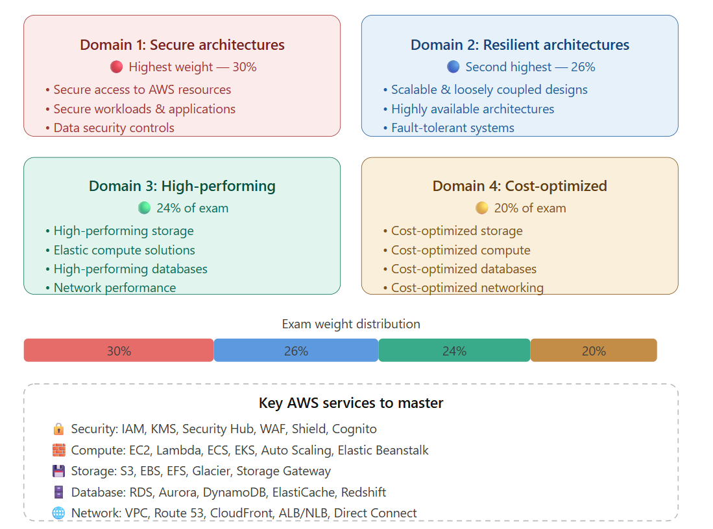
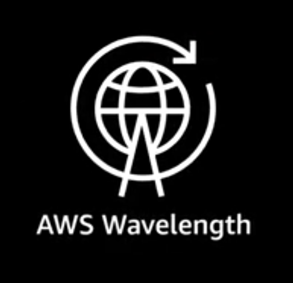
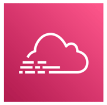
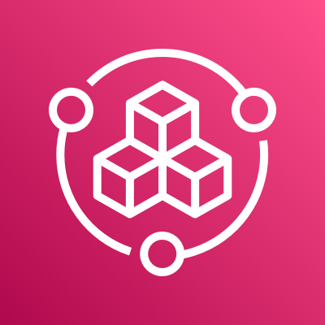
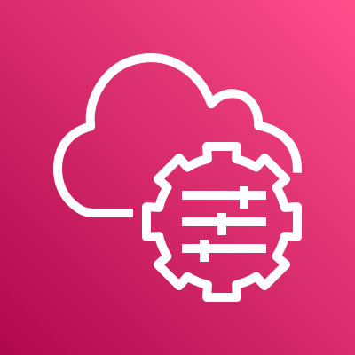
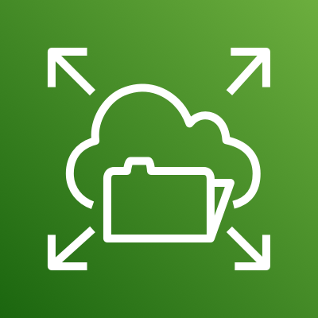
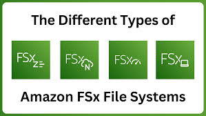

# AWS Certified Solutions Architect Associate SAA-C03 Reference Guide

This repository contains a **comprehensive reference guide and quick study notes** for the **AWS Certified Solutions Architect – Associate SAA-C03** certification exam.

The goal of this repository is to provide a **concise, structured, and practical reference** for developers, architects, and cloud engineers preparing for the exam.

It includes key AWS services, architecture patterns, security concepts, and best practices aligned with the **AWS Well-Architected Framework**.

## Table of Contents

* Overview
* Exam Overview
* Exam Domains
* AWS Core Services
* Architecture Patterns
* Security Best Practices
* Storage Services
* Compute Services
* Networking
* Databases
* Serverless Architecture
* Monitoring & Logging
* Cost Optimization
* High Availability & Disaster Recovery
* Study Tips
* Useful Resources

## Overview

The **AWS Certified Solutions Architect – Associate** certification validates your ability to design distributed systems and scalable architectures on AWS. ([AWS Documentation][2])

This certification focuses on designing solutions that are:

* Secure
* Highly available
* Fault tolerant
* Scalable
* Cost optimized

Solutions architects must evaluate trade-offs and choose the most appropriate AWS services for different use cases. ([CloudFluently][3])

## Exam Overview

| Attribute              | Details                                          |
| ---------------------- | ------------------------------------------------ |
| Exam Name              | AWS Certified Solutions Architect – Associate    |
| Exam Code              | SAA-C03                                          |
| Duration               | 130 minutes                                      |
| Questions              | ~65 (50 scored, 15 unscored)                     |
| Passing Score          | 720 / 1,000 (Scaled score)                       |
| Format                 | Multiple Choice & Multiple Response              |
| Recommended Experience | 1+ year hands-on AWS experience                  |
| Cost                   | $150 USD                                         |
| Delivery               | Testing center or Online proctored (Pearson VUE) |

The exam primarily tests **real-world architectural design scenarios** rather than theoretical knowledge. ([aabiance.com][4])


## Exam Domains

The exam is divided into four major domains:



These domains represent the core competencies required for designing solutions on AWS. ([AWS Documentation][5])

## Core AWS Services (In-scope AWS services and features)

### Analytics

* Amazon Athena
* AWS Data Exchange
* Amazon Data Firehose
* Amazon EMR
* AWS Glue
* Amazon Kinesis
* AWS Lake Formation
* Amazon Managed Streaming for Apache Kafka (Amazon MSK)
* Amazon OpenSearch Service
* Amazon QuickSuite
* Amazon Redshift

### Application Integration

* Amazon AppFlow
* AWS AppSync
* Amazon EventBridge
* Amazon MQ
* Amazon SNS
* Amazon SQS
* AWS Step Functions

### AWS Cost Management

* [AWS Budgets](#aws-budgets)
* AWS Cost and Usage Report
* AWS Cost Explorer
* Savings Plans

### Compute

* [AWS Batch](#aws-batch)
* [Amazon EC2](#amazon-ec2-elastic-compute-cloud)
* [Amazon EC2 Auto Scaling](#amazon-ec2-auto-scaling)
* [AWS Elastic Beanstalk](#aws-elastic-beanstalk)
* [AWS Outposts](#aws-outposts)
* [AWS Serverless Application Repository](#aws-serverless-application-repository-sar)
* [VMware Cloud on AWS](#vmware-cloud-on-aws)
* [AWS Wavelength](#aws-wavelength)

### Containers

* Amazon ECR
* Amazon ECS
* Amazon ECS Anywhere
* Amazon EKS
* Amazon EKS Anywhere
* Amazon EKS Distro

### Database

* Amazon Aurora
* Amazon Aurora Serverless
* Amazon DocumentDB
* Amazon DynamoDB
* Amazon ElastiCache
* Amazon Keyspaces
* Amazon Neptune
* Amazon RDS
* Amazon Redshift

### Developer Tools

AWS X-Ray

### Front-End Web and Mobile

* AWS Amplify
* Amazon API Gateway
* AWS Device Farm

### Machine Learning

* Amazon Comprehend
* Amazon Kendra
* Amazon Lex
* Amazon Polly
* Amazon Rekognition
* Amazon SageMaker AI
* Amazon Textract
* Amazon Transcribe
* Amazon Translate

### Management and Governance

*  [AWS Auto Scaling](#aws-auto-scaling)
*  [AWS CLI](#aws-cli-command-line-interface)
*  [AWS CloudFormation](#aws-cloudformation)
*  [AWS CloudTrail](#aws-cloudtrail)
*  [Amazon CloudWatch](#amazon-cloudwatch)
*  [AWS Compute Optimizer](#aws-compute-optimizer)
*  [AWS Config](#aws-config)
*  [AWS Control Tower](#aws-control-tower)
*  [AWS Health Dashboard](#aws-health-dashboard)
*  [AWS License Manager](#aws-license-manager)
*  [Amazon Managed Grafana](#amazon-managed-grafana)
*  [Amazon Managed Service for Prometheus](#amazon-managed-service-for-prometheus-amp)
*  [AWS Management Console](#aws-management-console)
*  [AWS Organizations](#aws-organizations)
*  [AWS Service Catalog](#aws-service-catalog)
*  [AWS Systems Manager](#aws-systems-manager-ssm)
*  [AWS Trusted Advisor](#aws-trusted-advisor)
*  [AWS Well-Architected Tool](#aws-well-architected-tool)

### Media Services

* Amazon Elastic Transcoder
* Amazon Kinesis Video Streams

### Migration and Transfer

* AWS Application Migration Service
* AWS DataSync
* AWS DMS
* AWS Snow Family
* AWS Transfer Family

### Networking and Content Delivery

* AWS Client VPN
* Amazon CloudFront
* AWS Direct Connect
* Elastic Load Balancing (ELB)
* AWS Global Accelerator
* AWS PrivateLink
* Amazon Route 53
* AWS Site-to-Site VPN
* AWS Transit Gateway
* Amazon VPC

### Security, Identity, and Compliance

* AWS Artifact
* AWS Audit Manager
* AWS Certificate Manager (ACM)
* AWS CloudHSM
* Amazon Cognito
* Amazon Detective
* AWS Directory Service
* AWS Firewall Manager
* Amazon GuardDuty
* AWS IAM Identity Center
* Amazon Inspector
* AWS KMS
* Amazon Macie
* AWS Network Firewall
* AWS Resource Access Manager (AWS RAM)
* AWS Secrets Manager
* AWS Security Hub
* AWS Shield
* AWS WAF
* [IAM](#IAM)

### Serverless

* AWS AppSync
* AWS Fargate
* AWS Lambda

### [Storage](#storage-services)

* [AWS Backup](#aws-backup)
* [Amazon EBS](#amazon-ebs-elastic-block-store)
* [Amazon EFS](#amazon-efs-elastic-file-system)
* [Amazon FSx (for all types)](#amazon-fsx-all-types)
* [Amazon S3](#amazon-s3-simple-storage-service)
* [Amazon S3 Glacier](#amazon-s3-glacier)
* [AWS Storage Gateway](#aws-storage-gateway)

<details>
  <summary>Out-of-scope AWS services and features</summary>
  
### Application Integration
* Amazon Managed Workflows for Apache Airflow (Amazon MWAA)
### AR and VR
* Amazon Sumerian
### Blockchain
* Amazon Managed Blockchain
### Compute
* Amazon Lightsail
### Database
* Amazon RDS on VMware
### Developer Tools
* AWS CDK
* AWS CloudShell
* AWS CodeArtifact
* AWS CodeBuild
* AWS CodeCommit
* AWS CodeDeploy
* Amazon Corretto
* AWS Fault Injection Simulator (AWS FIS)
* AWS Tools and SDKs
### Front-End Web and Mobile
* Amazon Location Service
### Game Tech
* Amazon GameLift
### Internet of Things
* All services
### Machine Learning
* Apache MXNet on AWS
* Amazon Augmented AI (Amazon A2I)
* AWS DeepComposer
* AWS Deep Learning AMIs (DLAMI)
* AWS Deep Learning Containers
* Amazon DevOps Guru
* Amazon Elastic Inference
* Amazon HealthLake
* AWS Inferentia
* Amazon Personalize
* PyTorch on AWS
* Amazon SageMaker Canvas
* Amazon SageMaker Ground Truth
* TensorFlow on AWS
### Management and Governance
* AWS Console Mobile Application
* AWS Distro for OpenTelemetry
### Media Services
* AWS Elemental Appliances and Software
* AWS Elemental MediaConnect
* AWS Elemental MediaConvert
* AWS Elemental MediaLive
* AWS Elemental MediaPackage
* AWS Elemental MediaTailor
* Amazon Interactive Video Service (Amazon IVS)
### Migration and Transfer
* Migration Evaluator
### Networking and Content Delivery
* AWS Cloud Map
### Quantum Technologies
* Amazon Braket
### Satellite
* AWS Ground Station

</details>


### IAM

xxx

### AWS CLI

xxx

### AWS Budgets

---

### Compute Services

#### AWS Batch

##### What It Is
A **fully managed batch processing service** that dynamically provisions compute resources (EC2 or Spot) to run batch jobs at any scale — no infrastructure management needed.


##### Core Components

| Component | Description |
|---|---|
| **Job** | Unit of work (shell script, Docker container, executable) |
| **Job Definition** | Blueprint for a job (Docker image, CPU, memory, IAM role) |
| **Job Queue** | Jobs submitted here; associated with compute environments |
| **Compute Environment** | Managed or unmanaged EC2/Fargate resources that run jobs |

##### Architecture
```
┌─────────────────────────────────────────────────────────────────┐
│                        AWS Batch Flow                            │
│                                                                   │
│  Developer                                                        │
│     │                                                             │
│     ▼                                                             │
│  ┌──────────────┐     ┌──────────────┐     ┌──────────────────┐  │
│  │ Job          │────▶│  Job Queue   │────▶│ Compute          │  │
│  │ Definition   │     │  (Priority)  │     │ Environment      │  │
│  │ (Docker/ECS) │     └──────────────┘     │                  │  │
│  └──────────────┘                           │ ┌─────────────┐ │  │
│                                             │ │  EC2 / Spot │ │  │
│                                             │ │  Instances  │ │  │
│                                             │ └─────────────┘ │  │
│                                             │ ┌─────────────┐ │  │
│                                             │ │  Fargate    │ │  │
│                                             │ └─────────────┘ │  │
│                                             └──────────────────┘  │
└─────────────────────────────────────────────────────────────────┘
```

##### Managed vs Unmanaged Compute Environments
| Type | AWS Manages | You Manage |
|---|---|---|
| **Managed** | Provisioning, scaling, termination | Job definitions, queues |
| **Unmanaged** | Nothing | You provision and manage instances |

#### Exam Key Points
- **AWS Batch vs Lambda**: Batch = long-running jobs (no time limit), Lambda = short functions (15 min max)
- **Spot Instances** support — great for cost-optimized batch; jobs are retried on interruption
- **Multi-node parallel jobs** — tightly coupled HPC using MPI
- Jobs run as **Docker containers** on ECS under the hood
- **AWS Batch on Fargate** — serverless compute, no EC2 management
- Supports **job dependencies** — Job B starts only after Job A completes
- **Use when**: ETL pipelines, ML training, genomics, financial risk modeling

#### Amazon EC2 (Elastic Compute Cloud)

##### What It Is
**Virtual servers** in the cloud. The foundational AWS compute service — full control over OS, networking, storage, and software.


##### Instance Families

```
┌────────────────────────────────────────────────────────────────────┐
│                    EC2 Instance Families                            │
├────────────┬──────────────────┬────────────────────────────────────┤
│  Family    │  Optimized For   │  Examples / Use Cases              │
├────────────┼──────────────────┼────────────────────────────────────┤
│  General   │  Balanced        │  t3, t4g, m5, m6i                  │
│  Purpose   │  CPU/Mem/Net     │  Web servers, app servers, dev     │
├────────────┼──────────────────┼────────────────────────────────────┤
│  Compute   │  High CPU        │  c5, c6g, c7g                      │
│  Optimized │                  │  HPC, batch, gaming, ML inference  │
├────────────┼──────────────────┼────────────────────────────────────┤
│  Memory    │  High RAM        │  r5, r6g, x1, z1d                  │
│  Optimized │                  │  In-memory DB, SAP HANA, Redis     │
├────────────┼──────────────────┼────────────────────────────────────┤
│  Storage   │  High Disk I/O   │  i3, i4i, d2, h1                   │
│  Optimized │  or throughput   │  OLTP, NoSQL, data warehousing     │
├────────────┼──────────────────┼────────────────────────────────────┤
│  Accel.    │  GPU / FPGA      │  p3, p4, g4, inf1, trn1            │
│  Computing │                  │  ML training, video encoding       │
└────────────┴──────────────────┴────────────────────────────────────┘
```

##### Purchasing Options

| Option | Payment | Discount | Best For |
|---|---|---|---|
| **On-Demand** | Per hour/second | None (baseline) | Short-term, unpredictable |
| **Reserved (1 or 3 yr)** | Upfront/partial/no | Up to 72% | Steady-state workloads |
| **Savings Plans** | Commit to $/hr | Up to 72% | Flexible instance types |
| **Spot** | Bid market price | Up to 90% | Fault-tolerant, flexible |
| **Dedicated Host** | Per host | Varies | Licensing, compliance (BYOL) |
| **Dedicated Instance** | Per instance | Varies | Isolated hardware (no BYOL) |
| **Capacity Reservations** | On-Demand rate | None | Guaranteed capacity in AZ |

##### Reserved Instance Types
| Type | Flexibility | Use Case |
|---|---|---|
| **Standard RI** | Locked to instance type/region | Max discount, predictable |
| **Convertible RI** | Can change instance family/OS | Lower discount, more flexible |
| **Scheduled RI** | Reserved for specific time windows | Predictable recurring jobs |

##### EC2 Instance Lifecycle
```
         Pending ──▶ Running ──▶ Stopping ──▶ Stopped
                        │                        │
                        │◀───────────────────────┘
                        │
                        ▼
                    Shutting-down ──▶ Terminated
```

##### Placement Groups
| Type | Description | Use Case |
|---|---|---|
| **Cluster** | Same rack, same AZ | Low latency HPC, 10 Gbps |
| **Spread** | Different hardware per instance (max 7/AZ) | Critical instances, HA |
| **Partition** | Groups of instances on separate partitions | Hadoop, Kafka, Cassandra |

##### AMI (Amazon Machine Image)
- Blueprint for an EC2 instance (OS + software + config)
- **Region-specific** — copy to other regions as needed
- Types: AWS-provided, AWS Marketplace, Custom (your own)

##### User Data & Metadata
- **User Data**: Bootstrap script run at first launch (install packages, configure software)
- **Instance Metadata**: `http://169.254.169.254/latest/meta-data/` — instance info available from within
- **IMDSv2**: Session-oriented, more secure — enforce via instance metadata options

##### Exam Key Points
- **Spot Instance interruption**: 2-minute warning via instance metadata/CloudWatch Events
- **Spot Fleet**: Mix of Spot + On-Demand; maintains target capacity
- **Hibernate**: Saves RAM to EBS; must be enabled at launch; root volume must be encrypted
- **Burstable instances (T-series)**: Use CPU credits; `unlimited` mode allows sustained burst
- **Dedicated Host vs Dedicated Instance**: Host = per-host billing + BYOL; Instance = per-instance, no BYOL
- **EC2 Instance Connect**: Browser-based SSH without managing SSH keys
- **Nitro System**: Newer instance types (C5, M5+) — better performance, enhanced networking

#### Amazon EC2 Auto Scaling

##### What It Is
**Automatically adjusts** the number of EC2 instances in response to demand, maintaining performance and minimizing cost.


##### Architecture
```
┌─────────────────────────────────────────────────────────────────────┐
│                    EC2 Auto Scaling Group                            │
│                                                                       │
│   CloudWatch Alarm                                                    │
│   (CPU > 70%)  ──▶  Scaling Policy  ──▶  Launch Template            │
│                                                     │                │
│          Min: 2        Desired: 4       Max: 10     │                │
│          ┌──┐          ┌──┐ ┌──┐        ┌──┐        │                │
│   AZ-1a  │EC2│         │EC2│ │EC2│       │EC2│◀───────┘                │
│          └──┘          └──┘ └──┘        └──┘        new instance     │
│   AZ-1b  ┌──┐                                                        │
│          │EC2│                                                        │
│          └──┘                                                        │
│                                                                       │
│          └──────────── Load Balancer (ALB/NLB) ──────────────┘       │
└─────────────────────────────────────────────────────────────────────┘
```

##### Scaling Policies

| Policy | How It Works | Use Case |
|---|---|---|
| **Simple Scaling** | Single adjustment when alarm triggers; cooldown period | Basic scaling |
| **Step Scaling** | Bigger adjustments for bigger alarm breaches | Variable load |
| **Target Tracking** | Maintain a target metric (e.g., 50% CPU) | Most common, recommended |
| **Scheduled Scaling** | Scale at known times | Predictable patterns |
| **Predictive Scaling** | ML-based forecast + proactive scaling | Cyclical traffic |

##### Launch Template vs Launch Configuration
| Feature | Launch Template (Recommended) | Launch Configuration (Legacy) |
|---|---|---|
| Versioning | ✅ | ❌ |
| Multiple instance types | ✅ | ❌ |
| Spot + On-Demand mix | ✅ | ❌ |
| T2/T3 Unlimited | ✅ | ❌ |

##### Lifecycle Hooks
```
  Launch: Pending ──▶ Pending:Wait ──▶ Pending:Proceed ──▶ InService
  Terminate: Terminating ──▶ Terminating:Wait ──▶ Terminating:Proceed ──▶ Terminated
```
- Pause instance in wait state to perform custom actions (install software, drain connections)
- Default wait: 1 hour; send heartbeat to extend

##### Health Checks
| Type | Source | Use Case |
|---|---|---|
| **EC2** (default) | Instance status checks | Basic health |
| **ELB** | Load balancer health checks | Web/app tier |
| **Custom** | Lambda/CloudWatch | Application-level |

##### Exam Key Points
- **Cooldown period**: Prevents rapid scale-in/out after a scaling activity (default 300s)
- **Warm-up period**: New instances don't count toward metrics until warmed up
- **Default termination policy**: Terminates oldest launch configuration first, then in AZ with most instances
- **ASG spans multiple AZs** — balances instances across AZs automatically
- **Instance Refresh**: Rolling replacement of instances (e.g., after AMI update) with configurable min healthy %
- ASG integrates with **ALB/NLB** — auto-registers/deregisters instances
- **Scale-in protection**: Prevent specific instances from being terminated during scale-in


#### AWS Elastic Beanstalk

##### What It Is
A **Platform as a Service (PaaS)** that handles infrastructure provisioning, deployment, scaling, and monitoring — you just upload your code.


 

##### Architecture
```
┌──────────────────────────────────────────────────────────────────┐
│                   Elastic Beanstalk Application                   │
│                                                                    │
│  Developer ──▶  Upload Code (ZIP/WAR/Docker)                      │
│                       │                                            │
│                       ▼                                            │
│  ┌────────────────────────────────────────────────────────────┐   │
│  │              Beanstalk Environment                          │   │
│  │                                                             │   │
│  │  ┌─────────────────┐      ┌──────────────────────────────┐ │   │
│  │  │  Load Balancer  │      │  Auto Scaling Group          │ │   │
│  │  │  (ALB/NLB/CLB)  │─────▶│  EC2 Instances               │ │   │
│  │  └─────────────────┘      └──────────────────────────────┘ │   │
│  │                                                             │   │
│  │  ┌─────────────────┐      ┌──────────────────────────────┐ │   │
│  │  │  RDS (optional) │      │  CloudWatch Monitoring       │ │   │
│  │  └─────────────────┘      └──────────────────────────────┘ │   │
│  └────────────────────────────────────────────────────────────┘   │
└──────────────────────────────────────────────────────────────────┘
```

##### Supported Platforms
- **Languages**: Node.js, Java, .NET, PHP, Python, Ruby, Go
- **Containers**: Docker (single/multi-container)
- **Web servers**: Tomcat, Passenger, Puma, IIS

##### Environment Tiers
| Tier | Use Case | Underlying |
|---|---|---|
| **Web Server** | Handles HTTP requests | ALB + ASG + EC2 |
| **Worker** | Background jobs from SQS | SQS + ASG + EC2 |

##### Deployment Policies
| Policy | Downtime | Extra Cost | Rollback Speed |
|---|---|---|---|
| **All at once** | Yes (brief) | None | Manual re-deploy |
| **Rolling** | No | None | Manual re-deploy |
| **Rolling with additional batch** | No | Yes (extra batch) | Manual re-deploy |
| **Immutable** | No | Yes (double fleet) | Fast (swap ASG) |
| **Blue/Green** | No | Yes (2 environments) | Instant (DNS swap) |
| **Traffic splitting** | No | Yes | Automatic |

##### .ebextensions
- Configuration files in `.ebextensions/` folder (YAML/JSON)
- Customize and configure the Beanstalk environment
- Example: install packages, set env variables, configure nginx

##### Exam Key Points
- **Free service** — you only pay for the underlying resources (EC2, RDS, ELB)
- **Full control of EC2 instances** — access the servers if needed (unlike Lambda)
- **Immutable deployment** = safest; new instances deployed, then swapped — best for production
- **Blue/Green** = two separate environments; Route 53/CNAME swap
- **Managed Platform Updates**: Beanstalk can auto-apply platform patches
- Store database **outside** Beanstalk environment — RDS in Beanstalk is deleted when environment is deleted
- **Use when**: developers want to deploy without managing infrastructure (PaaS)

#### AWS Outposts

##### What It Is
AWS **rack-delivered infrastructure** installed in your on-premises data center, running native AWS services locally with full AWS API compatibility.


##### Architecture
```
┌───────────────────────────────────────────────────────────────────┐
│                          Your Data Center                          │
│                                                                    │
│  ┌──────────────────────────────────────────────────────────┐     │
│  │                    AWS Outpost Rack                       │     │
│  │                                                           │     │
│  │  ┌──────────┐  ┌──────────┐  ┌──────────┐  ┌─────────┐  │     │
│  │  │  EC2     │  │  EBS     │  │  S3      │  │  RDS    │  │     │
│  │  │  Compute │  │  Storage │  │ (Local)  │  │ (Local) │  │     │
│  │  └──────────┘  └──────────┘  └──────────┘  └─────────┘  │     │
│  │                                                           │     │
│  └──────────────────────────────────────────────────────────┘     │
│                           │  Service Link (VPN)                   │
└───────────────────────────┼───────────────────────────────────────┘
                            │
                    ┌───────▼──────────┐
                    │   AWS Region     │
                    │ (control plane,  │
                    │  IAM, Console)   │
                    └──────────────────┘
```

##### Form Factors
| Form Factor | Description |
|---|---|
| **Outpost Rack** | Full 42U rack; delivered and installed by AWS |
| **Outpost Servers** | 1U/2U server; smaller footprint for branch offices |

##### Supported Services on Outposts
- EC2, EBS, S3 (Outposts), RDS, EKS, ECS, ElastiCache, EMR, ALB

##### Connectivity
- **Service Link**: Private VPN connection back to AWS Region (required for management)
- **Local Gateway (LGW)**: Connects Outpost to on-premises network

##### Exam Key Points
- **Low latency** for on-premises applications that need AWS services locally
- **Data residency** — data stays on-premises for regulatory requirements
- AWS owns and manages the hardware; you provide power, space, and network
- **Outposts is an extension of your VPC** — same subnet, security groups, IAM
- Requires reliable **network connectivity** back to AWS Region (Service Link)
- **Use when**: data sovereignty, ultra-low latency on-prem, hybrid cloud


#### AWS Serverless Application Repository (SAR)

##### What It Is
A **managed repository** for pre-built serverless applications and components. Discover, deploy, and share serverless apps built with AWS SAM.


##### Architecture
```
┌──────────────────────────────────────────────────────────────────┐
│              AWS Serverless Application Repository               │
│                                                                    │
│  Publisher (Developer)              Consumer (You)                │
│  ┌─────────────────┐                ┌─────────────────────────┐  │
│  │  SAM Template   │                │ Browse / Search Apps    │  │
│  │  + Code         │──── Publish ──▶│                         │  │
│  │  + Policies     │                │ Deploy with 1-click     │  │
│  └─────────────────┘                │         │               │  │
│                                     └─────────┼───────────────┘  │
│                                               ▼                   │
│                                    ┌─────────────────────────┐   │
│                                    │  CloudFormation Stack   │   │
│                                    │  (Lambda, API GW, etc.) │   │
│                                    └─────────────────────────┘   │
└──────────────────────────────────────────────────────────────────┘
```

##### Key Concepts
| Concept | Description |
|---|---|
| **SAM (Serverless Application Model)** | Framework to define serverless apps (extension of CloudFormation) |
| **Application** | Package of Lambda functions, event sources, APIs, and other resources |
| **Publish** | Share your app publicly or privately within your org |
| **Nested Applications** | Use SAR apps as components inside larger SAM templates |

##### Exam Key Points
- Applications published to SAR are **packaged as SAM templates**
- Can be **public** (shared with everyone) or **private** (within AWS account/org)
- Enables **code reuse** across teams and projects
- Integrates with **CloudFormation** for deployment
- **Use when**: quickly deploying common serverless patterns (image resizing, API backends, chatbots)
- Not heavily tested on SAA-C03 — understand the concept and purpose

#### VMware Cloud on AWS

##### What It Is
A jointly developed service by **AWS and VMware** that lets you run VMware workloads on AWS infrastructure without changing VMware tools, skills, or processes.

##### Architecture
```
┌───────────────────────────────────────────────────────────────────┐
│                        AWS Region                                  │
│                                                                    │
│  ┌───────────────────────────────┐    ┌──────────────────────┐   │
│  │    VMware Cloud on AWS SDDC   │    │   Native AWS         │   │
│  │    (Software-Defined DC)      │◀──▶│   Services           │   │
│  │                               │    │                      │   │
│  │  ┌──────────┐  ┌──────────┐   │    │   S3, RDS, Lambda    │   │
│  │  │ vSphere  │  │  vSAN    │   │    │   DynamoDB, etc.     │   │
│  │  │ (Compute)│  │(Storage) │   │    │                      │   │
│  │  └──────────┘  └──────────┘   │    └──────────────────────┘   │
│  │  ┌──────────┐  ┌──────────┐   │                               │
│  │  │  NSX-T   │  │  HCX     │   │                               │
│  │  │(Network) │  │(Migrate) │   │                               │
│  │  └──────────┘  └──────────┘   │                               │
│  └───────────────────────────────┘                               │
│                                                                    │
│  On-Premises VMware ──── HCX ──────────────────────────────────▶ │
└───────────────────────────────────────────────────────────────────┘
```

##### Key Concepts
| Concept | Description |
|---|---|
| **SDDC** | Software-Defined Data Center — the VMware environment on AWS |
| **vSphere** | VMware virtualization platform (VMs) |
| **vSAN** | VMware storage (runs on bare-metal AWS hosts) |
| **NSX-T** | VMware networking and security |
| **HCX** | VMware Hybrid Cloud Extension — live migration of VMs to/from AWS |

##### Exam Key Points
- Runs on **dedicated bare-metal AWS infrastructure** (i3 or i3en instances)
- **No re-platforming needed** — use same VMware tools (vCenter, vSphere, NSX)
- Ideal for **data center extension**, **disaster recovery**, and **cloud migration**
- Access native AWS services (S3, RDS) directly from VMware workloads
- **HCX** enables **live, in-place migration** of VMs with minimal downtime
- Managed by VMware — no need for VMware expertise changes
- **Use when**: organizations have heavy VMware investment and want to extend to cloud


#### AWS Wavelength

##### What It Is
Embeds AWS compute and storage services **within 5G telecommunications networks** at the edge — enabling ultra-low latency applications for mobile devices.



##### Architecture
```
┌──────────────────────────────────────────────────────────────────────┐
│                        AWS Wavelength                                 │
│                                                                        │
│  Mobile Device                                                         │
│  (5G Phone/IoT)                                                        │
│       │                                                                │
│       │ 5G Radio                                                       │
│       ▼                                                                │
│  ┌──────────────────────────────┐                                     │
│  │   Telecom Provider 5G        │                                     │
│  │   Network (Verizon, Vodafone)│                                     │
│  │                              │                                     │
│  │   ┌──────────────────────┐   │         ┌───────────────────┐      │
│  │   │  Wavelength Zone     │   │◀───────▶│   AWS Region      │      │
│  │   │  (Edge Compute)      │   │         │                   │      │
│  │   │  EC2, EBS, VPC       │   │         │   S3, DynamoDB    │      │
│  │   └──────────────────────┘   │         │   RDS, etc.       │      │
│  └──────────────────────────────┘         └───────────────────┘      │
│                                                                        │
│  Latency: ~1ms (device to Wavelength Zone)                            │
└──────────────────────────────────────────────────────────────────────┘
```

##### Key Concepts
| Concept | Description |
|---|---|
| **Wavelength Zone** | AWS infrastructure deployed inside telecom provider's 5G network |
| **Carrier Gateway** | Connects Wavelength Zone to telecom network and internet |
| **Carrier IP** | IP address assigned from telecom's pool for direct mobile access |

##### Telecom Partners
- Verizon (USA), Vodafone (Europe), KDDI (Japan), SK Telecom (South Korea)

##### Exam Key Points
- Designed for **single-digit millisecond latency** to 5G devices
- **Wavelength Zone is an extension of your VPC** — same subnets, security groups, IAM
- Traffic goes: Device → 5G network → Wavelength Zone → (if needed) → AWS Region
- **No data leaves the telecom network** to reach the Wavelength Zone
- **Use cases**: connected vehicles, AR/VR, real-time gaming, live video streaming, IoT
- Similar concept to **Local Zones** but specifically for **telecom/5G** networks
- **Local Zones** = low latency in a metro area; **Wavelength** = low latency over 5G

---

#### Quick Comparison: When to Use What - Compute service

| Scenario | Service |
|---|---|
| Full control over servers, OS, networking | **Amazon EC2** |
| Auto-scale EC2 fleet based on demand | **EC2 Auto Scaling** |
| Deploy web app without managing infrastructure | **Elastic Beanstalk** |
| Run batch processing / HPC jobs | **AWS Batch** |
| Run VMware workloads on AWS | **VMware Cloud on AWS** |
| Run AWS services in your own data center | **AWS Outposts** |
| Ultra-low latency apps on 5G networks | **AWS Wavelength** |
| Deploy pre-built serverless applications | **Serverless Application Repository** |


#### Common Exam Traps - Compute service

1. **Elastic Beanstalk is free** — you pay only for underlying resources (EC2, ELB, RDS)
2. **Beanstalk Immutable** ≠ Blue/Green — Immutable replaces instances within same env; Blue/Green swaps entire environments via DNS
3. **Don't put RDS inside Beanstalk** — it will be deleted when environment is deleted; always keep RDS external
4. **EC2 Spot 2-minute warning** — not guaranteed for all interruptions; design fault-tolerant workloads
5. **Dedicated Host vs Dedicated Instance** — Host = per-host billing + BYOL; Instance = per-instance billing, NO BYOL
6. **Launch Template > Launch Configuration** — Launch Configurations are legacy; always use Launch Templates
7. **Target Tracking Scaling** is the recommended/default policy — not Simple Scaling
8. **Auto Scaling cooldown** prevents thrashing; warm-up period is for new instances joining the group
9. **Outposts requires connectivity** to AWS Region via Service Link — it's NOT standalone
10. **Wavelength ≠ Local Zones** — Wavelength is specifically for 5G carrier networks; Local Zones are metro edge
11. **AWS Batch** jobs have **no time limit** — unlike Lambda (15 min max); use Batch for long-running jobs
12. **Placement Group Spread** — max **7 instances per AZ** per group; hard limit

---

### Management and Governance

#### AWS Auto Scaling

##### What It Is
A **unified scaling service** that manages scaling for multiple AWS resources beyond just EC2 — including DynamoDB, ECS, Aurora, and more — from a single interface.


> ⚠️ **AWS Auto Scaling ≠ EC2 Auto Scaling**
> - **EC2 Auto Scaling** = manages EC2 instance fleets only
> - **AWS Auto Scaling** = orchestrates scaling across multiple resource types using Scaling Plans

##### Supported Resources
| Resource | Scaling Dimension |
|---|---|
| EC2 Auto Scaling Groups | Instance count |
| ECS Services | Task count |
| DynamoDB Tables/Indexes | Read/Write capacity units |
| Aurora Read Replicas | Replica count |
| Spot Fleet Requests | Instance count |

##### Scaling Plans
- **Dynamic Scaling**: Responds to live CloudWatch metrics
- **Predictive Scaling**: Uses ML to forecast demand and scale proactively
- **Target Tracking**: Maintain a specific resource utilization target (e.g., 60% CPU)

##### Exam Key Points 
- Use **AWS Auto Scaling** when you need to scale **multiple resource types together**
- **Predictive Scaling** is key differentiator — proactive, not reactive
- Works with **Application Auto Scaling** API under the hood for non-EC2 resources
- Integrates with **CloudWatch** for metrics and **Cost Explorer** for cost-aware scaling

#### AWS CLI (Command Line Interface)

##### What It Is
A **unified tool** to control AWS services from the command line. Automate and script any AWS operation.

##### Key Concepts

```
┌──────────────────────────────────────────────────────────────┐
│                    AWS CLI Structure                          │
│                                                              │
│   aws  <service>  <operation>  [options]  [parameters]       │
│    │       │           │                                     │
│    │       │           └── describe-instances, create-bucket │
│    │       └── ec2, s3, iam, cloudformation, lambda          │
│    └── Entry point                                           │
│                                                              │
│  Example:                                                    │
│  aws s3 cp file.txt s3://my-bucket/                          │
│  aws ec2 describe-instances --region us-east-1               │
│  aws cloudformation deploy --template-file stack.yaml        │
└──────────────────────────────────────────────────────────────┘
```

##### Authentication & Configuration
| Config File | Location | Purpose |
|---|---|---|
| `~/.aws/credentials` | Local machine | Access key ID + Secret key |
| `~/.aws/config` | Local machine | Region, output format, profiles |

```bash
# Configure CLI
aws configure
# Outputs: access key, secret key, region, output format

# Named profiles
aws configure --profile prod
aws s3 ls --profile prod

# Use IAM role (on EC2 — no keys needed)
# Instance Profile automatically provides credentials
```

##### CLI v2 Features
- **AWS SSO integration** — `aws sso login`
- **Auto-prompt** — `aws --cli-auto-prompt`
- **Wizards** — guided setup for complex services
- **Paginators** — auto-paginate large result sets

##### Output Formats
| Format | Use Case |
|---|---|
| `json` (default) | Programmatic parsing |
| `yaml` | Human-readable structured |
| `text` | Shell scripting |
| `table` | Human-readable display |

##### Exam Key Points
- **Never store access keys on EC2** — use **IAM Instance Profiles / Roles** instead
- **Credential chain order**: CLI flags → Env vars → `~/.aws/credentials` → Instance Profile → Container role → IAM Role
- `--dry-run` flag — checks permissions without executing (useful for IAM testing)
- `--query` flag — JMESPath filter for output (e.g., `--query 'Instances[*].InstanceId'`)
- CLI on **EC2** automatically uses **instance metadata** for credentials — no keys needed
- CLI is a **thin wrapper** over the AWS REST APIs


#### AWS CloudFormation

##### What It Is
**Infrastructure as Code (IaC)** — model, provision, and manage AWS resources using declarative YAML/JSON templates.


##### Architecture & Concepts
```
┌──────────────────────────────────────────────────────────────────────┐
│                    CloudFormation Workflow                            │
│                                                                       │
│  Template (YAML/JSON)                                                 │
│  ┌────────────────────────────────────────────────────────────────┐  │
│  │  AWSTemplateFormatVersion │ Description │ Metadata             │  │
│  │  Parameters  │  Mappings  │  Conditions │  Transform           │  │
│  │  Resources (REQUIRED)     │  Outputs                           │  │
│  └────────────────────────────────────────────────────────────────┘  │
│                │                                                       │
│                ▼                                                       │
│  ┌─────────────────────┐   Create/Update/Delete                       │
│  │   CloudFormation    │──────────────────────────▶  AWS Resources    │
│  │   Stack             │                             (EC2, S3, RDS…)  │
│  └─────────────────────┘                                              │
└──────────────────────────────────────────────────────────────────────┘
```

##### Template Sections
| Section | Required | Description |
|---|---|---|
| `AWSTemplateFormatVersion` | No | Template version (always `2010-09-09`) |
| `Description` | No | Template description string |
| `Parameters` | No | Input values at stack creation |
| `Mappings` | No | Key-value lookup tables (e.g., AMI by region) |
| `Conditions` | No | Conditional resource creation |
| `Transform` | No | Macros (e.g., `AWS::Serverless-2016-10-31` for SAM) |
| `Resources` | **YES** | AWS resources to create — only required section |
| `Outputs` | No | Values to export or display after stack creation |

##### Key Features

###### Stacks & StackSets
| Feature | Description |
|---|---|
| **Stack** | Single deployment unit of a template in one account/region |
| **StackSets** | Deploy stacks across **multiple accounts and regions** simultaneously |
| **Nested Stacks** | Stacks that reference other stacks (modularity/reuse) |
| **Stack Sets + Org** | Auto-deploy to new accounts joining AWS Organization |

###### Change Sets
- Preview **what will change** before executing an update
- Identifies resource replacements (destructive changes)

###### Drift Detection
- Detect if deployed resources were **manually modified** outside CloudFormation
- Reports configuration drift per resource

###### CloudFormation Rollback
- On failure: automatically rolls back to last known good state
- Can disable rollback for debugging

##### Intrinsic Functions
| Function | Purpose |
|---|---|
| `!Ref` | Reference parameter or resource |
| `!GetAtt` | Get attribute of resource (e.g., ARN, URL) |
| `!Sub` | String substitution |
| `!Join` | Concatenate values |
| `!Select` | Select item from list |
| `!If` | Conditional value |
| `!ImportValue` | Import output from another stack |

##### Exam Key Points 
- **Resources** is the only mandatory section
- **`DeletionPolicy: Retain`** — preserves resource when stack is deleted
- **`DeletionPolicy: Snapshot`** — takes snapshot before deleting (EBS, RDS)
- **Stack Outputs + `!ImportValue`** = cross-stack references (loose coupling)
- **StackSets** require a **trusted account** (admin) and **target accounts**
- **CloudFormation Helper Scripts** (`cfn-init`, `cfn-signal`, `cfn-hup`) for EC2 bootstrapping
- **CreationPolicy + WaitCondition** — pause stack creation until EC2 signals ready
- **`AWS::CloudFormation::Init`** — declarative EC2 instance configuration
- CloudFormation is **free** — you pay only for resources it creates

#### AWS CloudTrail

##### What It Is
Records **API calls and account activity** across your AWS infrastructure — who did what, when, and from where.



###### Architecture
```
┌──────────────────────────────────────────────────────────────────────┐
│                       AWS CloudTrail Flow                             │
│                                                                       │
│  User / Role / Service                                                │
│       │                                                               │
│       │ API Call (Console, CLI, SDK)                                  │
│       ▼                                                               │
│  ┌──────────────────────┐                                            │
│  │    CloudTrail        │──── Log Event ────▶  S3 Bucket             │
│  │    (Always On)       │                      (90 days → indefinite)│
│  └──────────────────────┘                                            │
│            │                                                          │
│            ├──────────────────────▶  CloudWatch Logs                 │
│            │                         (real-time alerting)            │
│            │                                                          │
│            └──────────────────────▶  EventBridge                     │
│                                       (automated response)           │
└──────────────────────────────────────────────────────────────────────┘
```

##### Event Types
| Type | Description | Logged by Default |
|---|---|---|
| **Management Events** | Control plane — CreateBucket, RunInstances, IAM changes | ✅ Yes |
| **Data Events** | Data plane — S3 object GET/PUT, Lambda invocations | ❌ No (extra cost) |
| **Insights Events** | Unusual API activity detection | ❌ No (extra cost) |

##### Trail Types
| Type | Scope |
|---|---|
| **Single Region Trail** | One region only |
| **All Regions Trail** | All current and future regions (recommended) |
| **Organization Trail** | All accounts in AWS Organization |

##### Exam Key Points
- CloudTrail is **enabled by default** — 90 days of management events in **Event History**
- For **long-term retention** → create a Trail → logs to **S3**
- **Log File Integrity Validation** — uses SHA-256 hash to detect tampering
- CloudTrail logs are **not real-time** — typically delivered within 15 minutes
- **Use CloudTrail for**: auditing, compliance, security investigation, "who deleted my resource?"
- **Encrypt logs** with KMS; restrict S3 bucket access
- CloudTrail **≠ CloudWatch**: CloudTrail = API audit log; CloudWatch = metrics/performance monitoring


#### Amazon CloudWatch

##### What It Is
AWS's **observability platform** — collect and monitor metrics, logs, events, and traces. The backbone of monitoring on AWS.


##### Core Components
```
┌────────────────────────────────────────────────────────────────────┐
│                     Amazon CloudWatch                               │
│                                                                     │
│  ┌─────────────┐  ┌──────────────┐  ┌─────────────┐  ┌─────────┐ │
│  │   Metrics   │  │     Logs     │  │   Alarms    │  │ Events  │ │
│  │  (time-     │  │  (Log Groups │  │  (threshold │  │(rules + │ │
│  │  series     │  │   + Streams) │  │   based)    │  │triggers)│ │
│  │  data)      │  │              │  │             │  │         │ │
│  └──────┬──────┘  └──────┬───────┘  └──────┬──────┘  └────┬────┘ │
│         │                │                  │               │      │
│         └────────────────┴──────────────────┴───────────────┘      │
│                                    │                                │
│                          ┌─────────▼──────────┐                    │
│                          │  Dashboards         │                    │
│                          │  Insights           │                    │
│                          │  Contributor Insights│                   │
│                          └────────────────────┘                    │
└────────────────────────────────────────────────────────────────────┘
```

##### Metrics
| Concept | Detail |
|---|---|
| **Namespace** | Container for metrics (e.g., `AWS/EC2`) |
| **Dimension** | Key-value pair to filter metrics (e.g., InstanceId) |
| **Resolution** | Standard: 1 min; High-Resolution: 1 sec |
| **Retention** | < 60s: 3 hrs; 60s: 15 days; 5 min: 63 days; 1 hr: 455 days |
| **Custom Metrics** | Push your own metrics via `PutMetricData` API |

##### CloudWatch Alarms
| State | Meaning |
|---|---|
| `OK` | Metric within threshold |
| `ALARM` | Metric breached threshold |
| `INSUFFICIENT_DATA` | Not enough data to evaluate |

**Alarm Actions**: EC2 actions, Auto Scaling, SNS notifications

##### CloudWatch Logs
| Feature | Description |
|---|---|
| **Log Group** | Container for log streams (define retention here) |
| **Log Stream** | Sequence of log events from one source |
| **Log Insights** | SQL-like query language for log analysis |
| **Metric Filter** | Extract metric data from log entries |
| **Subscription Filter** | Stream logs to Lambda, Kinesis, Firehose in real time |
| **Log Retention** | 1 day to 10 years (default: never expire) |

##### CloudWatch Agent
- Collects **system-level metrics** not available by default:
  - Memory, disk usage, processes (EC2 doesn't report these natively)
- Sends custom logs from EC2 to CloudWatch Logs
- Configured via `amazon-cloudwatch-agent-config-wizard`

##### Amazon EventBridge (formerly CloudWatch Events)
- **Event bus** for routing events between AWS services and SaaS apps
- **Rules**: pattern match events → target actions (Lambda, SQS, SNS, Step Functions)
- **Schedule**: cron/rate-based events (like a scheduler)
- **Custom Event Bus** + **Partner Event Bus**

##### Exam Key Points
- **Default EC2 metrics**: CPU, Network, Disk I/O — **NOT memory or disk space** (need CloudWatch Agent)
- **Detailed Monitoring**: 1-minute intervals (extra cost); Basic: 5-minute
- **CloudWatch Logs Insights** ≠ CloudTrail — Insights queries CW Logs; CloudTrail is API audit
- **Alarm on `INSUFFICIENT_DATA`** — valid alarm state; don't ignore it
- **Composite Alarms** — combine multiple alarms with AND/OR logic; reduce alarm noise
- **CloudWatch Synthetics** — canary scripts to monitor APIs and endpoints
- **CloudWatch Container Insights** — metrics/logs for ECS, EKS, Kubernetes
- **Anomaly Detection** — ML-based baseline for dynamic alarm thresholds

#### AWS Compute Optimizer

##### What It Is
Uses **machine learning** to analyze resource utilization and recommend **optimal AWS resources** to reduce cost and improve performance.


##### Supported Resources
| Resource | What It Optimizes |
|---|---|
| EC2 Instances | Right-size instance type |
| EC2 Auto Scaling Groups | ASG configuration |
| EBS Volumes | Volume type and size |
| Lambda Functions | Memory size |
| ECS on Fargate | CPU and memory |

##### Recommendation Categories
```
  ┌─────────────────────────────────────────────────────┐
  │  Over-provisioned  →  Downsize (save cost)          │
  │  Under-provisioned →  Upsize  (improve performance) │
  │  Optimized         →  No change needed              │
  │  Not enough data   →  Collect more metrics          │
  └─────────────────────────────────────────────────────┘
```

##### Exam Key Points 
- Requires **at least 30 days** of metric data for accurate recommendations
- Integrates with **CloudWatch** for utilization data
- **Free** basic tier; Enhanced Recommendations (with savings estimates) require opt-in
- Works across **AWS Organizations** — org-level recommendations
- **Different from Trusted Advisor**: Compute Optimizer = deep ML-based right-sizing; Trusted Advisor = broad best-practice checks

#### AWS Config

##### What It Is
**Continuous compliance and configuration tracking** — records configuration changes of AWS resources and evaluates them against desired rules.


##### Architecture
```
┌──────────────────────────────────────────────────────────────────────┐
│                          AWS Config Flow                              │
│                                                                       │
│  AWS Resources                                                        │
│  (EC2, S3, SG, IAM…)                                                 │
│         │  Config change / periodic evaluation                        │
│         ▼                                                             │
│  ┌─────────────────┐                                                  │
│  │   AWS Config    │──── Configuration History ────▶  S3 Bucket      │
│  │   Recorder      │                                                  │
│  └────────┬────────┘                                                  │
│           │                                                           │
│           ▼                                                           │
│  ┌─────────────────┐        ┌──────────────────────────────────┐     │
│  │  Config Rules   │──────▶ │  Compliant / Non-Compliant       │     │
│  │  (AWS Managed   │        │  Dashboard + SNS Notifications   │     │
│  │   or Custom)    │        └──────────────────────────────────┘     │
│  └─────────────────┘                                                  │
│           │                                                           │
│           ▼                                                           │
│  ┌─────────────────┐                                                  │
│  │  Remediation    │  (Auto via SSM Automation or Lambda)             │
│  └─────────────────┘                                                  │
└──────────────────────────────────────────────────────────────────────┘
```

##### Config Rules
| Type | Description |
|---|---|
| **AWS Managed Rules** | Pre-built rules (e.g., `s3-bucket-public-read-prohibited`) |
| **Custom Rules** | Lambda-backed rules for custom logic |
| **Service-Linked Rules** | Created by AWS services (e.g., Security Hub) |

##### Evaluation Triggers
- **Configuration Change**: When resource config changes
- **Periodic**: Every 1, 3, 6, 12, or 24 hours

##### Conformance Packs
- Bundle of Config Rules + Remediation actions
- Deploy as a single unit across Organization accounts
- Pre-built packs for PCI DSS, HIPAA, CIS benchmarks

##### Exam Key Points
- **AWS Config is NOT preventive** — it detects and reports non-compliance; it does NOT block actions
- For prevention → use **IAM policies** or **Service Control Policies (SCPs)**
- Config logs **configuration history** — "what did this SG look like 3 months ago?"
- **Remediation**: manual or automatic (SSM Automation documents)
- **Aggregators**: consolidate Config data across accounts/regions
- Config is **regional** — enable per region; multi-region via aggregators
- **Cost**: charged per rule evaluation — more rules + more resources = higher cost


#### AWS Control Tower

##### What It Is
**Automated setup and governance** for a multi-account AWS environment using AWS best practices — built on top of AWS Organizations, Service Control Policies, and Config.


##### Architecture
```
┌──────────────────────────────────────────────────────────────────────┐
│                       AWS Control Tower                               │
│                                                                       │
│  ┌────────────────────────────────────────────────────────────────┐  │
│  │                     Landing Zone                                │  │
│  │                                                                 │  │
│  │   ┌─────────────────┐    ┌────────────────────────────────┐    │  │
│  │   │  Management     │    │   Organizational Units (OUs)   │    │  │
│  │   │  Account        │    │                                │    │  │
│  │   └─────────────────┘    │  ┌────────────┐  ┌──────────┐ │    │  │
│  │                           │  │ Security   │  │ Sandbox  │ │    │  │
│  │   ┌─────────────────┐    │  │    OU      │  │   OU     │ │    │  │
│  │   │  Log Archive    │    │  └────────────┘  └──────────┘ │    │  │
│  │   │  Account        │    └────────────────────────────────┘    │  │
│  │   └─────────────────┘                                          │  │
│  │   ┌─────────────────┐    Controls (Guardrails)                 │  │
│  │   │  Audit Account  │    ┌──────────────────────────────────┐  │  │
│  │   └─────────────────┘    │ Preventive (SCPs)                │  │  │
│  │                           │ Detective  (Config Rules)        │  │  │
│  │                           │ Proactive  (CloudFormation hooks)│  │  │
│  │                           └──────────────────────────────────┘  │  │
│  └────────────────────────────────────────────────────────────────┘  │
└──────────────────────────────────────────────────────────────────────┘
```

##### Key Concepts
| Concept | Description |
|---|---|
| **Landing Zone** | Multi-account environment baseline setup |
| **Guardrails (Controls)** | Governance rules applied to OUs |
| **Preventive Guardrails** | SCPs — block non-compliant actions |
| **Detective Guardrails** | AWS Config rules — detect violations |
| **Proactive Guardrails** | CloudFormation hooks — check before provisioning |
| **Account Factory** | Automated provisioning of new AWS accounts with baseline config |
| **Log Archive Account** | Central account for all CloudTrail and Config logs |
| **Audit Account** | Read-only/write access for security teams |

##### Exam Key Points
- **Control Tower = Governance at scale** — automated multi-account setup
- **Account Factory** automates new account creation with guardrails pre-applied
- **Preventive guardrails** use **SCPs** (cannot be bypassed by root)
- **Detective guardrails** use **AWS Config** Rules
- Built on **AWS Organizations** — OUs and accounts managed through Control Tower
- **Drift**: if manually changed outside Control Tower → detected and flagged
- **Use when**: setting up a new organization, standardizing account creation

#### AWS Health Dashboard

##### What It Is
Provides **personalized visibility** into AWS service health events that may affect your resources.


##### Two Views
| View | Description |
|---|---|
| **Service Health** (formerly PHD) | Public status of all AWS services globally |
| **Your Account Health** | Events affecting YOUR specific resources |

##### Event Types
| Type | Description |
|---|---|
| **Issue** | Ongoing service disruption affecting your resources |
| **Scheduled Change** | Planned maintenance (e.g., EC2 host retirement) |
| **Account Notification** | Important account-level info |

##### Exam Key Points
- **AWS Health API** — programmatic access; automate responses via EventBridge
- **Organizational View** — see health events across all accounts in AWS Org
- **Health Events → EventBridge** → trigger Lambda/SNS for automated response
- Replaces legacy **Personal Health Dashboard (PHD)** — now unified
- **Use when**: getting notified about EC2 host retirements, region outages, certificate expiry

#### AWS License Manager

##### What It Is
Manages **software licenses** from vendors (Microsoft, Oracle, SAP, IBM) across AWS and on-premises to ensure compliance and reduce over-provisioning.


##### Key Concepts
| Concept | Description |
|---|---|
| **License Configuration** | Define license rules (e.g., max vCPUs per license) |
| **License Rules** | Enforce hard/soft limits on usage |
| **Self-Managed Licenses** | Track BYOL (Bring Your Own License) |
| **AWS Marketplace Licenses** | Manage licenses purchased via Marketplace |

##### Exam Key Points
- Associates licenses with **AMIs**, **CloudFormation**, **Service Catalog** products
- **Hard limit** — blocks launch of non-compliant instances
- **Soft limit** — alerts but allows non-compliant launch
- Integrates with **AWS Organizations** for org-wide tracking
- Critical for **Dedicated Hosts** (BYOL scenarios for Windows Server, SQL Server)
- **Use when**: managing SQL Server, Windows Server, Oracle DB licenses on EC2

#### Amazon Managed Grafana

##### What It Is
A fully managed **Grafana service** for interactive data visualization and dashboards — no Grafana infrastructure to manage.


##### Key Concepts
| Feature | Detail |
|---|---|
| **Data Sources** | CloudWatch, Prometheus, X-Ray, Timestream, Athena, OpenSearch |
| **Authentication** | AWS SSO or SAML 2.0 |
| **Workspaces** | Isolated Grafana environments |
| **Plugins** | Supports standard Grafana plugins |

##### Exam Key Points
- **Managed Grafana** = operational metrics **visualization** layer
- Pairs with **Amazon Managed Service for Prometheus** for container monitoring
- Data stays within your VPC — no data sent to Grafana Labs
- **Use when**: unified observability dashboards across multiple data sources

#### Amazon Managed Service for Prometheus (AMP)

##### What It Is
A **fully managed Prometheus-compatible** monitoring service for container workloads — no Prometheus server to operate.


##### Architecture
```
┌──────────────────────────────────────────────────────────────────┐
│                                                                    │
│  EKS / ECS / K8s ──▶ Prometheus Agent ──▶ Amazon AMP Workspace  │
│                          (remote write)                           │
│                                                │                  │
│                                                ▼                  │
│                                    Amazon Managed Grafana         │
│                                    (PromQL dashboards)           │
└──────────────────────────────────────────────────────────────────┘
```

##### Exam Key Points
- **PromQL** compatible — use existing Prometheus queries
- Stores data in **workspaces** (isolated environments)
- Data replicated across **3 AZs** automatically
- **Use with Grafana** for visualization; use **Alertmanager** for alerts
- **Use when**: monitoring Kubernetes/EKS workloads at scale without managing Prometheus

#### AWS Management Console

### What It Is
The **web-based GUI** to access and manage AWS services. Entry point for most AWS interactions.


##### Key Features
| Feature | Description |
|---|---|
| **Resource Groups** | Group resources by tag for unified management |
| **Tag Editor** | Find and manage tags across resources/regions |
| **Console Home** | Customizable widgets showing account overview |
| **Billing Dashboard** | Cost visibility and budgets |
| **CloudShell** | Browser-based CLI — pre-authenticated, no local setup |

##### Exam Key Points
- **CloudShell** — free, browser-based shell with AWS CLI pre-installed; 1 GB persistent storage
- **Console Mobile App** — view resources and alarms on mobile
- MFA should be enforced for **root** and all **IAM users** with console access
- **IAM Identity Center (SSO)** — single sign-on portal for multi-account console access


#### AWS Organizations

##### What It Is
**Centrally manage and govern** multiple AWS accounts — consolidate billing, apply policies, and automate account creation.


##### Architecture
```
┌──────────────────────────────────────────────────────────────────────┐
│                        AWS Organizations                              │
│                                                                       │
│   Root ──────────────────────────────────────────┐                   │
│     │                                             │                   │
│   Management Account (Payer)                      │                   │
│     │                                             │                   │
│   ┌─▼──────────────┐        ┌────────────────┐    │                   │
│   │   OU: Prod     │        │   OU: Dev      │    │                   │
│   │                │        │                │    │                   │
│   │ ┌────────────┐ │        │ ┌────────────┐ │    │                   │
│   │ │Account A   │ │        │ │Account C   │ │    │                   │
│   │ │(Web App)   │ │        │ │(Testing)   │ │    │                   │
│   │ └────────────┘ │        │ └────────────┘ │    │                   │
│   │ ┌────────────┐ │        └────────────────┘    │                   │
│   │ │Account B   │ │                               │                   │
│   │ │(Database)  │ │  SCPs applied at OU level     │                   │
│   │ └────────────┘ │                               │                   │
│   └────────────────┘                               │                   │
└──────────────────────────────────────────────────────────────────────┘
```

##### Service Control Policies (SCPs)
- Applied to **OUs or accounts** — restrict what services/actions can be used
- **Do NOT grant permissions** — only restrict; IAM policies still required
- **Root account** of a member account is also restricted by SCPs
- **Management account is NEVER affected** by SCPs

##### Key Features
| Feature | Description |
|---|---|
| **Consolidated Billing** | Single bill; volume discounts shared across accounts |
| **Reserved Instance Sharing** | RIs/Savings Plans shared across accounts in org |
| **Delegated Admin** | Assign member account as admin for specific services |
| **Tag Policies** | Enforce tag standards across accounts |
| **Backup Policies** | Apply AWS Backup plans org-wide |
| **AI Services Opt-out Policy** | Control data used for AI service improvement |

##### Exam Key Points 
- **SCPs + IAM** = effective permissions (intersection/deny wins)
- **SCP deny > IAM allow** — explicit deny at SCP always wins
- **Management account cannot be restricted by SCPs**
- **Consolidated billing** — benefits: volume discounts, RI sharing, single bill
- **`aws:PrincipalOrgID`** condition key — restrict S3/resource policies to org members only
- **All Features mode** (not just Consolidated Billing) required for SCPs
- **Invite existing accounts** or **create new accounts** within organization


#### AWS Service Catalog

##### What It Is
A **self-service portal** for organizations to create and manage approved catalogs of IT services — ensures governance while giving users autonomy.



##### Architecture
```
┌──────────────────────────────────────────────────────────────────┐
│                      AWS Service Catalog                          │
│                                                                    │
│  Admin Team                          End Users                    │
│  ┌────────────────────┐              ┌──────────────────────┐    │
│  │  Create Portfolio  │              │  Browse Catalog      │    │
│  │  (group of         │  Publish ──▶ │  (approved products) │    │
│  │   products)        │              │                      │    │
│  │                    │              │  Launch Product       │    │
│  │  Define Products   │              │  (no CloudFormation  │    │
│  │  (CloudFormation   │              │   knowledge needed)  │    │
│  │   templates)       │              └──────────────────────┘    │
│  └────────────────────┘                                           │
│                                                                    │
│  Governance: IAM, Tags, Budget limits enforced per product        │
└──────────────────────────────────────────────────────────────────┘
```

##### Key Concepts
| Concept | Description |
|---|---|
| **Portfolio** | Collection of products shared with IAM users/groups |
| **Product** | CloudFormation template wrapped as a deployable item |
| **Provisioned Product** | Running instance of a product |
| **Constraints** | Limit what users can do (IAM, Launch, Notification, Template) |

##### Exam Key Points
- Admins create products using **CloudFormation templates**
- Users deploy **without needing CloudFormation or IAM expertise**
- **Launch Constraint** — IAM role used when provisioning (users don't need direct IAM permissions)
- **TagOptions Library** — enforce consistent tagging
- Supports **AWS Organizations** — share portfolios across accounts
- **Use when**: standardizing approved architectures; self-service with governance

#### AWS Systems Manager (SSM)

##### What It Is
A **unified operations platform** to manage EC2 and on-premises servers at scale — patching, configuration, automation, and remote access without SSH/RDP.



##### Key Capabilities
```
┌──────────────────────────────────────────────────────────────────────┐
│                     AWS Systems Manager                               │
│                                                                       │
│  ┌──────────────┐  ┌──────────────┐  ┌─────────────┐  ┌──────────┐  │
│  │  Session     │  │  Patch       │  │  Run        │  │Parameter │  │
│  │  Manager     │  │  Manager     │  │  Command    │  │  Store   │  │
│  │  (no SSH)    │  │  (automated) │  │  (scripts)  │  │ (config) │  │
│  └──────────────┘  └──────────────┘  └─────────────┘  └──────────┘  │
│  ┌──────────────┐  ┌──────────────┐  ┌─────────────┐  ┌──────────┐  │
│  │  Inventory   │  │  State       │  │  Automation │  │OpsCenter │  │
│  │  (software   │  │  Manager     │  │ (runbooks)  │  │(incident │  │
│  │   installed) │  │  (drift)     │  │             │  │ mgmt)    │  │
│  └──────────────┘  └──────────────┘  └─────────────┘  └──────────┘  │
└──────────────────────────────────────────────────────────────────────┘
```

##### Key Components

###### Session Manager
- **Browser/CLI-based shell** into EC2 — no SSH, no bastion host, no open ports
- Sessions logged to **S3 / CloudWatch Logs** for audit
- Works with **on-premises** via SSM Agent

###### Parameter Store
| Tier | Description |
|---|---|
| **Standard** | Up to 4KB, free, 10,000 params |
| **Advanced** | Up to 8KB, paid, 100,000 params, TTL/expiry, parameter policies |
| **SecureString** | Encrypted via KMS |

#### Patch Manager
- Define **Patch Baselines** (approved/rejected patches)
- **Maintenance Windows** — scheduled patching times
- Works on EC2 and **on-premises** servers

###### Run Command
- Execute scripts or commands across **multiple instances simultaneously**
- No SSH needed; output to S3/CloudWatch
- Common uses: install packages, restart services, collect diagnostics

###### Automation
- **SSM Automation Documents (Runbooks)** — multi-step automated tasks
- Pre-built runbooks: restart instances, create AMIs, remediate Config findings
- Integration with **CloudWatch Events/EventBridge** for event-driven automation

##### Exam Key Points 
- **SSM Agent** must be installed (pre-installed on Amazon Linux 2, Windows AMIs)
- **EC2 Instance Profile** must have `AmazonSSMManagedInstanceCore` policy
- **Session Manager replaces bastion hosts** — no inbound ports needed (443 outbound only)
- **Parameter Store vs Secrets Manager**: Parameter Store = config/non-secret values + basic secrets; Secrets Manager = dedicated secret management with auto-rotation
- **Patch Manager** works for both EC2 AND on-premises servers
- **Hybrid Activations** — register on-premises servers with SSM for unified management

#### AWS Trusted Advisor

##### What It Is
An **automated best-practice checker** that analyzes your AWS environment and provides recommendations across 5 categories.


##### Five Pillars
```
┌──────────────────────────────────────────────────────────────────────┐
│                     AWS Trusted Advisor                               │
│                                                                       │
│  ┌──────────────────┐  ┌────────────────────┐  ┌─────────────────┐  │
│  │  Cost            │  │    Performance     │  │    Security     │  │
│  │  Optimization    │  │                    │  │                 │  │
│  │  ───────────     │  │  ──────────────    │  │  ──────────     │  │
│  │  Idle RIs        │  │  High utilization  │  │  Open ports     │  │
│  │  Unattached EBS  │  │  CloudFront optim. │  │  Root MFA off   │  │
│  │  Low utiliz. EC2 │  │  EBS throughput    │  │  S3 public      │  │
│  └──────────────────┘  └────────────────────┘  └─────────────────┘  │
│                                                                       │
│  ┌──────────────────────────┐  ┌──────────────────────────────────┐  │
│  │  Fault Tolerance         │  │  Service Limits                  │  │
│  │  ────────────────        │  │  ───────────────                 │  │
│  │  No Multi-AZ RDS         │  │  Near EC2 vCPU limit             │  │
│  │  No S3 versioning        │  │  Near EIP limit                  │  │
│  │  EBS not backed up       │  │  Near IAM role limit             │  │
│  └──────────────────────────┘  └──────────────────────────────────┘  │
└──────────────────────────────────────────────────────────────────────┘
```

##### Plans and Access
| Plan | Checks Available |
|---|---|
| **Basic / Developer** | 7 core security & service limit checks |
| **Business** | All checks + AWS Support API + CloudWatch integration |
| **Enterprise** | All checks + Trusted Advisor Priority |

##### Exam Key Points
- **Business/Enterprise Support** required for full Trusted Advisor access
- **Automated refresh** every week; manual refresh available (once every 5 minutes)
- **Trusted Advisor + CloudWatch Alarms** → alert when service limits are approached
- **Trusted Advisor vs Compute Optimizer**: TA = broad 5-pillar checks; Compute Optimizer = deep ML right-sizing for compute
- **Trusted Advisor vs Config**: TA = recommendations; Config = compliance tracking over time

#### AWS Well-Architected Tool

##### What It Is
A **self-service review tool** that helps you evaluate your workloads against **AWS Well-Architected Framework best practices** and identify areas for improvement.


##### Six Pillars of the Well-Architected Framework
```
┌──────────────────────────────────────────────────────────────────────┐
│              AWS Well-Architected Framework — 6 Pillars              │
│                                                                       │
│  ┌──────────────┐  ┌──────────────┐  ┌──────────────────────────┐   │
│  │ Operational  │  │  Security    │  │  Reliability             │   │
│  │ Excellence   │  │              │  │                          │   │
│  │ ──────────── │  │  ──────────  │  │  ──────────────────────  │   │
│  │ Run & monitor│  │  Protect     │  │  Recover from failure    │   │
│  │ systems,     │  │  data,       │  │  dynamically acquire     │   │
│  │ improve      │  │  systems     │  │  resources, mitigate     │   │
│  │ processes    │  │  people      │  │  disruptions             │   │
│  └──────────────┘  └──────────────┘  └──────────────────────────┘   │
│                                                                       │
│  ┌──────────────┐  ┌──────────────┐  ┌──────────────────────────┐   │
│  │ Performance  │  │  Cost        │  │  Sustainability          │   │
│  │ Efficiency   │  │  Optimization│  │                          │   │
│  │ ──────────── │  │  ──────────  │  │  ──────────────────────  │   │
│  │ Use compute  │  │  Avoid       │  │  Minimize environmental  │   │
│  │ resources    │  │  unnecessary │  │  impact of cloud         │   │
│  │ efficiently  │  │  costs       │  │  workloads               │   │
│  └──────────────┘  └──────────────┘  └──────────────────────────┘   │
└──────────────────────────────────────────────────────────────────────┘
```

##### How It Works
1. **Define Workload** — name, environment, regions, AWS services used
2. **Answer Questions** — structured Q&A per pillar
3. **Review Findings** — high/medium risk items identified
4. **Improvement Plan** — prioritized list of improvements
5. **Milestone** — save snapshots to track progress over time

##### Lenses
- **AWS Well-Architected Lens** (default)
- Specialty lenses: Serverless, SaaS, Machine Learning, Data Analytics, IoT, Games
- **Custom Lenses** — define your own review questions

##### Exam Key Points 
- **Free** tool — no cost to use
- Produces a **risk report** with High Risk Issues (HRIs) and Medium Risk Issues (MRIs)
- **Milestones** allow tracking improvement progress over time
- **AWS Well-Architected Partners** can conduct reviews on your behalf
- Not a monitoring tool — it's a **review and assessment tool**
- The framework has **6 pillars** (memorize them — frequently tested)

---

#### Quick Comparison: When to Use What - Management and Governance

| Need | Service |
|---|---|
| Scale multiple resource types (EC2, ECS, DynamoDB) | **AWS Auto Scaling** |
| Automate AWS tasks from terminal/scripts | **AWS CLI** |
| Define infrastructure as code | **AWS CloudFormation** |
| Track who did what in your AWS account | **AWS CloudTrail** |
| Monitor metrics, logs, and set alarms | **Amazon CloudWatch** |
| Right-size EC2/Lambda/EBS recommendations | **AWS Compute Optimizer** |
| Track resource compliance over time | **AWS Config** |
| Govern multi-account environment setup | **AWS Control Tower** |
| Get notified about AWS service disruptions | **AWS Health Dashboard** |
| Track and enforce software license compliance | **AWS License Manager** |
| Visualize metrics in dashboards | **Amazon Managed Grafana** |
| Monitor Kubernetes/container metrics | **Amazon Managed Prometheus** |
| Manage accounts under one org/billing | **AWS Organizations** |
| Self-service IT product catalog with governance | **AWS Service Catalog** |
| Patch, manage, access EC2 without SSH | **AWS Systems Manager** |
| Best practice checks across 5 pillars | **AWS Trusted Advisor** |
| Review workload against AWS best practices | **AWS Well-Architected Tool** |


#### Common Exam Traps - Management and Governance

1. **CloudTrail ≠ CloudWatch** — CloudTrail = API audit log (who called what); CloudWatch = metrics/performance/logs
2. **AWS Config is NOT preventive** — it detects non-compliance; use SCPs or IAM to prevent
3. **SCPs do NOT grant permissions** — they only restrict; IAM policies still needed
4. **Management account is NOT affected by SCPs** — only member accounts
5. **CloudFormation Resources section is the ONLY required section** in a template
6. **Trusted Advisor full checks** require **Business or Enterprise** support plan
7. **SSM Session Manager replaces bastion hosts** — no inbound SSH port (22) needed
8. **Parameter Store vs Secrets Manager** — Secrets Manager has auto-rotation; Parameter Store does not natively
9. **Compute Optimizer needs 30 days** of data before giving reliable recommendations
10. **Control Tower Detective guardrails = Config Rules**; Preventive guardrails = SCPs
11. **Well-Architected Tool is free** but doesn't monitor — it's a review/assessment tool
12. **CloudFormation StackSets** require trusted (admin) account + target accounts with trust relationship
13. **EC2 default CloudWatch metrics do NOT include memory** — need CloudWatch Agent for memory/disk
14. **AWS Organizations Consolidated Billing** — Reserved Instances are shared across all accounts automatically
15. **AWS Auto Scaling (scaling plans)** ≠ **EC2 Auto Scaling** — AWS Auto Scaling manages multiple resource types


---

### Storage Services

#### AWS Backup

##### What It Is
A **fully managed, centralized backup service** that automates and consolidates backup tasks across AWS services and on-premises resources.


##### Key Concepts
| Feature | Detail |
|---|---|
| **Backup Plan** | Policy defining backup frequency, retention, and lifecycle |
| **Backup Vault** | Encrypted storage container for backups |
| **Recovery Point** | Snapshot/backup of a resource at a point in time |
| **Backup Rule** | Defines schedule, window, retention, and lifecycle within a plan |

##### Supported Services
- Amazon EBS, EC2, RDS, DynamoDB, EFS, FSx, Storage Gateway, S3, DocumentDB, Neptune

##### Exam Key Points
- Supports **cross-region** and **cross-account** backup copies
- Integrates with **AWS Organizations** for centralized backup governance
- **Backup Vault Lock** — WORM (Write Once Read Many) policy; even root cannot delete
- Supports **tag-based** backup policies
- **Compliance**: HIPAA, PCI DSS, ISO — audit manager integration


#### Amazon EBS (Elastic Block Store)

##### What It Is
**Block-level storage** volumes attached to EC2 instances. Like a hard drive in the cloud.


##### Volume Types

| EBS Volume Types | gp3 (SSD) | gp2 (SSD) | io2 / io1 (SSD) | st1 / sc1 (HDD) |
|---|---|---|---|---|
| Category | General Purpose | General Purpose | Provisioned IOPS | Throughput / Cold |
| Performance | 3000 IOPS baseline | 3 IOPS/GB (burst 3000) | Up to 64,000 IOPS | st1: 500 MB/s |
| Throughput | Max 1000 MB/s | Max 250 MB/s | Max 1000 MB/s | sc1: 250 MB/s |
| Notes | Up to 16,000 IOPS | | | Not bootable |


| Type | Use Case | Max IOPS | Max Throughput |
|---|---|---|---|
| **gp3** | General workloads (default choice) | 16,000 | 1,000 MB/s |
| **gp2** | Legacy general purpose | 16,000 | 250 MB/s |
| **io2 Block Express** | Critical databases (Oracle, SAP) | 256,000 | 4,000 MB/s |
| **io1** | I/O intensive databases | 64,000 | 1,000 MB/s |
| **st1** | Big data, data warehouses, log processing | 500 | 500 MB/s |
| **sc1** | Cold data, infrequent access | 250 | 250 MB/s |

##### Architecture
```
         ┌─────────────────────────────────────────┐
         │              AWS Region                  │
         │   ┌──────────────────────────────────┐   │
         │   │    Availability Zone (AZ-1a)     │   │
         │   │                                  │   │
         │   │  ┌──────────┐   ┌─────────────┐  │   │
         │   │  │  EC2     │──▶│  EBS Volume │  │   │
         │   │  │ Instance │   │  (gp3/io2)  │  │   │
         │   │  └──────────┘   └──────┬──────┘  │   │
         │   │                        │ Snapshot  │   │
         │   └────────────────────────┼──────────┘   │
         │                            ▼              │
         │              ┌────────────────────────┐   │
         │              │   Amazon S3 (Snapshot  │   │
         │              │     Storage)           │   │
         │              └────────────────────────┘   │
         └─────────────────────────────────────────┘
```

##### Exam Key Points
- **AZ-locked** — a volume exists in one AZ; to move, take snapshot → create in new AZ
- **Snapshots** are incremental, stored in S3, can be shared across accounts/regions
- **Multi-Attach**: io1/io2 only — attach to up to 16 Nitro instances in same AZ (cluster applications)
- **Encryption**: Uses AWS KMS; snapshots of encrypted volumes are encrypted automatically
- **EBS-optimized instances** provide dedicated bandwidth for EBS
- **gp3 vs gp2**: gp3 is cheaper and lets you independently scale IOPS and throughput — **prefer gp3**
- Root EBS volume is deleted on termination by default (configurable)
- Data volumes are NOT deleted by default on termination


#### Amazon EFS (Elastic File System)

##### What It Is
**Managed NFS (Network File System)** that can be mounted by multiple EC2 instances simultaneously. Fully elastic — grows/shrinks automatically.




##### Architecture
```
         ┌────────────────────────────────────────────────────┐
         │                   AWS Region                        │
         │                                                     │
         │  ┌──────────────┐         ┌──────────────┐         │
         │  │    AZ-1a     │         │    AZ-1b     │         │
         │  │ ┌──────────┐ │         │ ┌──────────┐ │         │
         │  │ │ EC2  EC2 │ │         │ │ EC2  EC2 │ │         │
         │  │ └────┬─────┘ │         │ └────┬─────┘ │         │
         │  │      │Mount   │         │      │Mount  │         │
         │  │ ┌────▼─────┐ │         │ ┌────▼─────┐ │         │
         │  │ │ EFS Mount│ │         │ │ EFS Mount│ │         │
         │  │ │  Target  │ │         │ │  Target  │ │         │
         │  └─┴────┬─────┴─┘         └─┴────┬─────┴─┘         │
         │         └──────────┬─────────────┘                  │
         │                    ▼                                 │
         │           ┌─────────────────┐                       │
         │           │   Amazon EFS    │                       │
         │           │ (Shared Storage)│                       │
         │           └─────────────────┘                       │
         └────────────────────────────────────────────────────┘
```

##### Storage Classes
| Class | Use Case | Cost |
|---|---|---|
| **EFS Standard** | Frequently accessed data | Highest |
| **EFS Standard-IA** | Infrequently accessed | ~92% less than Standard |
| **EFS One Zone** | Single AZ, frequently accessed | ~47% less than Standard |
| **EFS One Zone-IA** | Single AZ, infrequent | Lowest |

##### Performance Modes
| Mode | When to Use |
|---|---|
| **General Purpose** (default) | Latency-sensitive (web serving, CMS) |
| **Max I/O** | Highly parallel big data, media processing |

##### Throughput Modes
| Mode | Details |
|---|---|
| **Elastic** (recommended) | Auto-scales throughput up/down |
| **Bursting** | Scales with file system size |
| **Provisioned** | Fixed throughput regardless of size |

##### Exam Key Points
- **Multi-AZ**, shared access — thousands of concurrent NFS clients
- Works with **Linux only** (NFS protocol) — NOT Windows
- **POSIX-compliant** file system with standard file permissions
- **Lifecycle Management**: Auto-moves files to IA classes after N days
- Supports **EFS Access Points** for application-specific entry points with enforced user identity
- Can mount on **on-premises** via Direct Connect or VPN
- **EFS vs EBS**: EFS = shared NFS across AZs; EBS = single instance block storage in one AZ

#### Amazon FSx (All Types)

##### What It Is
Fully managed **third-party file systems** on AWS. Choose based on OS/workload requirements.



##### FSx Comparison Table

| Feature | FSx for Windows | FSx for Lustre | FSx for NetApp ONTAP | FSx for OpenZFS |
|---|---|---|---|---|
| **Protocol** | SMB | POSIX/Lustre | NFS, SMB, iSCSI | NFS |
| **OS** | Windows | Linux | Both | Linux/Windows |
| **Use Case** | Windows apps, AD integration | HPC, ML, big data | Enterprise storage | ZFS workloads |
| **AD Integration** | ✅ Native | ❌ | ✅ | ❌ |
| **S3 Integration** | ❌ | ✅ (data repo) | ✅ | ❌ |
| **Multi-AZ** | ✅ | ❌ | ✅ | ❌ |
| **Snapshots** | ✅ (VSS) | ❌ | ✅ | ✅ |
| **Deduplication** | ✅ | ❌ | ✅ | ✅ |
| **Storage Tiers** | ❌ | ❌ | ✅ (SSD+HDD) | ❌ |

##### FSx for Windows File Server
- SMB protocol — native **Windows** file shares
- **Active Directory** integration (Microsoft AD or AWS Managed AD)
- Supports **DFS** (Distributed File System) namespaces
- Multi-AZ for high availability
- **Use when**: migrating Windows file servers, SharePoint, SQL Server

##### FSx for Lustre
- High-performance file system — millions of IOPS, sub-ms latency
- **S3 integration** — reads data from S3, writes back results
- Deployment: **Scratch** (temporary, no replication) or **Persistent** (replicated)
- **Use when**: ML training, genomics, financial modeling, HPC

##### FSx for NetApp ONTAP
- NFS, SMB, iSCSI support — most flexible
- **Automatic data tiering** (SSD → S3)
- **SnapMirror** for replication between FSx ONTAP file systems
- **Use when**: lifting and shifting NetApp environments to AWS

##### FSx for OpenZFS
- NFS-based, ZFS features (snapshots, clones, compression)
- **Use when**: migrating ZFS/NFS Linux workloads to AWS

##### Exam Key Points
- FSx for **Windows** → SMB + Active Directory (**most tested combo**)
- FSx for **Lustre** → HPC / ML + S3 data repository
- FSx for **ONTAP** → enterprise multi-protocol needs
- FSx volumes can be accessed **on-premises** via Direct Connect/VPN
- Lustre **Scratch** = no replication, cheaper; **Persistent** = replicated, durable


#### Amazon S3 (Simple Storage Service)

##### What It Is
**Object storage** — store and retrieve any amount of data, any time, from anywhere. Industry-standard for most storage use cases.


##### Storage Classes

```
┌────────────────────────────────────────────────────────────────────────┐
│                     S3 Storage Class Decision Tree                      │
│                                                                          │
│  Frequently accessed?                                                    │
│  ┌─── YES ──▶  S3 Standard (default)                                   │
│  │                                                                       │
│  └─── NO ──▶  How often accessed?                                       │
│                    │                                                     │
│                    ├── Unknown/changing ──▶ S3 Intelligent-Tiering      │
│                    │                                                     │
│                    ├── Infrequent (once/month) ──▶ S3 Standard-IA       │
│                    │                            or S3 One Zone-IA       │
│                    │                                                     │
│                    └── Archive?                                          │
│                              │                                           │
│                              ├── Milliseconds retrieval ──▶ S3 Glacier  │
│                              │                              Instant      │
│                              ├── Minutes retrieval   ──▶ S3 Glacier     │
│                              │                              Flexible     │
│                              └── Hours retrieval     ──▶ S3 Glacier     │
│                                                            Deep Archive │
└────────────────────────────────────────────────────────────────────────┘
```

| Storage Class | Availability | Min Storage | Retrieval | Use Case |
|---|---|---|---|---|
| **S3 Standard** | 99.99% | None | Instant | Frequently accessed data |
| **S3 Intelligent-Tiering** | 99.9% | None | Instant/Arch | Unknown access patterns |
| **S3 Standard-IA** | 99.9% | 30 days | Instant | Infrequent, rapid access |
| **S3 One Zone-IA** | 99.5% | 30 days | Instant | Infrequent, non-critical |
| **S3 Glacier Instant** | 99.9% | 90 days | Milliseconds | Archive with instant needs |
| **S3 Glacier Flexible** | 99.99% | 90 days | 1–12 hours | Archive |
| **S3 Glacier Deep Archive** | 99.99% | 180 days | 12–48 hours | Long-term compliance archive |

##### Key S3 Features

###### Versioning & MFA Delete
- **Versioning**: Keeps all versions of an object; protects against accidental delete
- **MFA Delete**: Requires MFA to permanently delete a version or suspend versioning

###### S3 Replication
| Type | Details |
|---|---|
| **CRR** (Cross-Region Replication) | Different region; compliance, latency |
| **SRR** (Same-Region Replication) | Same region; log aggregation, test accounts |

- Requires versioning on source AND destination
- Only new objects are replicated by default (use S3 Batch Replication for existing)
- Delete markers are NOT replicated by default

###### S3 Lifecycle Policies
- Transition objects between storage classes automatically
- Expire (delete) objects after N days

###### S3 Security
| Feature | Description |
|---|---|
| **Bucket Policies** | JSON resource-based policies; control who can access |
| **ACLs** | Legacy; Object-level access (prefer bucket policies) |
| **Block Public Access** | Account or bucket level setting to prevent public exposure |
| **Presigned URLs** | Temporary URL for private object access |
| **S3 Object Lock** | WORM model (Governance / Compliance mode) |

###### S3 Performance
- Prefix-based scaling: **3,500 PUT/COPY/POST/DELETE** and **5,500 GET/HEAD** per second per prefix
- **S3 Transfer Acceleration** — uses CloudFront edge locations for faster uploads
- **Multipart Upload** — recommended for objects > 100MB, required > 5GB

###### S3 Event Notifications
- Trigger Lambda, SQS, SNS on object events (PUT, DELETE, etc.)
- Or use **Amazon EventBridge** for more advanced routing

##### Exam Key Points
- S3 is **region-scoped** but bucket names are **globally unique**
- Objects up to **5TB**, single PUT up to **5GB**
- **S3 Select** — retrieve subset of data using SQL queries
- **Requester Pays** — requester pays data transfer costs
- **Cross-account access** — use bucket policies or IAM roles
- **Server-Side Encryption (SSE)**: SSE-S3 (AWS managed), SSE-KMS (KMS key), SSE-C (customer key)
- **Static website hosting** with S3 + CloudFront is a classic architecture
- **One Zone-IA** — data is in 1 AZ; if AZ is destroyed, data is lost


#### Amazon S3 Glacier

##### What It Is
Low-cost **archival storage** for data that is rarely accessed. Part of the S3 storage class family.


##### Tiers
| Tier | Retrieval Time | Min Storage Duration | Best For |
|---|---|---|---|
| **Glacier Instant Retrieval** | Milliseconds | 90 days | Medical images, news media |
| **Glacier Flexible Retrieval** | 1-5 min (Expedited) / 3-5 hrs (Standard) / 5-12 hrs (Bulk) | 90 days | Backup/DR archives |
| **Glacier Deep Archive** | 12 hours (Standard) / 48 hours (Bulk) | 180 days | Compliance, 7+ year retention |

##### Vault Lock
- Enforce compliance controls using a **Vault Lock policy**
- Once locked, policy is **immutable** — cannot be changed or deleted
- Use for regulatory requirements (SEC 17a-4, HIPAA, etc.)

##### Exam Key Points
- **Expedited retrievals** for Flexible can be provisioned with **Provisioned Capacity Units** for guaranteed availability
- Glacier is accessed via **S3 Lifecycle rules** (most common) or directly via API
- Data in Glacier is encrypted by default
- **Vault** is a Glacier concept; **Bucket** is S3 — distinction matters in older exam questions

#### AWS Storage Gateway

##### What It Is
**Hybrid cloud storage** service — bridges on-premises environments to AWS storage. Three gateway types for different use cases.


##### Gateway Types

```
┌──────────────────────────────────────────────────────────────────────┐
│                    AWS Storage Gateway Types                          │
│                                                                       │
│  On-Premises                           AWS Cloud                     │
│  ──────────                            ─────────                     │
│                                                                       │
│  ┌──────────────────┐                 ┌─────────────────────┐        │
│  │  S3 File Gateway │── HTTPS/TLS ──▶│  Amazon S3          │        │
│  │  (NFS/SMB)       │                 │  (Standard, IA, etc)│        │
│  └──────────────────┘                 └─────────────────────┘        │
│                                                                       │
│  ┌──────────────────┐                 ┌─────────────────────┐        │
│  │  FSx File Gateway│── HTTPS/TLS ──▶│  Amazon FSx for     │        │
│  │  (SMB)           │                 │  Windows            │        │
│  └──────────────────┘                 └─────────────────────┘        │
│                                                                       │
│  ┌──────────────────┐   Local cache   ┌─────────────────────┐        │
│  │  Volume Gateway  │── iSCSI ──────▶│  Amazon S3 + EBS    │        │
│  │  (Stored/Cached) │                 │  Snapshots          │        │
│  └──────────────────┘                 └─────────────────────┘        │
│                                                                       │
│  ┌──────────────────┐                 ┌─────────────────────┐        │
│  │  Tape Gateway    │── VTL ────────▶│  S3 + S3 Glacier    │        │
│  │  (iSCSI VTL)     │                 │  (Virtual Tapes)    │        │
│  └──────────────────┘                 └─────────────────────┘        │
└──────────────────────────────────────────────────────────────────────┘
```

##### Gateway Type Details

###### S3 File Gateway
- NFS / SMB access to S3 objects
- Local cache for frequently accessed data
- Files stored as **native S3 objects** — accessible via S3 API and S3 Lifecycle
- **AD integration** for SMB access
- **Use when**: replacing on-premises file servers with S3 backend

###### FSx File Gateway
- Local cache of **FSx for Windows** file shares
- SMB + Active Directory
- **Use when**: low-latency access to FSx from on-premises

###### Volume Gateway
| Mode | Data Stored | Backup |
|---|---|---|
| **Cached Volume** | Primary in S3, cache on-prem | EBS Snapshots |
| **Stored Volume** | Primary on-prem, async backup to S3 | EBS Snapshots |

- Accessed via **iSCSI block protocol**
- **Cached**: low-latency access to frequently used; minimal local storage needed
- **Stored**: full dataset on-prem; disaster recovery to AWS

###### Tape Gateway
- Emulates a physical **tape library** (VTL — Virtual Tape Library)
- Works with existing backup software (Veeam, Veritas, etc.)
- Virtual tapes stored in **S3**; archived tapes move to **S3 Glacier**
- **Use when**: replacing physical tape infrastructure

##### Exam Key Points 
- Storage Gateway runs as a **VM on-premises** or as a **hardware appliance**
- **S3 File Gateway** → NFS/SMB to S3 (most tested)
- **Volume Gateway Cached** → S3 as primary, local cache (minimize local storage)
- **Volume Gateway Stored** → on-prem as primary, S3 backup (full data on-prem)
- **Tape Gateway** → replaces physical tape libraries
- All gateways use **HTTPS** to transfer data to AWS
- Local cache reduces latency for frequently accessed data

---

#### Quick Comparison: When to Use What - Storage Services

| Scenario | Service |
|---|---|
| Single EC2 needs fast block storage | **Amazon EBS** (gp3) |
| Multiple EC2s share a file system (Linux) | **Amazon EFS** |
| Multiple EC2s share a file system (Windows) | **FSx for Windows** |
| HPC / ML workloads needing fast parallel file system | **FSx for Lustre** |
| Centralized object storage, web hosting, data lakes | **Amazon S3** |
| Archive rarely accessed data for compliance | **S3 Glacier Deep Archive** |
| Hybrid: on-prem to cloud file shares | **Storage Gateway (S3 File Gateway)** |
| Hybrid: replace physical tape backups | **Storage Gateway (Tape Gateway)** |
| Hybrid: on-prem block storage backed by S3 | **Storage Gateway (Volume Gateway)** |
| Centralized backup policy across AWS accounts | **AWS Backup** |


#### Common Exam Traps - Storage Services

1. **EBS Multi-Attach** only for io1/io2, same AZ, Linux cluster — not a shared file system
2. **EFS is Linux-only** (NFS) — if Windows is mentioned, use FSx for Windows
3. **S3 Standard-IA and One Zone-IA** have a **minimum 30-day** charge; don't use for short-lived objects
4. **S3 Glacier Deep Archive** has 180-day minimum; do not confuse with Glacier Flexible (90-day)
5. **SRR/CRR** requires versioning on **both** source and destination buckets
6. **Presigned URLs** use the credentials of the person who created them — not the bucket policy
7. **Volume Gateway Stored** = full data on-prem (NOT primarily in S3)
8. **Volume Gateway Cached** = primary data in S3 (NOT primarily on-prem)
9. **S3 Intelligent-Tiering** has no retrieval fees, but has a small **monitoring fee per object**
10. **FSx for Lustre Scratch** — no replication; data loss if file server fails; temporary workloads only

---


## Useful Resources

* Official AWS documentation
* AWS Skill Builder training
* AWS Well-Architected Framework
* Practice exams and hands-on labs

## Contributing

Contributions are welcome!

You can help by:

* Adding study notes
* Improving explanations
* Adding diagrams
* Fixing mistakes

Create a pull request to contribute.


## Support

If you find this repository useful, consider giving it a **star ⭐**.
 
## Key Preparation Resources

* **[Official Exam Guide (PDF)](https://docs.aws.amazon.com/pdfs/aws-certification/latest/solutions-architect-associate-03/solutions-architect-associate-03.pdf):** The definitive source for all task statements and in-scope services.
* **[AWS Skill Builder](https://skillbuilder.aws/learning-plan/UYRXS2DF85/exam-prep-plan-aws-certified-solutions-architect--associate-saac03--english/):** Offers a 4-step exam prep plan including official practice questions.
* **[AWS Certification Page](https://aws.amazon.com/certification/certified-solutions-architect-associate/):** General overview and registration details.

[2]: https://docs.aws.amazon.com/aws-certification/latest/examguides/aws-certification-exam-guides.html "AWS Certification Exam Guides"
[3]: https://cloudfluently.com/blog/aws-certified-solutions-architect-associate-exam-guide-2026 "AWS Certified Solutions Architect Associate Exam Guide ..."
[4]: https://aabiance.com/aws-solution-architect-aws-saa-c03-syllabus-study-guide/ "AWS Solution Architect (AWS SAA-C03) Syllabus & Study ..."
[5]: https://docs.aws.amazon.com/aws-certification/latest/solutions-architect-associate-03/solutions-architect-associate-03.html "AWS Certified Solutions Architect - Associate (SAA-C03)"

Sthithapragna - Practice exam - 63
https://www.youtube.com/watch?v=PhdDjKXl_Y4&t=3183s
Paid - patreon.com/collection/1283618

Practice exam (very good) - Playlist - CertPro Deep dive - 500 Question
https://www.youtube.com/watch?v=OGy8zXqkHfo&list=PLB574eEmT4ocaZvy0MHVykInztB7nsB8e&index=1

Practice exam (last) - Playlist - IT India - 240 Question
https://www.youtube.com/watch?v=C7zZb98q56w&list=PL2SluYPF9ZQVrOupgNv8jIB-ZblznwxHX

Tecg with Shapingpixel - 795
https://www.youtube.com/watch?v=Wr_V8vOcH2Y

Very good 
https://www.youtube.com/watch?v=e4CY7NZDhDw&list=PL7Jj8Ba9Yr6AEe1lS3zTf2jrd1bJ7nycj
http://cloudexpert-solutions.s3-website-us-east-1.amazonaws.com/index.html

Low perference
https://www.youtube.com/watch?v=jMP0z7vxGOg&list=PLyABYqulvUwaow4m_e2AJYlOjmWTOIjcM

