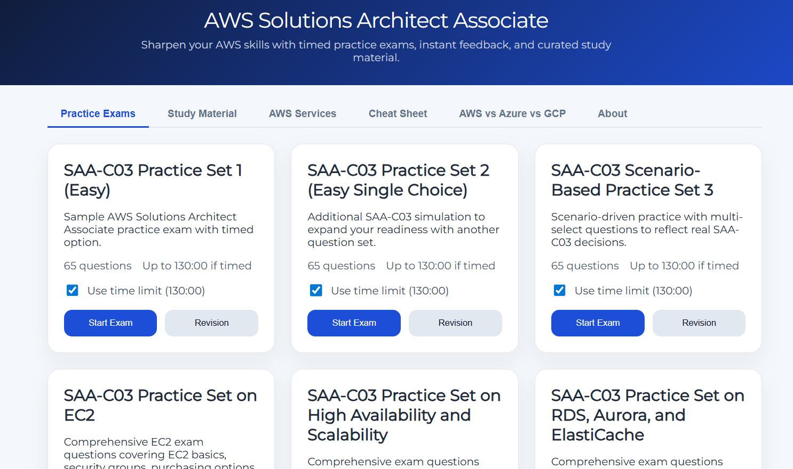

# AWS Solutions Architect Associate Exam Prep

An interactive web application for preparing for the **AWS Certified Solutions Architect – Associate (SAA-C03)** exam. Includes practice exams, a cheat sheet, AWS services glossary, cloud provider comparison, and curated study resources.

This repository contains a **comprehensive reference guide and quick study notes** for the **AWS Certified Solutions Architect – Associate SAA-C03** certification exam.

The goal of this repository is to provide a **concise, structured, and practical reference** for developers, architects, and cloud engineers preparing for the exam.

It includes key AWS services, architecture patterns, security concepts, and best practices aligned with the **AWS Well-Architected Framework**.

## Live Demo

https://amitpnk.github.io/AWS-Solutions-Architect-Associate-Exam/

## Exam Overview

| Attribute              | Details                                          |
| ---------------------- | ------------------------------------------------ |
| Exam Name              | AWS Certified Solutions Architect – Associate    |
| Exam Code              | SAA-C03                                          |
| Duration               | 130 minutes                                      |
| Questions              | ~65 (50 scored, 15 unscored)                     |
| Passing Score          | 720 / 1,000 (Scaled score)                       |
| Format                 | Multiple Choice & Multiple Response              |
| Recommended Experience | 1+ year hands-on AWS experience                  |
| Cost                   | $150 USD                                         |
| Delivery               | Testing center or Online proctored (Pearson VUE) |

The exam primarily tests **real-world architectural design scenarios** rather than theoretical knowledge. 

## Features

- **Practice Exams** — 3 full exam sets with 100+ questions covering all SAA-C03 domains
- **Timed Mode** — Configurable exam timer (default 130 minutes), with auto-submit on timeout
- **Multiple Choice & Multiple Response** — Supports both single-select and multi-select question formats
- **Detailed Results** — Per-question score breakdown with explanations for every answer
- **Question Navigation** — Skip, jump back, and review flagged questions mid-exam
- **Revision Mode** — Revisit completed exams and review answers
- **Cheat Sheet** — Scenario-based decision trees, service comparisons, and key numbers/limits
- **AWS Services Glossary** — Searchable reference of AWS services with descriptions
- **Cloud Comparison** — AWS vs Azure vs GCP service mapping
- **Study Resources** — Curated AWS documentation links organized by domain
- **Dark Mode** — Toggle between light and dark themes
- **Responsive Design** — Works on desktop and mobile

## Exam Domains Covered

| Domain | Weight |
|--------|--------|
| Design Secure Architectures | 30% |
| Design Resilient Architectures | 26% |
| Design High-Performing Architectures | 24% |
| Design Cost-Optimized Architectures | 20% |

## License

MIT — see [LICENSE](LICENSE).
